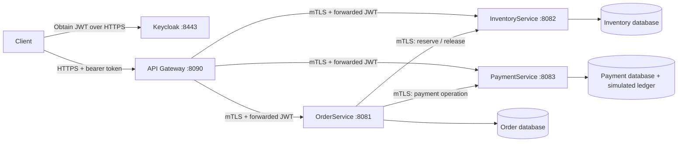

# Orderflow: practical microservices interview lab

This Java 21 / Spring Boot 4.1.1 project contains four independently runnable
applications: an API gateway, OrderService, InventoryService, and PaymentService.
The gateway routes public APIs. OrderService coordinates a durable checkout Saga.
Each business service owns a separate PostgreSQL database and database role.

The implementation uses real Keycloak user authentication, locally generated
HTTPS certificates, mutual TLS between services, Resilience4j circuit breakers,
durable idempotency, and an advisory inventory cache. PaymentProvider is explicitly
simulated: this lab never charges real money.

Start with the [walkthrough and practical exercises](docs/MICROSERVICES-LAB.md).
It explains the code path, authentication versus authorization, HTTPS client
adapters, Saga recovery, circuit breakers, caching, and the limits of CAP claims.



## Repository layout

```text
orderflow/
├── pom.xml                 Maven aggregator; not a running application
├── api-gateway/            WebFlux / Netty routing and JWT policy
├── order-service/          MVC / JDBC; durable Saga and HTTPS client adapters
├── inventory-service/      MVC / JDBC; reservations, stock, advisory cache
├── payment-service/        MVC / JDBC; payment outcomes and provider simulator
├── security-support/       Shared JWT and servlet security library; no server
├── legacy-monolith/        Preserved earlier backend and its tests
├── config/keycloak/        Realm template without generated user passwords
├── scripts/                Local setup, lifecycle, certificate and smoke helpers
└── docs/                   Lessons, implementation records, interview practice
```

The root build now aggregates the four applications and shared library. The old
backend is preserved under `legacy-monolith`; its earlier data is not converted
into the new service databases. The earlier `gateway/` application is now
`api-gateway/`. Historical lesson commands describe their original checkpoint;
use the commands below for the current platform.

## Run locally

Prerequisites: JDK 21, Python 3.9+, OpenSSL, and the PostgreSQL binaries used by the
existing project helper. `./dev` uses the project's local Java runtime when it
exists; otherwise set `JAVA_HOME`. On the original machine the installed runtime
is `/Users/pavtiwar/orderflow/.tools/java21/Contents/Home`.

```sh
cd /Users/pavtiwar/orderflow
./scripts/platform setup
./dev verify
./scripts/keycloak start
./scripts/keycloak status
./scripts/platform start
./scripts/platform status
```

Allow initial startup to complete before checking status again. Setup downloads
the pinned Keycloak distribution when needed, starts the local database, creates
three business databases and three isolated test databases with separate roles,
and generates private local settings. Keycloak uses an explicit local file database and local cache, with its HTTP
listener disabled. It is a learning configuration, not an HA identity deployment
or another business PostgreSQL database.

An existing PostgreSQL installation can be selected through `ORDERFLOW_PG_BIN`;
the earlier `./scripts/db-setup` helper prepares its pinned distribution on the
supported Mac environment.

Servers bind to the local machine by default. Settings, keys, tokens, database
files, and logs live under ignored `.tools/`. A CA certificate is valid for 365
days; individual app certificates are valid for 90 days. Setup reuses valid
existing certificates and never changes the operating system trust store.

Use the HTTP guide to make requests, or run the automated lab checks:

```sh
./scripts/platform-smoke
./scripts/platform-smoke --resilience
```

The resilience option deliberately stops and restarts selected applications to
exercise recovery. Run it against this local lab when no other exercise depends
on those processes. Actual results are recorded with the implementation evidence;
these commands describe how to reproduce the checks.

Stop only the project-owned processes:

```sh
./scripts/platform stop
./scripts/keycloak stop
```

For an individual application, use for example
`./scripts/platform stop inventory-service` or
`./scripts/platform start inventory-service`. PostgreSQL remains available until
you stop it with the database helper, after all dependent applications stop.

## What to explain in the interview

| Question | Implemented answer |
|---|---|
| Why a separate gateway? | Independent runtime and dependencies; it routes API requests and applies edge policies. |
| Is authentication only at the gateway? | Keycloak signs user tokens. Gateway and public backend APIs validate them; backend code checks ownership. |
| How do services use HTTPS? | Client adapters use Spring SSL bundles, certificate trust, hostname verification, and separate service identities. |
| What happens when a dependency fails? | Timeouts bound waiting; circuit breakers reject repeated calls; durable Saga state retains pending work. |
| How do three databases commit together? | They do not. Local transactions and idempotent compensation implement the checkout workflow. |
| What is cached? | Availability observations for five seconds; reservation decisions always use locked database rows. |
| Which CAP behavior is implemented? | Mutations refuse or defer when authoritative storage is unreachable; advisory cached reads can be stale. No replicated CP/AP claim is made. |

This is a runnable, production-oriented learning implementation, not a production
deployment. Missing production work includes managed certificate rotation and
revocation, Keycloak production operations, browser authorization-code/PKCE login,
real payment reconciliation, distributed rate limiting, and database high
availability. A circuit breaker or Saga does not supply those guarantees.

## Learning records

Working implementation and trainer verification do not establish learner
understanding. Earlier unanswered checkpoints remain open.

- [Current microservices walkthrough](docs/MICROSERVICES-LAB.md)
- [Inventory behavior and tests](inventory-service/README.md)
- [Payment simulator and real-provider boundary](payment-service/README.md)
- [Technical notebook](docs/TECHNICAL-NOTEBOOK.md)
- [Learning progress](docs/PROGRESS.md)
- [Interview practice](docs/INTERVIEW-NOTES.md)
- [Question coverage tracker](docs/PDF-COVERAGE.md)
- [Lab catalog](docs/LAB-CATALOG.md)
- [Original gateway lesson](docs/API-GATEWAY.md)
- [Original class walkthrough](docs/CODE-WALKTHROUGH.md)
