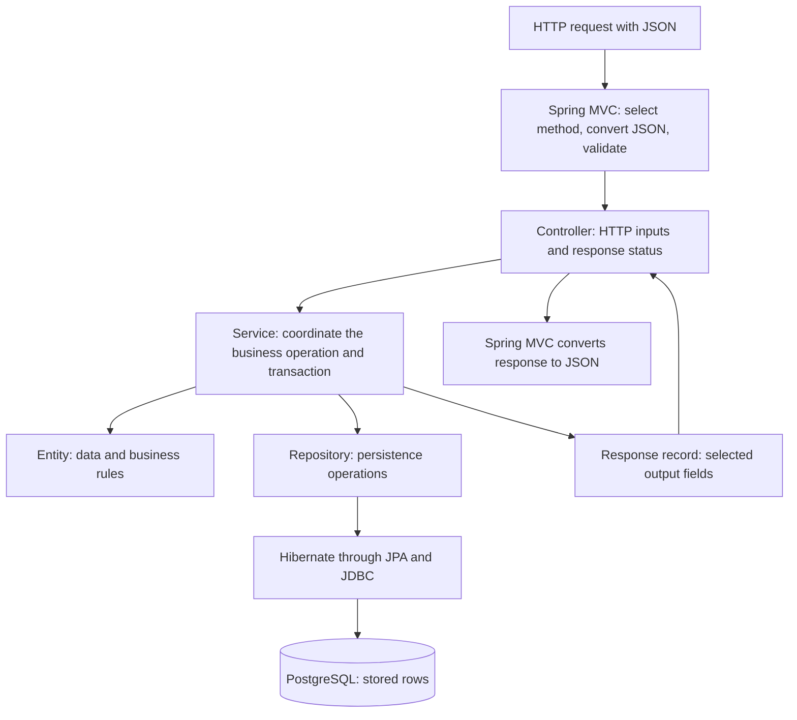

# Understand the current code before adding more

Prepared on 2026-09-26 against the Day 1 implementation (`fa1d4df`). This is a
guided reference, not a record of completed learner understanding. New feature
implementation is paused at the learner's request. Read the files alongside this
guide, one flow at a time; the deeper internals remain in the
[technical notebook](TECHNICAL-NOTEBOOK.md).

There are **20 application Java files** and **8 test Java files**. Two application
records and one test configuration are nested inside those files. This guide
accounts for all of them, the application settings, migration, and local helpers.

## 1. Connect the code to the response you saw

The learner reports that product 1 survived an application restart and supplied:

```json
{"id":1,"name":"Keyboard","price":1250.00,"stock":8}
```

This is a **product response**. `stock` means units currently available. An
**order response** instead contains `productId`, `quantity`, `unitPrice`, `total`,
and `createdAt`, as well as its own order ID. `quantity` means units purchased in
that particular order. Starting with stock 10 and buying 2 leaves stock 8, assuming
no other changes. We have not reviewed the learner's actual order JSON yet.

The product survives because PostgreSQL stores committed rows on disk. Restarting
Java destroys its in-memory objects. A later lookup loads the saved row into a
new application process; it does not preserve the old Java object.

## 2. The responsibilities in one picture



The entity is not a separate network service. The controller, service, entity,
repository, and framework all run inside our **one Java application**. PostgreSQL
is a separate process. The return path uses a response record instead of exposing
the entity directly.

| Word | Meaning in this project |
| --- | --- |
| Bean | An object registered with and managed by Spring's application context. |
| Dependency injection | Spring supplies an object's collaborators through its constructor. |
| DTO | Data transfer object: a value carrying input or output fields. Our DTOs use Java records. |
| Entity | A Java type whose persistent fields are mapped to database columns. |
| Repository | An interface through which application code requests database operations. |
| Persistence context | JPA's collection of managed entity instances for a unit of work; Hibernate tracks their changes. |
| Transaction | A database unit of work that commits together or rolls back on a qualifying failure. |

## 3. Startup and the original learning endpoint

### `OrderflowApplication` — start the application

Open [OrderflowApplication.java](../src/main/java/com/outforpavan/orderflow/OrderflowApplication.java).

- The JVM calls `main`. `SpringApplication.run(...)` bootstraps Spring Boot.
- `@SpringBootApplication` combines application configuration, component scanning,
  and auto-configuration. Scanning starts from `com.outforpavan.orderflow` and
  includes our packages below it. Auto-configuration uses available libraries,
  properties, and existing beans to configure infrastructure.
- `@EnableConfigurationProperties(LearningProperties.class)` registers our typed
  learning settings for binding and injection.
- Startup prepares the web server, mappings, database infrastructure, repositories,
  and application beans. Startup is different from processing each request.

We do not write `new ProductController()` in `main`. Spring resolves its required
constructor argument and constructs the controller. With no alternative bean
registration, removing the required service's `@Service` breaks that dependency.
The container detects the missing dependency; the controller does not search for it.
See the [Boot annotation reference](https://docs.spring.io/spring-boot/reference/using/using-the-springbootapplication-annotation.html).

### `LearningProperties` — hold a configured value

Open [LearningProperties.java](../src/main/java/com/outforpavan/orderflow/learning/LearningProperties.java).

`@ConfigurationProperties("learning")` binds `learning.message` to the record's
`message` component. `@Validated` and `@NotBlank` reject a blank required message
during binding. Spring creates this registered configuration bean and makes it
available for injection. It is a deliberate exception to the ordinary request
and response records, which are not Spring beans.

### `LearningService` — supply the message

Open [LearningService.java](../src/main/java/com/outforpavan/orderflow/learning/LearningService.java).

`@Service` registers our application logic with component scanning. Its constructor
requires `LearningProperties`; Spring supplies that object. `message()` reads the
bound setting. This small example teaches the same injection pattern later used
by the product and order services, without a database operation.

### `LearningController` and its nested `LearningStatus` — expose the message

Open [LearningController.java](../src/main/java/com/outforpavan/orderflow/learning/LearningController.java).

Spring injects `LearningService`. `@RestController` identifies an HTTP controller
whose method return values are written to the response body. `@GetMapping` maps
`GET /api/learning/status` to `status()`.

The controller calls `learningService.message()` and explicitly creates a
`LearningStatus(application, message)` record. `LearningStatus` is nested because
this tiny output type is used here. Spring MVC's JSON converter serializes it.
The controller is normally shared across requests; the returned record is created
for that method call.

## 4. Products: why seven different files exist

These files separate what callers may submit, what we store, what rules we apply,
and what callers may receive. Similar fields do not mean identical responsibilities.

### `CreateProductRequest` — accepted input

Open [CreateProductRequest.java](../src/main/java/com/outforpavan/orderflow/product/CreateProductRequest.java).

This record accepts `name`, `price`, and `stock`. It does not accept a creation ID;
the database generates that. A Java record supplies a constructor, component
accessors such as `request.name()`, and value-based `equals`, `hashCode`, and
`toString`. It is a compact data type, not a Spring-specific feature.

| Constraint in this record | Meaning |
| --- | --- |
| `@NotBlank`, `@Size(max = 120)` on name | Require a nonblank name no longer than 120 characters. |
| `@NotNull` on price/stock | Distinguish a missing or null value from a supplied value. |
| Positive `@DecimalMin`, `@Digits(integer = 10, fraction = 2)` on price | Require price greater than zero within our decimal precision limits. |
| `@PositiveOrZero` on stock | Allow zero stock but reject negative stock. |

`Integer` permits `null`, unlike primitive `int`, allowing the missing-stock check.
`BigDecimal` models decimal prices without binary floating-point approximation.
The constraints are evaluated by validation infrastructure; constructing a record
with `new` alone does not automatically enforce those annotations.

### `ProductController` — translate HTTP into an application call

Open [ProductController.java](../src/main/java/com/outforpavan/orderflow/product/ProductController.java).

The constructor stores a `ProductService` supplied by Spring. The `final` field
cannot later be reassigned; this alone does not prove thread safety.

| Route | Controller method | Result |
| --- | --- | --- |
| `POST /api/products` | `create` | `201 Created`, a `Location` header, and `ProductResponse`. |
| `GET /api/products/{id}` | `get` | The selected product or a missing-resource error. |
| `PATCH /api/products/{id}/price` | `changePrice` | The product after a price change. |

`@RequestMapping` supplies the shared path prefix. `@PostMapping`, `@GetMapping`,
and `@PatchMapping` select the HTTP method and remaining path. `@PathVariable`
binds `{id}` to the method argument. There is currently no product-list GET method
at the bare `/api/products` path.

For POST/PATCH, `@RequestBody` asks MVC to convert JSON into the request record,
using Jackson in our application. `@Valid` requests validation before our handler
body runs. `ResponseEntity` lets the POST method explicitly choose status, headers,
and body. The `Location` points to the new resource; it is not an automatic redirect.
See [Spring MVC request-body handling](https://docs.spring.io/spring-framework/reference/web/webmvc/mvc-controller/ann-methods/requestbody.html).

### `ProductService` — coordinate product operations

Open [ProductService.java](../src/main/java/com/outforpavan/orderflow/product/ProductService.java).

- `create`: construct a `Product`, save it through the repository, and copy its
  fields into `ProductResponse`.
- `get`: load the requested product or throw `ResourceNotFoundException`, then
  build the response.
- `changePrice`: load the product, call its price-change rule, and build the response.
  There is intentionally no second `save()`.
- `findProduct`: a private helper shared by lookup and price change. An empty
  repository result becomes the explicit missing-resource exception.

`@Transactional` lets Spring wrap calls to the managed service with transaction
handling. In our controller-to-service flow, a successful write transaction commits
before the managed service call returns normally to the controller. A response
record created inside the method is not itself evidence that commit has succeeded.

The lookup uses `@Transactional(readOnly = true)`, expressing read intent and
allowing infrastructure optimizations. Treat it as a hint, not a universal guard
against writes. A single constructor requires no `@Autowired` here.

### `Product` — persistent data plus product rules

Open [Product.java](../src/main/java/com/outforpavan/orderflow/product/Product.java).

`@Entity` marks a persistence mapping and `@Table(name = "products")` names its
table. `@Id` identifies the key. `@GeneratedValue(strategy = IDENTITY)` uses the
database identity column. `@Column` describes column mapping details such as
nullability, length, precision, and scale. These annotations do not create tables
in our configuration; Flyway owns schema creation.

The protected no-argument constructor allows JPA to instantiate loaded entities.
Our public constructor creates a new product from accepted values and applies
basic guards. The fields represent `id`, `name`, `price`, and `stock`; getters let
other code read them.

`reserve(quantity)` rejects nonpositive quantities, throws
`InsufficientStockException` when requested units exceed stock, and otherwise
subtracts the requested units. `changePrice(price)` requires a positive, non-null
price. These are ordinary Java methods containing business rules.

An entity is **not** a shared Spring service bean. The application constructs a
new product when creating one, and Hibernate constructs/populates entities when
loading rows. While an entity is managed, Hibernate tracks its persistent fields.
Changing its price inside our write transaction is detected and flushed as an
UPDATE. That mechanism is **dirty checking**, explaining the missing second
`save()` in `ProductService.changePrice`.

### `ProductRepository` — request persistence operations

Open [ProductRepository.java](../src/main/java/com/outforpavan/orderflow/product/ProductRepository.java).

```java
public interface ProductRepository extends JpaRepository<Product, Long> {
}
```

`Product` is the entity type; `Long` is its ID type. Spring Data creates a repository
bean backed by its runtime implementation/proxy, providing inherited operations
such as `save`, `findById`, and `flush`. We do not need to write an implementation
for these standard methods. `findById` returns an `Optional`: it may contain an
entity or be empty.

The underlying responsibilities are distinct:

| Component | Contribution |
| --- | --- |
| Spring Data JPA | Implements the repository programming model and delegates persistence operations. |
| JPA / Jakarta Persistence | Defines persistence APIs and mapping contracts, including `EntityManager`. |
| Hibernate | Implements JPA here; manages entities and executes generated SQL through JDBC. |
| PostgreSQL JDBC driver | Connects Java's database operations to PostgreSQL. |
| HikariCP | Reuses a bounded pool of database connections. |
| PostgreSQL | Executes SQL, enforces database constraints, and stores committed rows. |

### `ProductResponse` — selected output fields

Open [ProductResponse.java](../src/main/java/com/outforpavan/orderflow/product/ProductResponse.java).

This record holds `id`, `name`, `price`, and `stock` for JSON output. Its static
`from(Product)` method is code we wrote to copy fields into a new record. There
is no automatic mapping library. Keeping this separate from the entity lets us
change storage details without automatically changing the HTTP contract.

### `UpdateProductPriceRequest` — input for one specific change

Open [UpdateProductPriceRequest.java](../src/main/java/com/outforpavan/orderflow/product/UpdateProductPriceRequest.java).

This record accepts only `price`, with the same required, positive, and decimal
precision constraints as creation. It states what this PATCH operation changes;
we do not reuse the create request and accidentally require name and stock again.

## 5. Orders: combine stock reservation and order storage

### `CreateOrderRequest` — identify the product and requested units

Open [CreateOrderRequest.java](../src/main/java/com/outforpavan/orderflow/order/CreateOrderRequest.java).

The record contains required positive `productId` and `quantity`. Input uses
wrapper types so missing values can be detected. The caller does not choose the
trusted order price or total; our service reads the product price.

### `OrderController` — expose create/read routes

Open [OrderController.java](../src/main/java/com/outforpavan/orderflow/order/OrderController.java).

Spring injects `OrderService`. POST `/api/orders` converts and validates the request,
calls the service, then returns `201`, `Location: /api/orders/{id}`, and the order
response. GET `/api/orders/{id}` reads an order. These are the same HTTP patterns
as the product controller, applied to another resource.

### `OrderService` — own the complete operation

Open [OrderService.java](../src/main/java/com/outforpavan/orderflow/order/OrderService.java).

Two constructor dependencies are needed: `ProductRepository` to find and change
stock, and `OrderRepository` to store the resulting order. Follow `create` in order:

1. `products.findById(...)` loads a managed product or throws the missing-resource exception.
2. `product.reserve(request.quantity())` checks availability and changes the Java field.
3. `products.flush()` synchronizes pending entity changes with the database as SQL.
4. `new PurchaseOrder(...)` captures product ID, requested quantity, and current price.
5. `orders.saveAndFlush(...)` persists the order and flushes changes.
6. `OrderResponse.from(...)` prepares the result. Successful completion lets the
   transaction infrastructure commit before returning normally to the controller.

All of this runs in the same service transaction. `flush()` **does not commit**.
The explicit flushes make our rollback experiment able to fail after stock SQL
has executed. They are teaching choices here, not a requirement to flush manually
after every write. A runtime failure escaping this transaction causes rollback
under the current default rules. Rollback undoes database changes; it does not
automatically restore every mutated Java object.

The `get` method uses a read-only transaction to look up an order and build its
response or throw the missing-resource exception. Service-level boundaries can
span multiple repository calls; see [Spring Data transaction guidance](https://docs.spring.io/spring-data/jpa/reference/jpa/transactions.html).

### `PurchaseOrder` — retain the facts of one purchase

Open [PurchaseOrder.java](../src/main/java/com/outforpavan/orderflow/order/PurchaseOrder.java).

This entity maps to `purchase_orders`. Its fields are generated `id`, `productId`,
`quantity`, `unitPrice`, `total`, and `createdAt`. The public constructor calculates
`total = unitPrice × quantity` using `BigDecimal` and captures `Instant.now()`.
The protected no-argument constructor supports JPA loading; getters expose values.

`unitPrice` is a stored price snapshot. A later product price change must not
recalculate the historical order. `productId` is currently a scalar `Long` with
a database foreign key; we have not introduced a JPA `@ManyToOne` relationship.

### `OrderRepository` — persist and retrieve orders

Open [OrderRepository.java](../src/main/java/com/outforpavan/orderflow/order/OrderRepository.java).

It extends `JpaRepository<PurchaseOrder, Long>`. Spring Data supplies the bean just
as for products. `OrderService` uses `saveAndFlush` and `findById`.

### `OrderResponse` — the purchase shown to the caller

Open [OrderResponse.java](../src/main/java/com/outforpavan/orderflow/order/OrderResponse.java).

The record carries the order's ID, product ID, quantity, captured unit price, total,
and creation time. `from(PurchaseOrder)` copies those values. Product stock is not
one of its fields. An example order for two units at 1250.00 would total 2500.00;
this is an illustration, not a claim about order JSON supplied by the learner.

## 6. Errors: three files and one nested record

| Type | Purpose and caller |
| --- | --- |
| [ResourceNotFoundException](../src/main/java/com/outforpavan/orderflow/api/ResourceNotFoundException.java) | A runtime exception created by services when a requested product or order does not exist. It carries the message; it does not write HTTP itself. |
| [InsufficientStockException](../src/main/java/com/outforpavan/orderflow/api/InsufficientStockException.java) | A runtime exception created by `Product.reserve` when requested units exceed available stock. Its message includes product ID, requested units, and available units. |
| [ApiExceptionHandler](../src/main/java/com/outforpavan/orderflow/api/ApiExceptionHandler.java) | A shared `@RestControllerAdvice` bean invoked by MVC error handling. Extends `ResponseEntityExceptionHandler` to customize common request errors. |
| `ApiExceptionHandler.FieldError` | A nested record created by the handler for a validation error's `field` and `message`. It does not include the rejected input value. |

The handler maps missing resources to **404**, insufficient stock to **409**, and
validation failures, malformed JSON/wrong body types, and invalid parameter types
to **400**. `@ExceptionHandler` selects handlers for our custom exception classes;
overridden methods customize the framework's request exceptions.

Its helpers build a `ProblemDetail` body with status, title, detail, and the request
path as `instance`. Validation responses add a sorted `fieldErrors` list. Services
do not call the handler directly, and it is not a catch-all mapping every possible
database or programming failure to one of these business responses.

## 7. Trace the product POST from beginning to end

Use the existing code, without creating another product just to read this trace:

1. The web server accepts `POST /api/products` with JSON.
2. MVC finds `ProductController.create`, converts JSON into `CreateProductRequest`,
   and validates it. Invalid input can stop here before the service is called.
3. The controller calls the injected service. Transaction infrastructure surrounds
   the managed call to `ProductService.create`.
4. The service constructs a `Product` and calls `ProductRepository.save`.
5. Hibernate persists it through JDBC; PostgreSQL supplies the identity ID.
6. `ProductResponse.from` copies the resulting fields.
7. Transaction infrastructure commits. A commit failure prevents a normal return
   to the controller; creating the record in step 6 did not send an HTTP response.
8. The controller builds `201 Created` and `Location`. MVC writes the record as JSON.

For `GET /api/products/1`, there is no creation request body: the path supplies the
ID, the service loads the product, and a response record supplies the JSON fields.

## 8. Every application configuration entry

Open [application.properties](../src/main/resources/application.properties).

| Setting | What it does and why it exists |
| --- | --- |
| `spring.application.name=orderflow` | Names the application. Does not create a route or choose the database name. |
| `spring.config.import=optional:file:.tools/database.properties` | Imports generated local datasource settings. `optional:` permits the file to be absent; database access still requires a configured, usable datasource. |
| `learning.message=LearningService - Learning Spring Boot one step at a time` | The value bound into `LearningProperties`, preserving the learner's message prefix. |
| `spring.jackson.deserialization.accept-float-as-int=false` | Rejects decimal JSON values for integer fields, so quantity `2.5` cannot silently become `2`. |
| `spring.jpa.hibernate.ddl-auto=validate` | Checks entity mappings against the database schema. Does not create or repair tables, or replace all database constraint checks. |
| `spring.jpa.open-in-view=false` | Disables a request-spanning EntityManager. This project loads data and maps responses inside service transactions. The property itself does not enforce where repository calls may be written. |
| `spring.datasource.hikari.maximum-pool-size=5` | Allows at most five pooled database connections for this datasource, including busy and idle connections. Not a five-user limit. |
| `spring.datasource.hikari.connection-timeout=5000` | Wait up to five seconds for a pooled connection. Not a timeout for an executing query or the whole HTTP request. |

Open-in-view behavior is described in [Boot SQL support](https://docs.spring.io/spring-boot/reference/data/sql.html#data.sql.jpa-and-spring-data.open-entity-manager-in-view);
pool settings are described in [HikariCP's configuration reference](https://github.com/brettwooldridge/HikariCP#configuration-knobs-baby).

The generated, ignored `.tools/database.properties` holds
`spring.datasource.url`, `spring.datasource.username`, and
`spring.datasource.password`. Do not copy its password into notes or Git.
The local helper uses `127.0.0.1:54329` and database `orderflow`.

Open [application-sql.properties](../src/main/resources/application-sql.properties).
When the `sql` profile is active, `logging.level.org.hibernate.SQL=DEBUG` displays
SQL statement text, and `spring.jpa.properties.hibernate.format_sql=true` formats
it. These entries do not enable bound-parameter-value logging or change business rules.

Open [application-test.properties](../src/test/resources/application-test.properties).
The `test` profile imports `file:.tools/test-database.properties`, without `optional:`.
Missing test settings fail startup. That generated file uses the separate
`orderflow_test` database on the same local server. The integration test also
asserts the connected database name before working with test data.

Profiles select additional named configuration. Ordinary file edits are not live
reloading in this project. Environment values can override file values, and
command-line values can override both; see [Boot external configuration](https://docs.spring.io/spring-boot/reference/features/external-config.html).

## 9. The database migration creates the schema

Open [V1__products_and_orders.sql](../src/main/resources/db/migration/V1__products_and_orders.sql).

Flyway runs versioned migrations during application startup. `V1` is the version;
the double underscore separates version and description. Flyway records applied
migrations in schema history, so a normal restart does not create the tables again.
Add a later migration for future schema changes instead of editing an already
applied V1. Hibernate then validates mappings against the schema.
See [Boot database initialization](https://docs.spring.io/spring-boot/how-to/data-initialization.html).

| SQL definition | Meaning in our schema |
| --- | --- |
| `products` | Stores product ID, name, current price, and available stock. |
| `purchase_orders` | Stores each order's ID, product ID, quantity, price snapshot, total, and time. |
| Identity `BIGINT` primary keys | The database generates row IDs; the primary key requires uniqueness and a non-null key. |
| `VARCHAR(120)` | A product name has a maximum length; its additional check rejects a trimmed empty name. |
| `NUMERIC(12,2)` | Up to twelve decimal digits including two fractional digits, for product and unit prices. |
| `NUMERIC(22,2)` | A larger total column; its check requires `total = unit_price * quantity`. |
| `REFERENCES products(id)` | Database foreign key: an order must reference an existing product. |
| `NOT NULL` and `CHECK` rules | Require supplied values, positive prices/quantities, and nonnegative stock, even for writes outside HTTP. |
| `TIMESTAMP WITH TIME ZONE` | Stores the order's timestamp with PostgreSQL's time-zone-aware semantics; Java represents the instant with `Instant`. |

Input validation gives callers useful errors. Entity methods express business
rules. Database constraints protect stored data. These layers overlap deliberately
but do not all check exactly the same conditions.

## 10. Build dependencies and local helper files

Open [pom.xml](../pom.xml). Maven uses this file to build and select libraries.

| POM item | Purpose |
| --- | --- |
| `modelVersion=4.0.0` | Maven file-format version, not our Spring version. |
| Boot parent `4.1.1`, empty `relativePath` | Gets Boot build defaults and managed dependency versions from repositories. Dependencies still have to be selected. |
| `groupId`, `artifactId`, `version` | Coordinates identifying `com.outforpavan:orderflow:0.0.1-SNAPSHOT`; this is a development version. |
| `name`, `description`, `url` | Human-readable project metadata. |
| `java.version=21` | Intended Java build/language level. Does not install Java or select IntelliJ's runtime by itself. |
| `spring-boot-starter-webmvc` | MVC, servlet server, and JSON infrastructure for the HTTP application. |
| `spring-boot-starter-validation` | Jakarta Validation infrastructure for our request and configuration constraints. |
| `spring-boot-starter-data-jpa` | Spring Data JPA, Hibernate, and JDBC infrastructure. |
| `spring-boot-starter-flyway` | Boot integration for database migrations. |
| `flyway-database-postgresql` | Flyway's database-specific PostgreSQL support. |
| `postgresql` with runtime scope | JDBC driver needed while running the application. |
| `spring-boot-starter-webmvc-test` with test scope | Test tools for JUnit, assertions, mocking, and MVC tests; not shipped as application dependencies. |
| `spring-boot-maven-plugin` | Supports running through Maven and packaging an executable application JAR. |

A starter supplies a useful dependency group; it does not implement our business
feature. The parent manages compatible versions. See [Boot build systems](https://docs.spring.io/spring-boot/reference/using/build-systems.html).

| File | Why it is in the project |
| --- | --- |
| [dev](../dev) | Selects/checks Java 21, keeps Maven downloads/cache under `.tools`, changes to the project directory, and invokes the Maven Wrapper. |
| [mvnw](../mvnw), [mvnw.cmd](../mvnw.cmd) | Standard Maven launchers for Unix-like systems and Windows, so the project can choose its Maven distribution. |
| [.mvn/wrapper/maven-wrapper.properties](../.mvn/wrapper/maven-wrapper.properties) | Pins Maven 3.9.16 and wrapper 3.3.4; `only-script` avoids a committed wrapper JAR. |
| [.mvn/maven.config](../.mvn/maven.config) | Selects project user/global settings and suppresses transfer progress. |
| [.mvn/settings.xml](../.mvn/settings.xml) | Minimal settings using default public repositories, isolating this project from machine-wide mirrors. |
| [scripts/db-setup](../scripts/db-setup) | Installs a pinned, checksum-verified local PostgreSQL distribution on this Mac. |
| [scripts/db](../scripts/db) | Starts/stops/inspects this project's database cluster and generates local connection settings. Creates separate application and test databases. Starting again retains existing data. |
| [scripts/day1-smoke.py](../scripts/day1-smoke.py) | Runs temporary application processes against the test database, makes real HTTP requests, and checks persistence across an application restart. Leaves labeled test rows and stops its own app processes. |
| [requests/day1.http](../requests/day1.http) | Manual IntelliJ HTTP examples; captures generated resource IDs for later requests. |
| [requests/day1.sql](../requests/day1.sql) | Read-only SQL examples for inspecting saved state. |
| [.gitignore](../.gitignore) | Excludes local tools, credentials, build output, logs, and generated IDE files from Git. |
| [README.md](../README.md), [AGENTS.md](../AGENTS.md), [docs](.) | Setup instructions, mentoring rules, and learning records. Not runtime application logic. |

The database helper is local teaching infrastructure. Its cluster owner is a
superuser; production role separation has not been implemented. `.tools` holds
local binaries, caches, credentials, and database files; `target` holds build output.
Neither directory is source code to study or commit.

## 11. Every test class: which claim it checks

JUnit runs tests; they are not endpoint implementations. A passing test proves
its particular assertions under its setup, not every production guarantee.

| Test class | Setup and purpose |
| --- | --- |
| [OrderflowApplicationTests](../src/test/java/com/outforpavan/orderflow/OrderflowApplicationTests.java) | `@SpringBootTest`, `test` profile: the full context starts with the configured database infrastructure. |
| [LearningControllerTest](../src/test/java/com/outforpavan/orderflow/learning/LearningControllerTest.java) | Focused MVC test with the real learning service imported: route, HTTP status, and message JSON. |
| [LearningConfigurationTest](../src/test/java/com/outforpavan/orderflow/learning/LearningConfigurationTest.java) | Small `ApplicationContextRunner`: property binding reaches the service; a blank message fails startup. Its nested `TestConfiguration` enables `LearningProperties` and imports `LearningService` only for this test setup. |
| [LearningDependencyInjectionTest](../src/test/java/com/outforpavan/orderflow/learning/LearningDependencyInjectionTest.java) | Registers the controller without its required service and asserts the expected startup failure. An expected failure makes this test pass. |
| [ProductTest](../src/test/java/com/outforpavan/orderflow/product/ProductTest.java) | Plain Java checks for reservation rules. No Spring or database is needed. |
| [ProductControllerTest](../src/test/java/com/outforpavan/orderflow/product/ProductControllerTest.java) | MVC binding, validation, status, headers, and errors. `ProductService` is mocked, so this does not prove database persistence. |
| [OrderControllerTest](../src/test/java/com/outforpavan/orderflow/order/OrderControllerTest.java) | MVC order contracts and error handling with a mocked `OrderService`. The supplied mock response does not prove real price calculation. |
| [OrderFlowIntegrationTest](../src/test/java/com/outforpavan/orderflow/OrderFlowIntegrationTest.java) | Real PostgreSQL and service transactions: order/stock commit, insufficient stock, dirty checking and historical price, rollback after executed stock SQL. |

`@WebMvcTest` loads a focused web slice. `MockMvc` exercises MVC without opening a
listening HTTP server. `@MockitoBean` replaces a collaborator with controlled test
behavior. `@SpringBootTest` loads the full application context here.
`@ActiveProfiles("test")` selects test configuration. Assertions compare outcomes
with expectations; parameterized tests run one method with several input cases.

The integration test has no enclosing test-managed transaction: service calls
finish before fresh JDBC queries inspect database state. A temporary test-only
trigger verifies that the stock UPDATE ran before deliberately failing the order
INSERT. Cleanup removes its trigger and its own rows. No failure endpoint was
added to the application.

Trainer verification on 2026-09-25 recorded **43 passing test executions** plus a
packaged HTTP/restart check. That is not 43 classes, and tests were not rerun for
this documentation-only walkthrough. See [the evidence record](labs/DAY1-order-flow.md).

## 12. Review in small steps

Use this order when explaining the files together:

1. Startup and object ownership: application → properties → learning service → controller.
2. One product POST: request → controller → service → entity/repository → response.
3. Read a product after restart: database row versus Java object.
4. One order: reservation, price snapshot, transaction, flush, and commit.
5. Configuration, migration, errors, and the tests supporting each claim.

Pause for the learner's questions within each group. Do not resume new feature
implementation simply because code exists or a session deadline has passed.

| Follow-up | Reference answer to compare after an attempt |
| --- | --- |
| Why three product data types? | Request defines allowed input, entity maps storage and rules, response defines selected output. |
| Who creates the service versus the response? | Spring constructs/injects the service; our mapper explicitly constructs each response record. |
| Where are records in the database? | Request/response records are not JPA entities; persistent product fields are mapped by `Product`. |
| Why no implementation file for a repository? | Spring Data provides the standard implementation/proxy at runtime. |
| Does `flush` mean committed? | No. SQL has been synchronized, but the surrounding transaction can still roll back. |
| Why no second `save` after price change? | Hibernate tracks the entity loaded in our write transaction and flushes its changed state. |
| Does `@Transactional` alone prevent simultaneous buyers overselling? | No. This code has no version/locking strategy yet; atomicity and concurrency correctness require separate reasoning. |
| Why did the product survive restarting Java? | PostgreSQL retained the committed row; the new app process loads it again. |
| Does stock 8 tell us an order's ID and quantity? | No. It is current product availability; inspect that order's response to establish its fields. |

These are prepared answers. Record the learner's actual answers and corrections
in [INTERVIEW-NOTES.md](INTERVIEW-NOTES.md); coverage statuses stay evidence-based.
