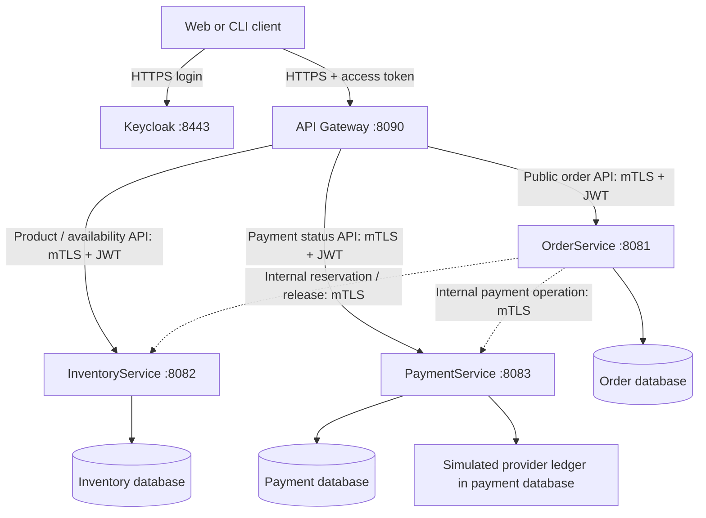
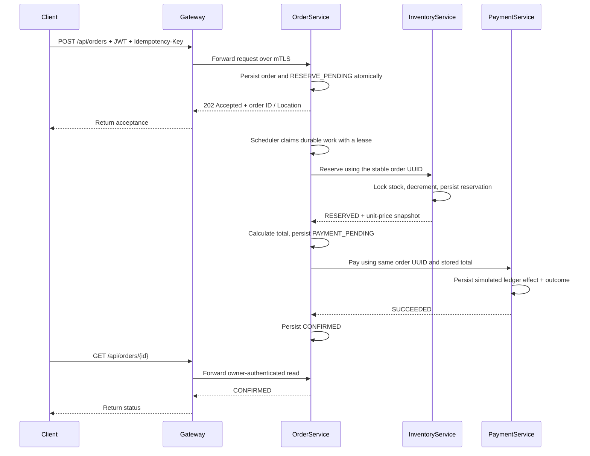
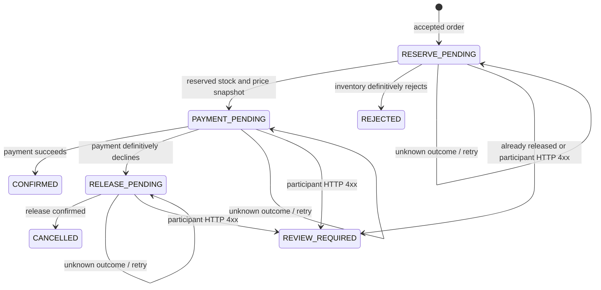

# Orderflow microservices: implementation and interview walkthrough

The gateway chooses the destination for a client request. OrderService owns the
checkout workflow. InventoryService owns stock and reservations. PaymentService
owns payment outcomes. Each business service owns its own database; none reads
or updates another service's tables.

This implementation follows the learner's explicit request to build the four
applications, use Keycloak, generate certificates locally, and demonstrate
security, HTTPS communication, circuit breakers, Saga, cache, and CAP tradeoffs.
It prepares runnable code and exercises. It does not mark any learner explanation
or historical coverage checkpoint as complete.

## 1. See the boundaries before the classes



There are four executable Spring Boot projects. `security-support` is a fifth
Maven module containing a shared library, not a fifth running service. The root
POM aggregates their builds. The original backend is retained in
`legacy-monolith` and is not part of the new default reactor.

```text
api-gateway/src/main/java/com/outforpavan/orderflow/gateway/
order-service/src/main/java/com/outforpavan/orderflow/orders/
inventory-service/src/main/java/com/outforpavan/orderflow/inventory/
payment-service/src/main/java/com/outforpavan/orderflow/payment/
security-support/src/main/java/com/outforpavan/orderflow/security/
```

The Java package is separate from the deployment unit. Putting every class under
one application's `src/main/java` would normally compile them into one runtime.
Each service here has its own POM, dependencies, configuration, migration, tests,
and executable JAR. Separate repositories would also be valid.

## 2. Authentication and authorization go at more than one boundary

**Authentication asks who the caller is. Authorization asks which operation and
which resource that caller may access.** This implementation uses different
identities for users and applications.

| Boundary | Authentication | Authorization |
|---|---|---|
| User to gateway | Keycloak-signed bearer access token | Public path/method and customer/admin role |
| Gateway to public backend API | Gateway client certificate plus the user's token | Backend validates roles again; order/payment ownership uses JWT subject |
| OrderService to internal participant API | OrderService client certificate | Only the `order-service` certificate identity may use `/internal/**` |

The issuer is `https://localhost:8443/realms/orderflow`. Both edge and backend
validate the RS256 signature, issuer, audience `orderflow-api`, expiration and
other time constraints, and a nonempty subject. `TokenPolicy` maps only the
allowlisted Keycloak realm roles `customer` and `admin` to Spring authorities.
A claim named `SERVICE_ORDER` cannot give a user token an internal service identity.

`ServiceSecurityConfiguration` supplies two filter chains. The earlier chain
matches `/internal/**` and authenticates X.509 certificates; it deliberately has
no bearer-token authentication. The public chain validates JWTs and roles.
Backend listeners require a trusted client certificate at TLS level before either
chain receives an HTTP request.

`OrderController` obtains the customer from the JWT subject. The client cannot
submit an arbitrary customer ID in the order body. `OrderStore.read` returns 404
for another customer's order. Payment status uses the same ownership principle.
Admin permissions are authorities, not a special username. See
[ServiceSecurityConfiguration](../security-support/src/main/java/com/outforpavan/orderflow/security/ServiceSecurityConfiguration.java),
[TokenPolicy](../security-support/src/main/java/com/outforpavan/orderflow/security/TokenPolicy.java),
and [OrderController](../order-service/src/main/java/com/outforpavan/orderflow/orders/api/OrderController.java).

The gateway does not expose internal payment or stock-mutation endpoints.
Naming a route `/internal` alone is not a security mechanism; the certificate
identity check supplies the enforcement here.

Keycloak exposes its public signing keys through its realm certificate/JWKS
endpoint; the apps retrieve them over CA-verified HTTPS. Token validation is
local after keys are cached, so login and JWT validation are not the same network
operation. Key retrieval and rotation still need a reachable issuer when required.
[Keycloak OIDC endpoints](https://www.keycloak.org/securing-apps/oidc-layers).

Local fixtures are `alice`, `bob`, and `admin`, with generated ignored passwords.
The CLI helper uses a direct password grant solely for these local test fixtures.
It is not the login flow to copy into a browser product; Keycloak's current
guidance excludes that grant for production applications. Use authorization code
with PKCE for a browser/mobile client. Keycloak uses `start --db=dev-file --cache=local` with HTTP disabled and an
explicit HTTPS hostname/certificate. Its file database is local learning storage,
not another business PostgreSQL database or an HA identity deployment. The
`start-dev` command forces an HTTP listener on, so the helper deliberately avoids
it even though this remains a local lab configuration.

Interview follow-up: **Why validate the token twice?** The gateway provides an
early boundary; the service protects its own resource contract if routes change,
another trusted caller is added, or a gateway rule is misconfigured. The service
also has the data required to enforce resource ownership.

## 3. HTTPS is a transport boundary; the client adapter is the code boundary

`scripts/local-pki` generates a private CA and a distinct certificate/private key
for every application, including Keycloak. The leaf certificates include
`localhost` and `127.0.0.1` as subject alternative names. Keys stay under ignored
`.tools/platform/pki`; the script does not add its CA to the OS trust store.
It reuses existing valid files, refuses incomplete pairs, and does not silently
renew expired certificates. CA lifetime is 365 days; leaf lifetime is 90 days.

The backend's `server` SSL bundle contains its certificate, key, and trusted CA.
`server.ssl.client-auth=need` requires a client certificate. The `client` bundle
supplies the outgoing identity and trusted CA. The gateway presents its own
certificate to backend public APIs; OrderService presents its certificate for
reservation/payment operations. Private CA membership alone does not authorize
an internal action: the X.509 identity must specifically be `order-service`.

In [HttpsClientsConfiguration](../order-service/src/main/java/com/outforpavan/orderflow/orders/client/HttpsClientsConfiguration.java),
the HTTP client uses:

```java
HttpClient.newBuilder()
    .sslContext(bundles.getBundle("client").createSslContext())
    .connectTimeout(connect)
    .followRedirects(HttpClient.Redirect.NEVER)
    .build();
```

`JdkClientHttpRequestFactory` adds the response timeout, and `RestClient` sends
typed requests. The configuration rejects a non-HTTPS internal URL. No trust-all
manager or hostname-verification bypass is used. Spring's SSL bundles provide
the key/trust material used to construct this SSL context.
[Spring Boot SSL bundles](https://docs.spring.io/spring-boot/reference/features/ssl.html).

`InventoryClient` exposes `reserve` and `release`; `PaymentClient` exposes `pay`.
These adapters hide HTTP paths, response mapping, TLS and resilience wiring from
`SagaWorker`. They are local Java objects representing remote APIs, not injected
instances of another application's service class.

```text
SagaWorker
  → InventoryClient.reserve(orderId, productId, quantity)
  → circuit breaker
  → RestClient POST https://localhost:8082/internal/reservations
  → TLS server verification + client-certificate verification
  → internal security chain
  → InternalReservationController
  → ReservationService local database transaction
```

Internal calls go directly to the private service URL rather than back through
the public gateway. In a container deployment those URLs would use resolvable
service DNS names and certificates whose SANs match them. This local lab uses
fixed addresses; it does not install service discovery or a service mesh.

Interview follow-up: **Does HTTPS prevent duplicate payments?** No. TLS protects
the communication channel and authenticates its endpoints. Durable idempotency
controls repeated business effects.

## 4. Follow a checkout from the API to completion



The gateway selects one downstream destination for the order POST. It does not
run the three checkout steps itself.

`OrderController.create` requires `Idempotency-Key`. `OrderStore.create` binds
the key to the authenticated customer, fingerprints the normalized request, and
atomically stores the initial order and workflow state. The unique
`(customer_id, idempotency_key)` constraint handles concurrent duplicate requests.
The same key and payload returns the original order; a changed payload returns
409. A different customer has a separate key namespace.

The API returns `202 Accepted`, not a claim that payment succeeded. Its Location
header identifies the status resource. A lost API response can be recovered by
repeating the same request and key; a new key means a new intended operation.

`SagaScheduler` polls every 500 ms. `OrderStore.claim` selects ready work using
`FOR UPDATE SKIP LOCKED` and writes a 15-second lease. The claim statement ends
before any remote HTTP call. State writes are conditional on the lease owner and
previous state, preventing an obsolete worker from overwriting a newer claim.

No lease promises exactly-once execution: after a long pause or a crash, workers
can repeat an operation. Inventory and payment participants deduplicate it using
the stable order UUID. That is why the workflow remains correct when an effect
commits but its response is lost.

## 5. Saga: local transactions plus durable compensation



The actual business decisions live in
[SagaWorker](../order-service/src/main/java/com/outforpavan/orderflow/orders/saga/SagaWorker.java).
Retries and their next eligible time are persisted, with delays starting at one
second and capped at 30 seconds. A process restart does not erase pending steps.
`REVIEW_REQUIRED` is an operational terminal state in this lab; resolving it
requires investigation, and no administrative repair workflow is implemented.

Inventory reserves stock and its ledger record in one PostgreSQL transaction.
It serializes attempts for the same order and locks the product row to prevent
overselling. It stores the unit price at reservation time, so a later price edit
does not reprice the existing order. Compensation restores stock only once.
A release that arrives before reservation leaves a tombstone, preventing a late
request from consuming stock after cancellation.

PaymentService's provider adapter is a **simulator**. `demo-approved` creates one
simulated ledger effect; `demo-declined` records a definitive decline. Its effect
and payment outcome share one local database transaction. Its persistent unique
order ID prevents a response-loss retry from creating a second simulated debit.

An actual payment provider cannot join this PostgreSQL transaction. Replacing
the simulator requires provider-side idempotency, a durable pending operation,
separate network attempts, webhook/status reconciliation, and a decision process
for unknown outcomes. See [the payment boundary](../payment-service/README.md).

Most important failure case: **a timeout is uncertainty, not a payment decline**.
The Saga retains `PAYMENT_PENDING` and retries/reconciles the same operation. It
does not release stock immediately, generate a new payment ID, or report success.
Only a definitive decline starts inventory compensation.

Interview follow-up: **Why not add `@Transactional` to the Saga?** A local Spring
transaction controls one database connection. It cannot roll back committed
effects in other service databases or reverse a bank charge. Keeping a local
transaction open across network calls would also hold locks and connections
while waiting. This implementation uses short transactions and durable state.

## 6. Circuit breakers belong around outbound dependency calls

The independent `inventory` and `payment` breakers wrap the corresponding HTTPS
adapter operations in `HttpsClientsConfiguration`. The gateway itself retains
timeouts and disabled automatic transport retry; the checkout breakers protect
the calls where OrderService depends on another service.

| Setting | Lab value | Meaning |
|---|---|---|
| Connect timeout | 1 second | Bound connection establishment |
| Read timeout | 2 seconds | Bound the configured client wait for a response |
| Sliding window | 4 calls | Deliberately small to observe in a local exercise |
| Minimum calls | 4 | Need observations before evaluating failure rate |
| Failure threshold | 50% | Open when the sampled failures reach this threshold |
| Open wait | 5 seconds | Wait before permitting recovery probes |
| Half-open calls | 2 | Limit the probe sample |

These thresholds demonstrate transitions, not recommended production tuning.
Timeouts limit an individual attempt; a circuit breaker uses recent outcomes to
reject later attempts quickly. When open, `CallNotPermittedException` reaches the
Saga, which stores a retry without changing the business outcome. Normal HTTP
4xx client/contract errors are excluded from breaker failure accounting and send
the Saga to `REVIEW_REQUIRED`. A business decline is a valid HTTP response and
does not mean the payment service is unhealthy.

An admin can observe the current process's breaker states through
`GET /api/orders/_operations/breakers`. Breaker state is held in memory per
OrderService instance and resets after restart; durable Saga state does not.
The inventory breaker covers both reserve and release, so a dependency outage
can postpone compensation too. No success fallback fabricates an order, stock,
or a payment. [Resilience4j state and accounting rules](https://resilience4j.readme.io/docs/circuitbreaker).

## 7. Cache a display observation; keep stock decisions authoritative

`GET /api/inventory/availability/{productId}` uses Caffeine with a maximum of
1,000 entries and expiry five seconds after insertion. The response includes
`available`, `observedAt`, and `cached`. This is the cache chosen for this scenario:
a short-lived product display read, not a payment decision or stock reservation.

`AvailabilityService` loads from PostgreSQL on a miss and serves the stored
observation on a hit. Local writes evict after commit. Other replicas cannot
invalidate this process's memory, so observations can be stale until expiry.
The TTL limits cache residence time, not a global consistency guarantee.

`ReservationService` never asks the cache whether an order can be accepted. It
locks the database product row and checks committed stock. Repeated requests
return the durable reservation outcome. Missing products and failures are not
cached as invented availability. If the database is unavailable, an existing
unexpired hit can still be served; an expired entry or a miss fails.

Why not cache payment status or order ownership? Their changing workflow and
authorization semantics require another invalidation/keying design and do not
justify the added complexity here. Why not Redis? Shared cache infrastructure
could be appropriate at larger scale; it would still require a coherence policy.
This bounded local cache solves the lab's advisory read case with fewer moving
parts. [Caffeine expiry and size eviction](https://github.com/ben-manes/caffeine/wiki/Eviction).

## 8. CAP: explain the failure policy, not an imaginary feature flag

CAP concerns the impossibility of guaranteeing both atomic/linearizable
consistency and availability for every request when a network partition prevents
communication between parts of a distributed system. Its availability condition
is stronger than returning a quick error. ACID's consistency is also a different
use of the word. [Gilbert and Lynch's original paper](https://www.comp.nus.edu.sg/~gilbert/pubs/BrewersConjecture-SigAct.pdf).

There is no annotation that enables CAP, and using PostgreSQL does not prove the
whole checkout is a replicated CP system. The lab has one local writer for each
database and no replicated failover/consensus setup. A stopped process is a useful
unavailability exercise, not by itself a complete network-partition experiment.

| Operation when communication fails | Implemented choice | Practical implication |
|---|---|---|
| Reserve stock without reaching its DB writer | Fail/defer | Do not acknowledge an unverified stock effect |
| Record payment without reaching its DB writer | Fail/defer | Do not invent a successful payment |
| OrderService cannot reach a participant | Keep pending and retry the same operation | Checkout confirmation becomes unavailable until recovery |
| Availability read with an unexpired local hit | Serve the recorded observation | Better read availability at the cost of freshness |
| Availability miss/expiry while DB is unreachable | Fail | Cache does not guarantee all reads remain available |

The correct interview claim is: "For authoritative mutations I favor consistency
of the business effect over accepting a write without authoritative storage.
For advisory availability displays I allow bounded cache lifetime and stale reads.
The Saga makes cross-service state converge after recoverable failures, but it
does not provide a global atomic transaction or a formal CAP proof."

Recovery depends on services/storage returning, retryable requests, durable data
surviving, and operational repair of nonretryable failures. Merely persisting a
Saga does not guarantee progress during an indefinite partition.

## 9. Run the requests yourself

Follow [root setup instructions](../README.md) first. Run commands below from the
repository root. The scripts generate Keycloak fixture credentials; you do not
need to paste passwords or tokens into this document.

```sh
./scripts/keycloak token alice .tools/platform/alice.token
./scripts/keycloak token bob .tools/platform/bob.token
./scripts/keycloak token admin .tools/platform/admin.token
python3 - <<'PY'
from pathlib import Path
for name in ('alice', 'bob', 'admin'):
    base = Path('.tools/platform')
    header = base / (name + '.headers')
    header.write_text('Authorization: Bearer ' + (base / (name + '.token')).read_text().strip() + '\n')
    header.chmod(0o600)
PY
```

The private header files allow curl to read credentials without copying them into
command-line arguments. Refresh these short-lived tokens when they expire.

Create a product as admin:

```sh
curl --cacert .tools/platform/pki/ca.crt \
  -H @.tools/platform/admin.headers -H 'Content-Type: application/json' \
  -d '{"name":"Saga practice keyboard","price":1250,"stock":10}' \
  https://localhost:8090/api/products
```

Copy the returned product ID into the order request; `1` below is illustrative.

```sh
curl -i --cacert .tools/platform/pki/ca.crt \
  -H @.tools/platform/alice.headers -H 'Content-Type: application/json' \
  -H 'Idempotency-Key: practice-approved-001' \
  -d '{"productId":1,"quantity":2,"serviceLevel":"STANDARD","paymentMethodReference":"demo-approved"}' \
  https://localhost:8090/api/orders
```

Expect acceptance, then poll the returned Location with Alice's header. Use the
actual UUID in the response. Poll until `CONFIRMED`, a rejection/cancellation, or
an operational review state; the initial response is not payment confirmation.

Repeat the exact POST and key: the order ID must remain the same. Change quantity
but retain the key: expect 409. To test a different intended order use a new key.

Read advisory stock twice, replacing `1` with the actual product ID:

```sh
curl --cacert .tools/platform/pki/ca.crt \
  -H @.tools/platform/alice.headers \
  https://localhost:8090/api/inventory/availability/1
```

The first request may be a miss; a subsequent request within the TTL should use
the cached observation. A reservation/compensation made by this local instance
evicts its entry after commit. Concurrent activity can change whether an
individual request is a hit, so the automated tests use a controlled clock.

## 10. Practical failure exercises and what to explain

| Exercise | Steps | Expected invariant |
|---|---|---|
| Missing user identity | Call a protected gateway API without a bearer token | 401, no business effect |
| Wrong role | Alice POSTs a product | 403; product administration requires admin |
| Wrong owner | Bob reads Alice's order UUID | 404; possession of an ID is not permission |
| Bypass attempt | Call a backend without a client certificate | TLS handshake rejected before controller execution |
| Internal impersonation | Gateway certificate calls a participant internal API, even with an admin JWT | Internal certificate authorization rejects it |
| Definitive payment decline | New order/key with `demo-declined` | Saga releases reserved units once and becomes CANCELLED |
| Participant outage | Stop inventory, submit one order, observe pending state, start inventory | Retry uses the same order ID; no fabricated confirmation |
| Circuit opening | Keep a participant down through enough attempts; admin reads breaker states | OPEN rejects calls quickly; Saga remains durable |
| Coordinator restart | Restart OrderService while work is pending | Expired lease permits recovery from persisted state |
| Lost payment response | Run `SagaPersistenceTest.lostPaymentResponseRetriesSameOperationWithoutReleasingStock` plus participant idempotency tests | Injected response-loss failure retains the same payment operation and does not release stock; participant tests separately prove deduplication |
| Stale stock display | Run inventory cache/concurrency tests | Cached availability never authorizes a stock decrement |

For the controlled outage, run:

```sh
./scripts/platform stop inventory-service
# Submit an order with a fresh idempotency key and inspect its status.
./scripts/platform start inventory-service
./scripts/platform status
```

Stopping a service and restarting it is reversible, but do not leave another
learner's active lab dependent on it. The automated resilience check handles its
own application lifecycle; run `./scripts/platform-smoke --resilience` for the
full scripted fault sequence. Execution evidence belongs in the lab record;
the expected results above are assertions to verify, not claims that the learner
has already performed them.

## 11. Tests to connect to the failure model

`./dev verify` builds the reactor and runs its tests against isolated generated
test databases. Shared security tests check claims, role mapping, and the distinct
internal identity path. The packaged smoke harness adds real Keycloak issuance,
HTTPS handshakes, routing, and workflow behavior that plain unit tests cannot prove.

Inventory tests use competing threads and PostgreSQL to check overselling,
concurrent duplicates, compensation races, cancellation tombstones, and rollback
after an injected second write failure. A controllable cache ticker verifies
expiry without timing sleeps. Payment tests verify concurrent requests, immutable
outcomes, ownership, and transaction rollback across its simulated effect and
outcome. Order tests exercise durable transitions, retry scheduling, leases,
idempotency, failure recovery, and retained pricing behavior.

Passing these tests is evidence for the implemented scenarios, not throughput
measurement, a penetration test, or a distributed-system proof. Before a real
production deployment, add deployment-specific monitoring, operational repair,
capacity validation, certificate lifecycle management, real-provider integration,
and replicated storage/failover testing.

## Interview rehearsal

"I split Orderflow into four independently runnable applications. Spring Cloud
Gateway routes the public APIs, while OrderService orchestrates checkout. Keycloak
provides user tokens; both the gateway and services validate them, and services
enforce ownership. Internal adapters communicate directly over mutual TLS using
separate service certificates.

"Checkout is asynchronous and durable: an order is accepted with an idempotency
key, stock is reserved, then payment is attempted. A confirmed decline triggers
idempotent stock release; a timeout keeps the outcome pending. Circuit breakers
protect the outgoing calls, and participant ledgers make replay safe. Availability
is cached briefly for display, but authoritative stock mutations always use the
database. During communication failure I defer unverified effects rather than
fabricating success. That is a documented failure policy, not a claim that a CAP
switch or a global transaction exists."

Practice answering these without reading the code:

1. Why does an order still need idempotency when inventory locks its product row?
2. Why can a payment timeout not safely trigger immediate stock release?
3. Which identity authorizes the user, and which identity authorizes the service?
4. What survives an OrderService restart, and what resilience state is lost?
5. If availability says five but checkout is rejected, how can both responses be valid?
6. What would have to change before replacing the payment simulator with a real provider?
