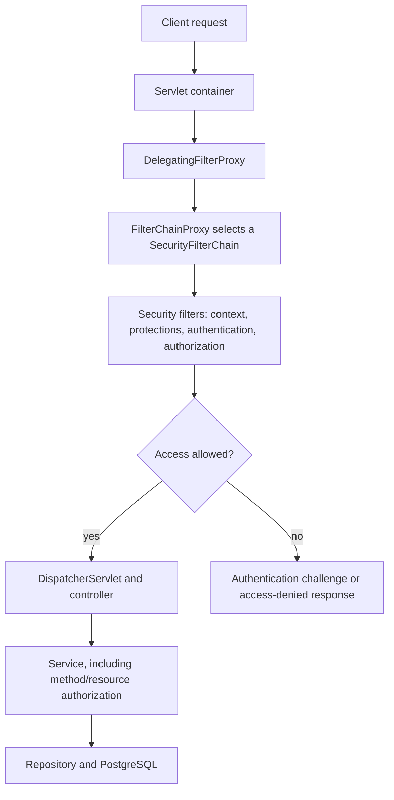

# Spring Security: explain the mechanism, then implement Orderflow access rules

Prepared 2026-09-29 for the learner's interview question. Baseline: Java 21,
Spring Boot 4.1.1, project commit `fe874e3`. Boot's dependency management selects
Spring Security 7.1.1. Use bean configuration and the lambda DSL; old examples
extending `WebSecurityConfigurerAdapter` do not apply to this version.

**Status: explanation and implementation reference.** These examples have not
been added to application source, compiled, or run. The application currently has
no security dependency, security configuration, user model, or order ownership.
The learner asked to understand security first. Selection of the initial client
and authentication mechanism is pending; HTTP Basic below is a teaching example.
Earlier class walkthrough and validation checkpoints remain open.

## 1. The problem Spring Security solves

Our API currently accepts requests without knowing the caller. A product price
change is as accessible to a customer as to an administrator. We need to establish
a caller's identity and apply explicit access rules before business actions run.

**Authentication:** establish identity using evidence such as a password or a
trusted access token. A JSON body saying `"userId": 42` is a claim, not proof.

**Authorization:** decide whether the authenticated caller may perform an action
on a resource. Identity alone does not entitle a caller to change prices or read
another customer's order.

Spring Security supplies authentication mechanisms, access-decision infrastructure,
security-context handling, servlet filters, method interception, and protections
such as CSRF handling and security response headers. We supply the application's
user source and business access policy. Spring Boot integrates that infrastructure
and supplies defaults. Adding the starter cannot invent our ownership policy.

Orderflow still needs DTO validation, database constraints, stock locking, and
transactions. Security does not replace those mechanisms. For example, a customer
may be authorized to place an order but request more stock than is available.

## 2. Decide how the client proves identity

These are distinct design choices, not mandatory stages of every application:

| Client/design | Credential presented to this backend | Main considerations |
| --- | --- | --- |
| HTTP Basic teaching client | Username/password in an Authorization header on requests | Simple way to inspect password authentication. Base64 is encoding, not encryption; use HTTPS outside local practice. |
| Browser with server session | Session identifier in a cookie after login | Server retains authentication state; logout invalidates it. Keep CSRF protection for authenticated writes and configure secure cookies. |
| API resource server | Bearer access token issued by a trusted authorization server | Backend verifies the token and maps trusted claims to permissions. It need not store users' passwords. |

JWT is a token format. OAuth 2.0 is an authorization framework; OpenID Connect
adds an identity/login layer. JWT is not automatically required by REST or
microservices. For interactive login using an identity provider, a browser-facing
application may use OAuth2/OIDC login plus a session while downstream APIs accept
access tokens. An ID token is not interchangeable with an API access token.

Source for the first mechanism: [HTTP Basic in Spring Security](https://docs.spring.io/spring-security/reference/servlet/authentication/passwords/basic.html).

## 3. Where security sits in a servlet application



`DelegatingFilterProxy` connects the servlet container to a Spring-managed filter.
`FilterChainProxy` selects the first matching `SecurityFilterChain`. That chain
contains filters configured through `HttpSecurity`; it is not our controller.
Within a chain, URL authorization rules are also evaluated in order.

Security can stop a request before Spring MVC invokes the controller or validates
its body. A chain may perform CORS/CSRF handling before authentication; the picture
is a responsibility map, not a list of every filter in exact execution order.

If multiple chains are configured, a first matching chain is selected rather than
combining every matching chain. `securityMatcher` selects a chain's scope;
`requestMatchers` inside it select authorization rules. A catch-all policy avoids
accidental unprotected paths. [Servlet architecture](https://docs.spring.io/spring-security/reference/servlet/architecture.html)

## 4. Password authentication: follow one request

For the HTTP Basic example, the client sends a username and password in its
Authorization header. The framework already supplies the filter that reads it.
We do not write a custom filter just to parse this standard header.

```text
BasicAuthenticationFilter
    → AuthenticationManager (usually ProviderManager)
        → DaoAuthenticationProvider
            → UserDetailsService loads the user
            → PasswordEncoder checks the submitted password
    → authenticated Authentication in SecurityContext
    → authorization decision
```

`UserDetailsService` looks up the stored username, encoded password, account status,
and authorities. It does not itself prove that the submitted password matches.
`DaoAuthenticationProvider` coordinates lookup and password verification. It
returns authenticated identity information when verification succeeds.
[Provider behavior](https://docs.spring.io/spring-security/reference/servlet/authentication/passwords/dao-authentication-provider.html)

| Framework type | Responsibility |
| --- | --- |
| `Authentication` | Represents an authentication attempt or an authenticated principal with granted authorities. |
| `AuthenticationManager` | Accepts an authentication attempt and delegates verification. |
| `AuthenticationProvider` | Implements verification for a supported credential type. Password and JWT verification use different providers. |
| `UserDetailsService` | Loads username/password-account information for the password provider. |
| `UserDetails` | The loaded account information exposed to that provider. |
| `PasswordEncoder` | Encodes passwords for storage and verifies a submitted password against the stored encoding. |
| `SecurityContext` | Holds the current Authentication. |
| `SecurityContextHolder` | Provides access to the current context; servlet usage normally uses thread-local storage. |
| `GrantedAuthority` | A granted permission string, such as `ROLE_ADMIN` or `SCOPE_orders.read`. |

The context is not a global "currently logged-in user" variable. Concurrent users
must remain isolated; framework request handling cleans up thread-bound context.
An arbitrary executor task does not automatically inherit the caller's identity.
Authentication persistence between requests depends on the configured mechanism
and context repository, not merely on setting a thread-local value.
[Authentication architecture](https://docs.spring.io/spring-security/reference/servlet/authentication/architecture.html)

## 5. Password handling

Use an adaptive, salted password encoding through `PasswordEncoder`. Do not store
plaintext passwords, use reversible encryption as password verification, or use
a fast unsalted hash as a password-storage scheme.

```java
@Bean
PasswordEncoder passwordEncoder() {
    return PasswordEncoderFactories.createDelegatingPasswordEncoder();
}
```

The delegating encoder's current encoding choice uses bcrypt with a format prefix
such as `{bcrypt}`. The prefix identifies how to verify stored values and supports
algorithm migration. At account creation, encode the raw password; at login,
verify with `matches(rawPassword, storedEncoding)`. Do not encode a second time
and compare strings: salts mean repeated encodings can differ.

Cost must be appropriate for the environment. Rechecking an expensive password
for every request is a reason to exchange it for a session or short-lived token
in an appropriate design. [Password storage](https://docs.spring.io/spring-security/reference/features/authentication/password-storage.html)

## 6. Authorization has both action and resource rules

Proposed Orderflow policy for teaching; product reads are authenticated in this
example. A public catalogue would be a separate deliberate policy choice.

| Existing endpoint | Target rule |
| --- | --- |
| `GET /api/learning/status` | Public. |
| `GET /api/products/{id}` | Customer or admin. |
| `POST /api/products` | Admin. |
| `PATCH /api/products/{id}/price` | Admin. |
| `POST /api/orders` | Customer or admin; derive owner from authenticated identity. |
| `GET /api/orders/{id}` | Owner customer or admin. |
| Anything else | Deny unless explicitly supported. |

These are all six current routes. There is no product-list GET, pricing controller,
login endpoint, or registration endpoint in the current application. Pricing
changed order calculation without adding another HTTP route.

`hasRole("ADMIN")` checks `ROLE_ADMIN` using the default role prefix.
`hasAuthority("product:write")` checks that exact permission string. Admin does
not automatically imply customer; grant both, authorize either, or define an
intentional hierarchy. OAuth scopes often map to `SCOPE_...` authorities rather
than application roles. [Request authorization](https://docs.spring.io/spring-security/reference/servlet/authorization/authorize-http-requests.html)

If Alice and Bob both have `CUSTOMER`, their role does not tell us which orders
they own. Checking only `.hasRole("CUSTOMER")` for order reads would leave an
object-access vulnerability. Resource ownership must be checked using trusted
identity and stored order data.

## 7. First configuration example: secure product APIs

This is reference code to explain before adding files. It intentionally leaves
order routes denied until their owner model and service checks exist. It is not
the complete target implementation above. CSRF protection remains enabled.

Add Boot-managed dependencies when implementing:

```xml
<dependency>
    <groupId>org.springframework.boot</groupId>
    <artifactId>spring-boot-starter-security</artifactId>
</dependency>
<dependency>
    <groupId>org.springframework.security</groupId>
    <artifactId>spring-security-test</artifactId>
    <scope>test</scope>
</dependency>
```

An illustrative `security/SecurityConfiguration.java`:

```java
package com.outforpavan.orderflow.security;

import jakarta.servlet.DispatcherType;
import org.springframework.beans.factory.annotation.Value;
import org.springframework.context.annotation.Bean;
import org.springframework.context.annotation.Configuration;
import org.springframework.http.HttpMethod;
import org.springframework.security.config.Customizer;
import org.springframework.security.config.annotation.web.builders.HttpSecurity;
import org.springframework.security.core.userdetails.User;
import org.springframework.security.core.userdetails.UserDetailsService;
import org.springframework.security.crypto.factory.PasswordEncoderFactories;
import org.springframework.security.crypto.password.PasswordEncoder;
import org.springframework.security.provisioning.InMemoryUserDetailsManager;
import org.springframework.security.web.SecurityFilterChain;

@Configuration
public class SecurityConfiguration {
    @Bean
    SecurityFilterChain securityFilterChain(HttpSecurity http) throws Exception {
        return http
                .authorizeHttpRequests(rules -> rules
                        .dispatcherTypeMatchers(DispatcherType.ERROR).permitAll()
                        .requestMatchers(HttpMethod.GET, "/api/learning/status").permitAll()
                        .requestMatchers(HttpMethod.GET, "/api/products/*")
                            .hasAnyRole("CUSTOMER", "ADMIN")
                        .requestMatchers(HttpMethod.POST, "/api/products").hasRole("ADMIN")
                        .requestMatchers(HttpMethod.PATCH, "/api/products/*/price")
                            .hasRole("ADMIN")
                        .anyRequest().denyAll())
                .httpBasic(Customizer.withDefaults())
                .build();
    }

    @Bean
    PasswordEncoder passwordEncoder() {
        return PasswordEncoderFactories.createDelegatingPasswordEncoder();
    }

    @Bean
    UserDetailsService demoUsers(
            @Value("${orderflow.demo.customer-password-hash}") String customerHash,
            @Value("${orderflow.demo.admin-password-hash}") String adminHash) {
        return new InMemoryUserDetailsManager(
                User.withUsername("customer").password(customerHash)
                        .roles("CUSTOMER").build(),
                User.withUsername("admin").password(adminHash)
                        .roles("ADMIN").build());
    }
}
```

The configured values must be valid encoded passwords including their format
prefix, kept in ignored local configuration or a suitable secret source. No
working password/hash is supplied or committed in this guide. In-memory users
are for the first lab, not durable account management.

`@Configuration` groups bean declarations. `@Bean` registers the returned objects
with Spring, which supplies method arguments. `HttpSecurity` builds the chain;
`httpBasic` selects the credential mechanism; request rules select access policy.
The error-dispatch rule permits internal error rendering, not arbitrary client
access to `/error`. A normal client request still encounters the route policy.

With a single `UserDetailsService` and encoder, Spring's standard configuration
can assemble password authentication. A custom `AuthenticationManager` bean or
custom login controller is not necessary just to enable Basic authentication.
Our beans replace the generated demo-user path; defining only a filter chain
would not define real users. [Boot integration](https://docs.spring.io/spring-boot/reference/web/spring-security.html)

Because CSRF remains active, an admin POST/PATCH also needs a valid CSRF token.
For manual practice, add a small, deliberately permitted token endpoint returning
the framework's `CsrfToken`, and retain its session cookie when submitting the
token header. This helper is not in the sample or current application. Tests can
use Spring Security's `.with(csrf())`. Basic credentials alone do not bypass CSRF.

## 8. Replace demo accounts with database authentication when appropriate

For locally managed password accounts, the implementation would add:

| New piece | Job |
| --- | --- |
| `AppUser` and `UserRepository` | Persist a stable account ID, unique normalized username, encoded password, enabled status, and server-assigned roles. |
| `DatabaseUserDetailsService` | Look up a user by username and return account status, password encoding, and authorities. |
| `OrderflowPrincipal` | Carry a stable local user ID plus security identity information without exposing credentials in API responses. |
| Account provisioning | Encode a password once when creating/changing it; assign permitted roles on the server. |

Keep the same password authentication provider and HTTP policy; change the lookup
source. Do not leave two unqualified `UserDetailsService` beans and expect Spring
to guess. An illustrative lookup outline is:

```text
loadUserByUsername(username)
    → repository lookup using the chosen username normalization policy
    → absent? throw UsernameNotFoundException
    → construct principal from stored ID, encoded password, status, and roles
```

The provider performs verification. Do not expose the stored hash through a user
response DTO. Registration, if added, must never accept a caller-selected `ADMIN`
role. For an external identity provider, this local password model may be
unnecessary. [UserDetailsService](https://docs.spring.io/spring-security/reference/servlet/authentication/passwords/user-details-service.html)

## 9. Add order ownership before allowing customer order reads

`PurchaseOrder` currently has no owner field. `OrderService.get` loads by ID alone.
To enforce the target rule, introduce a new V3 migration, leaving applied V1/V2
unchanged. For local accounts, add `owner_user_id` referencing the account table.

Existing orders have unknown owners. A deliberate transitional policy is nullable
ownership for legacy rows, readable only by admins, with every new order requiring
an authenticated owner. Do not assign all old orders to whichever user logs in
next. Backfill and enforce a database NOT NULL rule only after ownership is known.

Illustrative service algorithm, not existing code:

```text
create(request):
    identity = require authenticated customer/admin principal
    calculate price and reserve stock using the existing transaction
    save order with owner_user_id = identity.stableUserId

get(orderId):
    identity = require authenticated customer/admin principal
    if identity is admin:
        find order by orderId
    else:
        find order by orderId AND owner_user_id = identity.stableUserId
    if no visible order:
        return the same 404 used for a missing order
```

The owner comes from a trusted principal, not a JSON `userId` or an unsigned
`X-User-Id` header. Scope reads before producing the response. Returning a
consistent 404 for non-owner/missing orders is our proposed concealment policy;
a documented 403 policy can also be designed. List queries, when added, must also
scope to the owner or tenant rather than checking only individual GETs.

For JWT identities, use an intentional mapping from trusted issuer/subject to
local owner identity; do not assume a JWT subject is our numeric database ID.

Method security can also protect service entry points:

```java
@Configuration
@EnableMethodSecurity
class MethodSecurityConfiguration {
}

// On the public product-price change service method:
@PreAuthorize("hasRole('ADMIN')")
@Transactional
public ProductResponse changePrice(long id, UpdateProductPriceRequest request) {
    // Existing method body.
}
```

This fragment illustrates additions, not a complete class. Method security must
be enabled; `@PreAuthorize` does not become active simply because it is imported.
It uses Spring interception; self-invocation and manually constructed services can
bypass the normal proxy path. Keep a resource check in the order access logic.
Avoid making all product operations admin-only: a customer's authorized order
must still reserve stock. [Method security](https://docs.spring.io/spring-security/reference/servlet/authorization/method-security.html)

## 10. What changes for sessions or JWTs?

For a browser session, form or OIDC login establishes authentication and saves it
for subsequent requests; a session cookie locates that state. Logout, expiry,
session fixation protection, cookie flags, CSRF, and multi-instance session
storage become part of the design. A hand-written login controller must perform
the framework's required context persistence/session steps; placing an object in
`SecurityContextHolder` alone is insufficient. [Session management](https://docs.spring.io/spring-security/reference/servlet/authentication/session-management.html)

For a JWT resource server, use Boot's OAuth2 resource-server starter and the
standard `oauth2ResourceServer(oauth2 -> oauth2.jwt(Customizer.withDefaults()))`
configuration, rather than writing a filter that merely decodes tokens.

The authorization server authenticates the user and issues an access token.
Orderflow verifies its signature with trusted keys, issuer, time validity, and
expected audience, then maps trusted scopes/roles to authorities. Configure the
expected audience; do not assume issuer configuration alone checks every intended
resource. The same endpoint and ownership rules still apply.

A signed JWT's content is normally readable; signing is not encryption. Issuing
tokens, refresh, revocation, logout behavior, and permission freshness are distinct
design concerns. A resource server is not automatically an authorization server.
[JWT resource-server support](https://docs.spring.io/spring-security/reference/servlet/oauth2/resource-server/jwt.html)

## 11. CSRF, CORS, and error handling are separate concerns

CSRF exploits credentials a browser automatically attaches to a cross-site
request. Cookie-based authentication needs an appropriate defense; browsers may
also automatically resend Basic credentials. "REST" or `STATELESS` alone is not
a reason to disable CSRF. A bearer-only API where credentials are explicitly added
to the Authorization header and are never sourced from automatic cookies can
justify disabling it after that assumption is made explicit.
[CSRF reference](https://docs.spring.io/spring-security/reference/servlet/exploits/csrf.html)

CORS controls allowed browser cross-origin access and preflight handling. It does
not authenticate a caller or stop a non-browser HTTP client. Configure intended
origins/methods/headers; do not solve authentication failures by allowing every
origin. Process preflight appropriately before requiring user credentials.
[CORS integration](https://docs.spring.io/spring-security/reference/servlet/integrations/cors.html)

For our proposed Basic API:

- Missing/invalid credentials on a protected GET normally produce 401, with an
  appropriate authentication challenge.
- An authenticated caller lacking the required role normally receives 403.
- A failed CSRF check can produce 403 even before credential authentication.
- A browser form-login flow can redirect to login instead of returning API-style
  401. Status behavior depends on the selected mechanism and failure.

`AuthenticationEntryPoint` starts authentication or returns authentication failures.
`AccessDeniedHandler` renders access-denied responses; authorization failures for
an authenticated caller and CSRF failures are typical uses. Errors that arise in
filters do not automatically reach our MVC `ApiExceptionHandler`.
For consistent JSON, implement security handlers with a deliberate response shape
and preserve the Basic/Bearer challenge header where appropriate. Do not reveal
whether a login username exists or log raw passwords/tokens.

## 12. Prove authentication and authorization separately

These are planned acceptance cases, not tests performed in this lesson:

| Scenario | Expected result |
| --- | --- |
| Public learning GET without credentials | 200. |
| Protected product GET without credentials | 401 under the Basic design. |
| Protected GET with a wrong password | 401. |
| Protected GET with valid customer credentials | Controller executes normally. |
| Customer product POST, otherwise valid with CSRF token | 403 and no product-service call. |
| Admin product POST, valid body and CSRF token | 201. |
| Admin write without CSRF token | 403 while CSRF protection is enabled. |
| Customer A reads A's order after ownership implementation | 200. |
| Customer B reads A's order | Concealed 404 under the proposed policy. |
| Admin reads either order | 200. |
| Customer supplies owner or role in input | Rejected by the strict DTO or otherwise never trusted. |
| Unlisted route/method | Denied by the access policy. |

`@WithMockUser` or `.with(user(...))` can test access rules, but they bypass real
password checking. Include credential-based requests using the actual configured
provider and encoded accounts. For role-denial tests on POST/PATCH, supply valid
CSRF so a 403 proves the role decision, not a missing-token failure. Keep filters
active in security tests and verify that denied requests did not call the service.
[Mock users](https://docs.spring.io/spring-security/reference/servlet/test/mockmvc/authentication.html),
[CSRF test support](https://docs.spring.io/spring-security/reference/servlet/test/mockmvc/csrf.html).

Existing direct service/integration tests must establish identity once method
security is introduced. The stock-race test uses executor workers: establish each
worker's buyer identity explicitly and clear it afterward. Preserve transaction,
pricing, and stock-locking tests. The latest existing pricing evidence records
74 passing tests on 2026-09-28; those are not security tests and were not rerun here.

## 13. Interview explanation and follow-ups

A concise explanation to practice in your own words:

> I first define the identity source and access policy. Spring Security processes
> servlet requests through a configured filter chain. Authentication verifies
> credentials and establishes a principal; authorization checks permissions for
> the requested action. I protect administrative product writes and enforce order
> ownership in the service/data-access path. I choose sessions or bearer tokens
> based on the client, handle CSRF accordingly, and test both successful access
> and unauthenticated, wrong-role, and cross-customer denial.

Then be ready to answer:

1. **Does UserDetailsService authenticate a password?** It loads account data;
   the password provider verifies the submitted credential using an encoder.
2. **Does authenticated mean admin?** No; identity and permissions are separate.
3. **Does ADMIN automatically include CUSTOMER?** No, not without deliberate grants
   or role hierarchy configuration.
4. **Can a customer read any order because the URL requires CUSTOMER?** No; roles
   do not establish resource ownership.
5. **Must every service issue JWTs?** No. Token issuance belongs to the chosen
   authorization system; resource servers normally validate access tokens.
6. **Is adding @PreAuthorize enough?** Enable method security and account for proxy
   invocation; still implement the actual ownership/business rule.
7. **Can a 403 test accidentally prove the wrong thing?** Yes, a missing CSRF token
   may block the request before the role rule being tested.
8. **Can the paid priority field grant an account privilege?** No. In the current
   pricing feature it is a paid service selection, not authenticated membership.
9. **Does security prevent duplicate orders?** No; idempotency is a separate
   requirement. Current pessimistic stock locking is also a separate mechanism.

Next teaching checkpoint: Alice and Bob are both customers. Alice creates an
order. Which facts must Orderflow check before returning it to Bob? The learner's
answer is pending; this reference is not evidence of demonstrated understanding.
