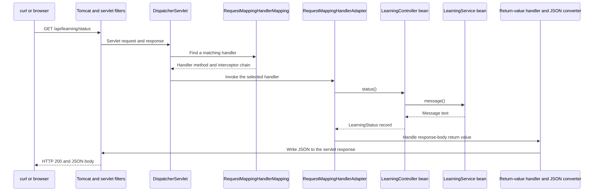

# Orderflow technical notebook

A living, sequential explanation of the internals behind our project, maintained
alongside each active learning session. Start with the concept, trace its mechanism,
observe it in code, then explain its failures and tradeoffs.

**Baseline:** Java 21, Spring Boot 4.1.1, Spring Framework 7.0.9; application code
at commit `3513f6a`. First notes prepared on 2026-09-24.
**Current implementation:** Lesson 002 constructor injection (2026-09-25).
Historical baseline observations are labeled; current wiring is described below.

## How to use this notebook

Read only the chapter relevant to the current lesson. The deeper material is a
reference to revisit, not a requirement to learn every internal class immediately.
Try follow-up questions before expanding their answer notes.

Each chapter contains the problem, current project connection, internal sequence,
failure cases, proposed observations, and interview follow-ups. Official references
and version-pinned implementation links support framework claims. Unversioned
documentation may change; match it to the version resolved by the project.

Three statuses must stay distinct:

- **Discussed:** an explanation was provided in our conversation.
- **Prepared:** reference notes or an exercise plan exist.
- **Demonstrated:** the learner performed the exercise, explained the mechanism,
  and supplied reviewed evidence. This is never inferred from a generated document.

The baseline startup and HTTP checks were performed during setup. On 2026-09-25
the learner confirmed receiving the endpoint's JSON. The remaining exercises and
reviewed explanations are pending. New experiments described here are proposed
unless an evidence record says otherwise.

Update on 2026-09-25: the learner's missing-service startup prediction was reviewed
as correct, with the clarification that Spring's container resolves the dependency.
Live failure/recovery evidence remains pending. The [three-day sprint](THREE-DAY-SPRINT.md)
groups teaching into feature blocks while this notebook retains sequential detail.

## Reading order

| Order | Chapter | Current state |
| --- | --- | --- |
| 1 | [Application startup and auto-configuration](#startup) | Fundamental explanation discussed; deeper notes prepared |
| 2 | [IoC, controller creation, and bean lifecycle](#beans) | Controller-creation explanation discussed; deeper notes prepared |
| 3 | [HTTP dispatch and JSON serialization](#http-flow) | Basic request path discussed; deeper notes prepared |
| 4 | [Constructor injection](#constructor-injection) | Implementation trainer-verified; learner practice pending |
| Log | [Conversation follow-ups](#follow-up-log) | Open questions and answer references |
| Later | [Next chapters](#next-chapters) | Planned in curriculum order |

Use the [roadmap](ROADMAP.md) for lesson order, the [PDF coverage tracker](PDF-COVERAGE.md)
for all 95 source questions, and the [lab catalog](LAB-CATALOG.md) for practical work.
The [interview notebook](INTERVIEW-NOTES.md) stores the learner's own reviewed answers.

## The code this notebook explains

| File | Role |
| --- | --- |
| [pom.xml](../pom.xml) | Java target, dependency management, web starter, and packaging plugin |
| [OrderflowApplication](../src/main/java/com/outforpavan/orderflow/OrderflowApplication.java) | Java entry point and application configuration |
| [LearningController](../src/main/java/com/outforpavan/orderflow/learning/LearningController.java) | GET endpoint and response record |
| [LearningService](../src/main/java/com/outforpavan/orderflow/learning/LearningService.java) | Constructor-injected message supplier |
| [LearningControllerTest](../src/test/java/com/outforpavan/orderflow/learning/LearningControllerTest.java) | MVC response-contract checks |

<a id="startup"></a>

## 1. From Java `main()` to a running Spring Boot application

These are deeper reference notes prepared alongside Lesson 001. Reading them or having a working application does not establish learner mastery. The exercise, explanation, and debugger observations remain to be completed by the learner.

### 1.1 Connect the build to our application

Our entry point is `com.outforpavan.orderflow.OrderflowApplication`. Its `main()` calls `SpringApplication.run(OrderflowApplication.class, args)`. Java invokes `main()`; Boot then coordinates Spring initialization. The class passed to `run` supplies our primary configuration.

Keep these three mechanisms distinct:

| Mechanism in our project | Responsibility |
| --- | --- |
| Maven parent: `spring-boot-starter-parent:4.1.1` | Supplies dependency management and Maven build defaults through POM inheritance. |
| Dependency: `spring-boot-starter-webmvc` | Brings a compatible collection of web libraries into the dependency graph. |
| Runtime auto-configuration | Evaluates configuration candidates and conditions while Spring builds the application context. |

Dependency management chooses versions for dependencies that participate in the build; it does not add every managed library. A starter adds dependencies; it does not itself execute the application. The separate `spring-boot-maven-plugin` supports running and packaging the application. See the official [build-system reference](https://docs.spring.io/spring-boot/4.1/reference/using/build-systems.html) and [Maven parent/plugin explanation](https://docs.spring.io/spring-boot/4.1/maven-plugin/using.html).

Our POM requests Java 21. The `dev` helper chooses a Java installation and delegates to Maven Wrapper; setting `<java.version>21</java.version>` does not install or select a JDK for the IDE. This distinction explains why terminal execution and IntelliJ execution can disagree.

### 1.2 What `@SpringBootApplication` actually combines

In the Boot 4.1.1 source, the annotation combines:

- `@SpringBootConfiguration`: a Boot configuration marker built on Spring's `@Configuration`. Boot tests can use it to locate the application configuration.
- `@EnableAutoConfiguration`: enables the import mechanism that selects applicable framework configuration.
- `@ComponentScan`: discovers eligible application components in the configured package scope.

The declaration also carries Java's `@Target(TYPE)`, `@Retention(RUNTIME)`, `@Documented`, and `@Inherited` metadata. Its component scan includes custom exclusions for `TypeExcludeFilter` and `AutoConfigurationExcludeFilter`. These support filtering and keep auto-configuration classes out of ordinary component scanning. The exact annotation declaration is available in [Boot 4.1.1 source](https://github.com/spring-projects/spring-boot/blob/v4.1.1/core/spring-boot-autoconfigure/src/main/java/org/springframework/boot/autoconfigure/SpringBootApplication.java); the configuration marker is described in the [SpringBootConfiguration API](https://docs.spring.io/spring-boot/api/java/org/springframework/boot/SpringBootConfiguration.html).

With our package layout, the default component scan begins at `com.outforpavan.orderflow`. The controller's `learning` subpackage falls inside it. This is package-scoped discovery, not a scan of every class everywhere. `scanBasePackages` adjusts component scanning only; it is not a universal switch for every kind of framework scanning. See the [SpringBootApplication API](https://docs.spring.io/spring-boot/4.1/api/java/org/springframework/boot/autoconfigure/SpringBootApplication.html).

### 1.3 Startup: the useful order of operations

For our ordinary JVM launch, this is a conceptual sequence:

1. **Construct the launcher.** Boot records the primary source and deduces the web application type from available classes.
2. **Prepare the environment.** Command-line arguments and other property sources provide runtime settings; profiles and configuration influence the setup.
3. **Create and prepare the context.** Boot chooses an appropriate context, applies initializers, and loads the primary configuration source.
4. **Refresh the context.** Spring processes configuration, registers definitions and infrastructure, creates required beans, and runs initialization/lifecycle work.
5. **Finish application startup.** Boot announces the started phase, invokes application/command-line runners if present, and publishes readiness after successful completion.

The launcher returns the configured context. This list summarizes the normal path; failures interrupt it, and customization can change details. The version-pinned [SpringApplication implementation](https://github.com/spring-projects/spring-boot/blob/v4.1.1/core/spring-boot/src/main/java/org/springframework/boot/SpringApplication.java) is the authority for its orchestration.

Refresh deserves one precision: server creation and server start are separate operations. In this servlet application, `ServletWebServerApplicationContext.onRefresh()` creates the server using a `ServletWebServerFactory`. Later refresh work instantiates remaining non-lazy singletons and invokes lifecycle processing. The registered `WebServerStartStopLifecycle` calls the server's `start()` method. Therefore, “Spring creates every bean, then creates Tomcat” is an inaccurate trace. See the pinned [servlet context](https://github.com/spring-projects/spring-boot/blob/v4.1.1/module/spring-boot-web-server/src/main/java/org/springframework/boot/web/server/servlet/context/ServletWebServerApplicationContext.java), [Framework 7.0.9 refresh implementation](https://github.com/spring-projects/spring-framework/blob/v7.0.9/spring-context/src/main/java/org/springframework/context/support/AbstractApplicationContext.java), and [server lifecycle implementation](https://github.com/spring-projects/spring-boot/blob/v4.1.1/module/spring-boot-web-server/src/main/java/org/springframework/boot/web/server/servlet/context/WebServerStartStopLifecycle.java).

### 1.4 Auto-configuration is conditional registration

Application scanning finds our controller. Auto-configuration follows a separate path: `@EnableAutoConfiguration` imports `AutoConfigurationImportSelector`. Candidate names come from classpath resources named `META-INF/spring/org.springframework.boot.autoconfigure.AutoConfiguration.imports`. The selector removes duplicates, applies exclusions/filtering, and participates in ordered configuration imports. See [EnableAutoConfiguration](https://docs.spring.io/spring-boot/api/java/org/springframework/boot/autoconfigure/EnableAutoConfiguration.html) and the pinned [import selector](https://github.com/spring-projects/spring-boot/blob/v4.1.1/core/spring-boot-autoconfigure/src/main/java/org/springframework/boot/autoconfigure/AutoConfigurationImportSelector.java).

Being a candidate does not guarantee registration of every bean inside it. Conditions can inspect classes, properties, application type, or existing bean definitions. For example, `@ConditionalOnMissingBean` enables a default only when its specified matching bean is absent. A user-defined bean causes only configurations with the relevant conditions to back off; it does not disable Boot globally. See the official [auto-configuration development reference](https://docs.spring.io/spring-boot/4.1/reference/features/developing-auto-configuration.html).

### 1.5 Proposed observation exercises — not yet executed

Use these during a guided session and record actual observations afterward:

1. Run `./dev spring-boot:run -Dspring-boot.run.arguments=--debug`. Pick one positive and one negative match in the condition report. Explain the condition and evidence, rather than merely reading the configuration's name. Boot documents this diagnostic in its [auto-configuration guide](https://docs.spring.io/spring-boot/4.1/reference/using/auto-configuration.html).
2. In IntelliJ, put a breakpoint in our `main()`, then inspect `SpringApplication.run`, `createApplicationContext`, and `AbstractApplicationContext.refresh`. Record the concrete context type. Use attached sources matching our resolved versions.
3. Inspect `AutoConfigurationImportSelector.getAutoConfigurationEntry` and `getCandidateConfigurations`. Distinguish candidate names from the final conditionally registered beans.
4. Start with `--server.port=8081`, predict the endpoint address, call it, and stop that process. This checks whether a runtime property changes infrastructure without changing the controller.

### 1.6 Follow-up questions and answer notes

<details>
<summary>1. Could we build this without @SpringBootApplication?</summary>

Yes. Its constituent configuration, scan, and auto-configuration mechanisms can be declared separately. Reproducing identical behavior requires preserving relevant attributes and filters, not just memorizing three annotation names.

</details>

<details>
<summary>2. Does the web starter guarantee that a server starts?</summary>

No. Dependencies make features available. The selected application type, effective configuration, matching conditions, and successful initialization determine the outcome. A startup exception can prevent a usable server.

</details>

<details>
<summary>3. Why can Boot configure infrastructure outside our package?</summary>

Auto-configuration candidates are imported through their classpath metadata. They do not need to be application components under `com.outforpavan.orderflow`.

</details>

<details>
<summary>4. Is a server listening the same as application readiness?</summary>

No. Runners can still be doing startup work. Boot's readiness notification follows successful runners; a listening socket alone does not prove that initialization succeeded. See [application events and availability](https://docs.spring.io/spring-boot/4.1/reference/features/spring-application.html).

</details>

<details>
<summary>5. Does proxyBeanMethods=false disable dependency injection?</summary>

No. It disables interception of direct calls between configuration `@Bean` methods. Spring still processes those bean definitions. This setting matters when configuration methods call one another; our current main class has no such methods.

</details>

<details>
<summary>6. What evidence would explain an unexpected auto-configuration decision?</summary>

Check resolved dependencies, active properties/profiles, explicit exclusions, existing bean definitions, and the condition report. Identify the particular failed or matched condition before proposing a dependency or configuration change.

</details>

<a id="beans"></a>

## 2. Who creates the controller? IoC and the bean lifecycle

**Learning status:** the core explanation has been discussed; the deeper reference below is prepared for progressive study. The learner's explanation and experiments remain pending.

### 2.1 The object, its definition, and its owner

In Orderflow, `main()` does not construct `LearningController`. Spring creates and manages that object. This is **Inversion of Control (IoC)**: object assembly and lifecycle decisions are delegated to a container. **Dependency injection (DI)** is a way to supply an object's collaborators; the Lesson 002 implementation in Chapter 4 makes this concrete.

`BeanFactory` supplies the fundamental bean-management contract. `ApplicationContext` builds on it with facilities such as application events and resource access. Spring Boot initializes an appropriate application context for our application. A **bean** is an object managed by that container. [Spring IoC introduction](https://docs.spring.io/spring-framework/reference/core/beans/introduction.html)

Keep these three things separate:

| Term | In our controller example |
| --- | --- |
| Java class | `LearningController`: the type compiled from our source |
| `BeanDefinition` | Metadata describing how Spring should create and configure a bean, including its class and scope |
| Bean instance | The actual object on which `status()` can execute |

A definition can exist before its instance. Registering metadata and constructing an object are different operations. [BeanDefinition API, Framework 7.0.9](https://docs.spring.io/spring-framework/docs/7.0.9/javadoc-api/org/springframework/beans/factory/config/BeanDefinition.html)

### 2.2 Why Spring discovers this class

Our application class is in `com.outforpavan.orderflow`; the controller is in its `learning` subpackage, inside our default component-scan boundary.

The relevant annotation relationships are:

```text
@RestController
  ├── @Controller
  │     └── @Component → eligible for component scanning
  └── @ResponseBody    → MVC response-body semantics
```

These are **meta-annotations**: annotations placed on another annotation. Their roles differ. The component stereotype helps register a bean definition; response-body semantics tell MVC how to handle return values. Spring's default naming produces `learningController` for our class. Scanning does not construct an instance of every Java class it finds. [Component scanning](https://docs.spring.io/spring-framework/reference/core/beans/classpath-scanning.html)

### 2.3 From metadata to a usable bean

The normal path for our controller is:

```text
discover class → register definition → process metadata
    → select constructor → resolve constructor arguments → create object
    → populate any configured fields/setters
    → initialize and post-process → expose managed bean
```

Two extension points explain much of Spring's apparent “magic.” A `BeanFactoryPostProcessor` can change **configuration metadata** before ordinary application beans are instantiated. A `BeanPostProcessor` participates in processing **instances**, including callbacks around initialization. Specialized post-processors also participate in earlier creation phases. Infrastructure may return a proxy when a configured feature requires interception; being a bean does not mean every object is proxied. [Container extension points](https://docs.spring.io/spring-framework/reference/core/beans/factory-extension.html)

At the first baseline our controller declared no constructor, so Java supplied a default no-argument constructor. This default came from Java, not from `@RestController`. Since Lesson 002 the controller declares a constructor requiring `LearningService`; Java no longer supplies that former default constructor. [Java 21 default constructors](https://docs.oracle.com/javase/specs/jls/se21/html/jls-8.html#jls-8.8.9)

Spring does **not** require every bean to have a no-argument constructor. For an ordinary component with one declared constructor, Spring uses that constructor even without `@Autowired`, resolving its dependencies. Multiple constructors need the applicable selection rules; simply adding more constructors is not a dependency-resolution strategy. Lesson 002 introduces a missing dependency; multiple-candidate ambiguity remains a later B03 exercise. [Constructor injection rules](https://docs.spring.io/spring-framework/reference/core/beans/annotation-config/autowired.html)

After dependency population, supported initialization callbacks can run. If distinct callbacks are configured, the usual initialization sequence is `@PostConstruct`, `InitializingBean.afterPropertiesSet()`, then a custom init method. Standard AOP wrapping normally follows target initialization. During orderly context shutdown, configured destruction callbacks can release resources. Our controller currently defines none of these callbacks. This outline describes the normal path, not every specialized factory or circular-reference case. [Bean lifecycle](https://docs.spring.io/spring-framework/reference/core/beans/factory-nature.html)

Ordinary singleton beans are normally created eagerly during context refresh. Lazy initialization can defer creation, although an eager bean's dependency can still force an otherwise lazy bean to be created. [Lazy initialization](https://docs.spring.io/spring-framework/reference/core/beans/dependencies/factory-lazy-init.html)

### 2.4 One shared controller and concurrent requests

The default scope is **singleton**: one shared instance for a bean definition in a container. It does not mean one object of that class throughout the JVM, and it does not prevent another application context or a manual `new` from creating another object. Other scopes include prototype, request, session, application, and websocket; web scopes require suitable web infrastructure. [Bean scopes](https://docs.spring.io/spring-framework/reference/core/beans/factory-scopes.html)

For our application, the consequence is that concurrent requests can execute against the same controller. **Singleton scope does not make mutable fields thread-safe.** For example, adding `private String currentUser;` and changing it for each request could expose one request's data to another. Our current `status()` method has no mutable controller fields and creates its response locally. Preserve that separation when we add inputs and business logic.

### 2.5 Failure predictions and a pending experiment

In the current application:

| Change | Expected consequence |
| --- | --- |
| Remove `@RestController`, add nothing | Default scanning no longer registers this class |
| Replace it with `@Component` | A bean exists, but it is not recognized as an annotated MVC controller |
| Construct it using `new LearningController(new LearningService())` in ordinary code | Separate Java objects exist; Spring does not automatically manage them |

The second row matters because Framework 7.0.9's `RequestMappingHandlerMapping` expects a controller stereotype; leaving `@GetMapping` alone is insufficient. [Handler detection API](https://docs.spring.io/spring-framework/docs/7.0.9/javadoc-api/org/springframework/web/servlet/mvc/method/annotation/RequestMappingHandlerMapping.html#isHandler(java.lang.Class))

**Pending guided experiment:** set a breakpoint in the controller's explicit constructor. Restart once, then call the endpoint twice with a breakpoint in `status()`. Predict one controller-constructor hit and two method hits in that process. Then temporarily remove the controller annotation, restart, and observe the missing handler. Restore it afterward. The learner has called the baseline endpoint; this debugger/failure experiment remains pending.

### 2.6 Follow-up questions, from fundamentals to interview depth

Try each answer before opening its reference.

<details>
<summary>Q2.1 — Who creates LearningController, and why?</summary>

Spring's container creates it from registered bean metadata. Its controller stereotype makes it eligible for scanning within our application package.

</details>

<details>
<summary>Q2.2 — Is a BeanDefinition the controller object?</summary>

No. It describes creation and configuration. The bean instance is the resulting managed object.

</details>

<details>
<summary>Q2.3 — Does removing @RestController always make a class impossible to register?</summary>

No. Our default scan would stop discovering it, but explicit registration such as an `@Bean` method is another mechanism. Registration alone does not establish controller semantics.

</details>

<details>
<summary>Q2.4 — Does a bean need a default constructor?</summary>

No. A single parameterized constructor can declare required collaborators. Spring must resolve those arguments to construct the component.

</details>

<details>
<summary>Q2.5 — Does one singleton mean one controller per request or per JVM?</summary>

Neither. It means one shared instance per bean definition per container. Concurrent requests can use that instance.

</details>

<details>
<summary>Q2.6 — Why distinguish bean-factory post-processing from bean post-processing?</summary>

One works on metadata; the other participates in processing objects. This distinction helps explain configuration changes, dependency population, initialization, and eligible proxy wrapping.

</details>

<details>
<summary>Q2.7 — Why is a shared currentUser field unsafe even in a Spring bean?</summary>

Requests could overwrite shared state. Container ownership provides no automatic synchronization or request isolation. Keep request data local or use an explicitly suitable design.

</details>

<details>
<summary>Q2.8 — What evidence would support your lifecycle explanation?</summary>

Compare constructor and handler breakpoint hits across repeated requests in one process, inspect the managed bean, and explain what changes after a restart. State the experiment's limits: it does not prove thread safety or cover other scopes.

</details>

<a id="http-flow"></a>

## 3. From an HTTP request to a JSON response

### 3.1 The concrete request we can explain

Our current API has one application endpoint:

```http
GET /api/learning/status HTTP/1.1
Host: localhost:8080
Accept: application/json
```

The application method returns a `LearningStatus` record with `application` and
`message` fields. It does not parse a TCP connection, search for a route, or write
JSON bytes itself. Those responsibilities belong to different infrastructure
components. Follow along in [LearningController.java](../src/main/java/com/outforpavan/orderflow/learning/LearningController.java).

### 3.2 Startup discovers routes; requests select a route

Two kinds of registration matter. Component scanning registers the controller
as a bean. MVC's `RequestMappingHandlerMapping` then examines controller types
and methods to register request mappings. Our `@GetMapping` is a composed
mapping for HTTP GET. The mapping describes path and HTTP-method conditions;
other endpoints can also constrain headers, parameters, or media types.
The registry is built during MVC initialization, not by scanning every Java
class again for every HTTP request. See [mapping conditions](https://docs.spring.io/spring-framework/reference/web/webmvc/mvc-controller/ann-requestmapping.html)
and the [handler-mapping API](https://docs.spring.io/spring-framework/docs/7.0.9/javadoc-api/org/springframework/web/servlet/mvc/method/annotation/RequestMappingHandlerMapping.html).

This distinction explains why `@GetMapping` on an arbitrary unmanaged object
is insufficient. There must be a controller known to MVC and a registered
mapping that matches the request.

### 3.3 The request path, one responsibility at a time



This is the successful synchronous path for our application. It omits exception,
asynchronous, and short-circuit branches; it is not a complete framework call stack.

1. **Tomcat and servlet filters:** the embedded servlet container receives HTTP
   traffic and dispatches through applicable filters to the mapped servlet.
2. **`DispatcherServlet`:** the MVC front controller coordinates processing. It
   delegates route selection and invocation instead of containing our business logic.
3. **`HandlerMapping`:** selects a handler and its interceptor chain. Interceptors,
   when present, can run before and after controller processing.
4. **`HandlerAdapter`:** knows how to invoke that handler type. For annotation-based
   methods, `RequestMappingHandlerAdapter` uses argument resolvers and return-value
   handlers. Our `status()` has no arguments, so there is no input binding to do.
5. **Controller:** calls `LearningService.message()` and creates the response record.
6. **Response-body processing:** converts that return value into the HTTP body;
   the servlet response is eventually sent to the client.

The coordination model is described by [DispatcherServlet](https://docs.spring.io/spring-framework/reference/web/webmvc/mvc-servlet.html)
and [request processing](https://docs.spring.io/spring-framework/reference/web/webmvc/mvc-servlet/sequence.html).
The [handler-adapter API](https://docs.spring.io/spring-framework/docs/7.0.9/javadoc-api/org/springframework/web/servlet/mvc/method/annotation/RequestMappingHandlerAdapter.html)
documents argument and return-value extension points. We have not added Spring
Security, so a security filter chain is a future topic, not a current project feature.

### 3.4 How the record becomes JSON

`@RestController` includes response-body semantics. MVC therefore processes the
returned record as response content. This does not mean that the annotation
itself serializes objects or that every return type must become JSON.
See [response-body handling](https://docs.spring.io/spring-framework/reference/web/webmvc/mvc-controller/ann-methods/responsebody.html).

For this method, `RequestResponseBodyMethodProcessor` is the relevant return-value
handler. It uses message converters to write the object, taking the return type
and media-type negotiation into account. The client signals acceptable response
types through `Accept`; `Content-Type` describes the body actually sent. Our
successful response uses `application/json`.
See the [return-value processor](https://docs.spring.io/spring-framework/docs/current/javadoc-api/org/springframework/web/servlet/mvc/method/annotation/RequestResponseBodyMethodProcessor.html).

The baseline packaged JAR contains Jackson databind **3.1.5** and Spring Web
**7.0.9**. For Jackson 3 JSON conversion, the framework converter is
`JacksonJsonHttpMessageConverter`. Older tutorials may instead describe
`MappingJackson2HttpMessageConverter`; that is the Jackson 2 converter, not an
interchangeable class name. Check the resolved dependencies before debugging
serialization internals. See [message converters](https://docs.spring.io/spring-framework/reference/web/webmvc/message-converters.html).

The record instance returned by `status()` is created by our own `new` expression
on each call. It is not automatically a Spring bean because a controller returns
it. This is separate from the container-managed lifetime of the controller.

### 3.5 Debug by the layer that failed

Use the symptom to choose an investigation, then verify the hypothesis:

| Symptom | First investigation |
| --- | --- |
| Connection refused | Is the app running and listening at the requested host and port? |
| 404 | Check the URL, context path, controller discovery, and registered mappings. |
| 405 | Check the HTTP method against the registered mapping; POST is not GET. |
| 406 | Check the requested response media type and available writers. |
| 500 | Inspect the exception and stack trace; a matched route can still fail during invocation or serialization. |

These are diagnostic starting points, not proofs of one specific root cause.
MVC can delegate exceptions to `HandlerExceptionResolver` implementations; error
responses can also involve the servlet container and Boot's error handling.
We will implement an intentional application error contract in a later lesson.
See [MVC exception resolution](https://docs.spring.io/spring-framework/reference/web/webmvc/mvc-servlet/exceptionhandlers.html).

### 3.6 Evidence and the next experiments

**Previously verified at baseline `3513f6a`:** two tests passed and a real localhost
request to the packaged application returned HTTP 200 with the expected JSON.

- `OrderflowApplicationTests` checks that the application context can load in
  the default mock web environment. It does not start a listening Tomcat port.
- `LearningControllerTest` checks MVC routing, status, content type, and JSON
  values using MockMvc. It is not a plain direct call to `status()` and not a
  real socket request. See [MockMvc's test boundary](https://docs.spring.io/spring-framework/reference/testing/mockmvc/overview.html).
- The separate localhost smoke check exercised the packaged application and
  its actual network endpoint. It did not prove every failure path or concurrency property.

**Proposed; not executed as learner exercises:** use the debugger at
`LearningController.status()`, then inspect `DispatcherServlet.doDispatch`,
`RequestMappingHandlerAdapter.invokeHandlerMethod`, and
`RequestResponseBodyMethodProcessor.handleReturnValue`. Observe what each layer
receives and returns. Source navigation may require downloading dependency sources.

Try one request variant at a time after starting the application:

```sh
curl -i http://localhost:8080/api/learning/status
curl -i -X POST http://localhost:8080/api/learning/status
curl -i http://localhost:8080/api/learning/missing
```

Predict 200, 405, and 404 respectively for the unchanged baseline. Record the
actual responses before treating the predictions as observations. The planned
message-change exercise remains in [Lesson 001](lessons/001-first-spring-boot-application.md).

### 3.7 Follow-up questions

<details>
<summary>H1 — Does Tomcat call our controller directly?</summary>

Tomcat dispatches to the servlet through the servlet filter chain. Spring MVC's
DispatcherServlet coordinates handler lookup and invocation through its delegates.
Our controller is not itself a Servlet.

</details>

<details>
<summary>H2 — Why separate HandlerMapping from HandlerAdapter?</summary>

Selecting a handler and knowing how to invoke it are distinct responsibilities.
This lets the dispatcher coordinate different handler styles without hard-coding
each invocation mechanism into one dispatcher implementation.

</details>

<details>
<summary>H3 — Does Spring scan all classes on every request?</summary>

No. MVC registers annotated mappings during initialization and uses them to match
requests. A runtime mapping lookup is different from classpath component scanning.

</details>

<details>
<summary>H4 — Why does this record become JSON rather than an HTML view?</summary>

The controller has response-body semantics, and the configured message conversion
can write this return value as JSON. A Java record by itself does not choose HTTP
serialization or turn itself into a web response.

</details>

<details>
<summary>H5 — Does a passing MockMvc test prove the network server works?</summary>

No. It exercises Spring MVC with mock servlet request and response objects. A real
HTTP test supplies additional evidence about server startup and network dispatch.
Neither test automatically proves database, security, or deployment behavior.

</details>

<details>
<summary>H6 — If the mapping exists, can the client still receive an error?</summary>

Yes. Invocation, response conversion, and surrounding infrastructure can fail after
route selection. Debug the failing stage rather than assuming every HTTP error is
a missing controller annotation.

</details>

**Interview synthesis:** explain the boundaries from server to dispatcher,
mapping, adapter, controller, and message converter. Then connect a concrete
failure to the layer you would inspect and the evidence you would collect.

<a id="constructor-injection"></a>

## 4. Constructor injection: connecting two managed objects

**Implemented on 2026-09-25; missing-service prediction reviewed, live practice and remaining explanations pending.**
Use [Lesson 002](lessons/002-constructor-injection.md) for the guided code walk-through
and six follow-up answers. The [lab record](labs/B03-001-constructor-injection.md)
contains the exact observations and their limits.

### 4.1 The required dependency is explicit

`LearningController` now has a final `LearningService` field and one constructor
accepting that service. `status()` obtains the message through the supplied
reference. Spring manages both components; it does not need a call to
`new LearningService()` in the controller. The endpoint's HTTP contract is unchanged.

```java
private final LearningService learningService;

public LearningController(LearningService learningService) {
    this.learningService = learningService;
}
```

The constructor is ordinary Java. Its parameter expresses the dependency; the
container resolves and supplies it. The field assignment retains the reference
for future requests. Construction and request handling are separate events.

### 4.2 Internal decision points

1. Scanning registers component definitions for the controller and service.
2. When creating the controller, Spring selects its single declared constructor.
3. The container resolves the `LearningService` parameter to a registered candidate.
4. It obtains that service instance, creating and initializing it if needed.
5. It invokes the controller constructor with the resolved reference and completes
   the remaining controller lifecycle work.

For source navigation in Framework 7.0.9, the constructor-candidate hook is
`AutowiredAnnotationBeanPostProcessor.determineCandidateConstructors`.
The name of that processor does not imply that every injected constructor must
carry `@Autowired`; its single-constructor rule applies here.
See the [constructor-processing API](https://docs.spring.io/spring-framework/docs/7.0.9/javadoc-api/org/springframework/beans/factory/annotation/AutowiredAnnotationBeanPostProcessor.html).

`DefaultListableBeanFactory.resolveDependency` is a useful dependency-resolution
entry point. Constructor selection answers which constructor to invoke; dependency
resolution answers what values to pass. An existing Java class is insufficient:
our required parameter needs a candidate registered with the relevant context.
See the [bean-factory API](https://docs.spring.io/spring-framework/docs/7.0.9/javadoc-api/org/springframework/beans/factory/support/DefaultListableBeanFactory.html).

### 4.3 Observe the correct boundary

The current positive evidence is a successful full context-load test and the
unchanged MVC response contract. An isolated negative test explicitly registers
only the controller. Its context refresh fails with `UnsatisfiedDependencyException`
caused by `NoSuchBeanDefinitionException` for `LearningService`.
This is verified evidence about a missing required bean; it is not a claim that
we physically removed the service annotation in the running application.

The MVC slice includes `@Import(LearningService.class)` because ordinary services
are outside its default scan scope. That explicit registration can succeed even
if `@Service` is removed. To investigate discovery, use full startup as directed
in the lesson, not only the focused MVC test. The separate full context-load test
uses the application's normal scanning.
See [WebMvcTest](https://docs.spring.io/spring-boot/api/java/org/springframework/boot/webmvc/test/autoconfigure/WebMvcTest.html).

### 4.4 Design reasoning to practice

The controller owns HTTP mapping and response construction; the service supplies
application behavior. This tiny service is a teaching step before business rules,
not a universal rule to wrap every constant in a separate class. A direct concrete
collaborator is sufficient for this step; alternative implementations are a later
requirement to explore.

The final field cannot be reassigned after construction. That does not make a
collaborator immutable or thread-safe, and Java callers can still pass null to an
unguarded constructor. The current service is stateless. Keep per-request data
out of shared mutable fields as the application grows.

**Understanding check:** trace who chooses the constructor, who resolves its
argument, and when `message()` is invoked. Then explain the different outcomes
of a missing service and a controller that was never registered.

<a id="follow-up-log"></a>

## 5. Conversation follow-up log

This records what was asked and what remains open. A reference answer is not a
substitute for a learner explanation.

| ID | Question or observation | Reference | Learner state |
| --- | --- | --- | --- |
| F001 | We never called `new LearningController()` in main. Who creates it? | Chapter 2: container ownership, scanning, metadata, construction | Trainer answer provided; learner explanation pending |
| F002 | If `@RestController` is removed and no other registration is added, is the class discovered? | Chapter 2: failure predictions and Q2.3 | Asked; learner answer and experiment pending |
| F003 | Does a controller singleton mean a new instance for each request? | Chapter 2: scope and concurrency | Reference prepared; not yet assessed |
| F004 | Who turns `LearningStatus` into JSON? | Chapter 3: return-value handling and converter | Reference prepared; not yet assessed |
| F005 | Why can IntelliJ use Java 25 even when the POM targets Java 21? | Chapter 1: build target versus selected runtime | Setup distinction noted; IDE Java 21 selection not verified |
| F006 | Why does the controller's single constructor work without `@Autowired`? | Chapter 4 and Lesson 002 | Implementation prepared; learner explanation pending |
| F007 | Why can a service import make a focused test pass even if normal scanning would miss the service? | Chapter 4: test boundaries | Trainer checks passed; learner experiment pending |
| F008 | Would removing `@Service` stop this application's startup? | Chapter 4 and INTERVIEW-NOTES.md | Learner correctly predicted failure; container resolves the dependency, not the controller; live recovery pending |

For each new question, add its context, attempted answer if any, correction,
relevant source, proposed experiment, and evidence after execution. Keep open
questions visible until the learner can reason through a changed example.

<a id="next-chapters"></a>

## 6. Next chapters, added as we learn

These are chapter commitments, not completed explanations or implemented features.
Lab families are deliberately split into small exercises when their turn arrives.

| Sequence | Future chapter | Internals and practical questions to investigate |
| --- | --- | --- |
| 4 continued | Additional dependency-selection cases and configuration classes | First constructor-injection step implemented; ambiguity, qualifiers, primary choices, and configuration-method interception remain planned |
| 5 | Configuration and profiles | Config data loading, property origins, precedence, typed binding, validation, environment differences |
| 6 | REST contracts and testing | DTO boundaries, validation, exception resolution, pagination, unit/MVC/integration test boundaries |
| 7 | SQL and JPA | PostgreSQL, migrations, entity identity, persistence context, state transitions, dirty checking, relationship ownership |
| 8 | Transactions | Proxy interception, transaction manager, rollback rules, propagation, flush/commit, isolation, self-invocation |
| 9 | Data correctness and performance | N+1, fetching, query plans/indexes, optimistic/pessimistic locking, request idempotency, connection budgets |
| 10 | Spring Security | Servlet filters, security context, authentication, authorization, ownership, password hashing, session/token tradeoffs, CSRF/CORS |
| 11 | Java 21 runtime and concurrency | Records, exceptions, executors, futures, locks, ThreadLocal, virtual threads, JVM memory, GC, JFR and thread/heap evidence |
| 12 | Operating the application | Logs, metrics, traces, Actuator, health/readiness, load tests, Docker, resource limits, deployment and rollback |
| 13 | Caching | Cache-aside, keys, TTL, invalidation, stale reads, stampedes, multi-instance behavior, failure policy |
| 14 | Kafka | Records, partitions, keys, ordering, groups, offsets, rebalance, lag, producer/consumer behavior and schema evolution |
| 15 | Reliable messaging | Retries, duplicate delivery, idempotent consumers, outbox publication, recovery and delivery-guarantee limits |
| 16 | Microservices and production scenarios | Boundaries, contracts, timeouts, retry budgets, circuit breakers, bulkheads, sagas, payment reconciliation, clustered jobs |
| 17 | Capstone and interview defense | Unfamiliar failure drills, capacity reasoning, architectural tradeoffs, evidence-based diagnosis and design review |

Foundational runtime and observability topics can be introduced earlier when a
current feature needs them. This sequence is a dependency guide, not a requirement
to postpone useful debugging until the operations chapter.

The [coverage tracker](PDF-COVERAGE.md) ties the provided PDFs to these chapters
and also lists requirements beyond the PDFs. It is the completion checklist;
this notebook is the explanation and revision reference.

## 7. How we maintain the notes

During each active lesson, prepare or review the relevant notes in parallel with
independent implementation work when useful. Integrate the result into this
notebook before committing the learning increment.

Add the actual code links, observations, follow-up questions, corrected assumptions,
and test or diagnostic evidence. Expand the matching future chapter instead of
leaving duplicate explanations in several files. Preserve the distinction between
trainer-prepared material and the learner's demonstrated understanding.

Maintain the source-question IDs and lab links as the project evolves. Reading a
chapter never automatically completes a question in the tracker. Revisit framework
internals when dependency versions change.
