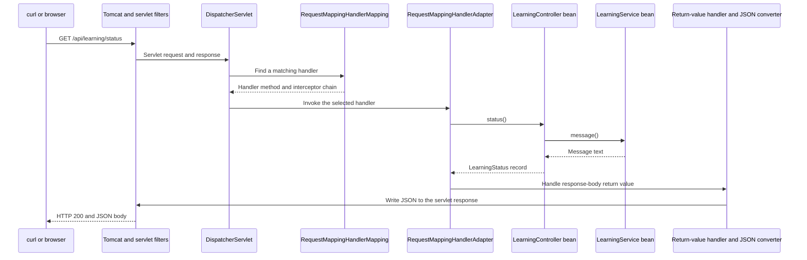
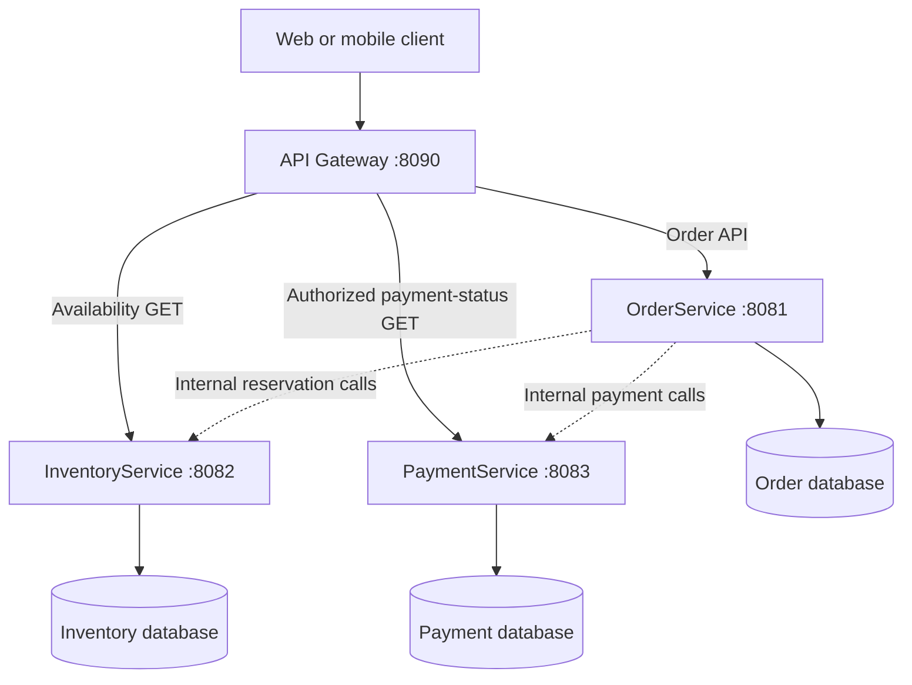

# Orderflow technical notebook

A living, sequential explanation of the internals behind our project, maintained
alongside each active learning session. Start with the concept, trace its mechanism,
observe it in code, then explain its failures and tradeoffs.

**Baseline:** Java 21, Spring Boot 4.1.1, Spring Framework 7.0.9; application code
at commit `3513f6a`. First notes prepared on 2026-09-24.
**Current implementation:** Day 1 product/order persistence and transactions (2026-09-25).
Historical baseline observations are labeled; current wiring is described below.

## How to use this notebook

Read only the chapter relevant to the current lesson. The deeper material is a
reference to revisit, not a requirement to learn every internal class immediately.
Try follow-up questions before expanding their answer notes.

Each chapter contains the problem, current project connection, internal sequence,
failure cases, proposed observations, and interview follow-ups. Official references
and version-pinned implementation links support framework claims. Unversioned
documentation may change; match it to the version resolved by the project.

Three statuses must stay distinct:

- **Discussed:** an explanation was provided in our conversation.
- **Prepared:** reference notes or an exercise plan exist.
- **Demonstrated:** the learner performed the exercise, explained the mechanism,
  and supplied reviewed evidence. This is never inferred from a generated document.

The baseline startup and HTTP checks were performed during setup. On 2026-09-25
the learner confirmed receiving the endpoint's JSON. The remaining exercises and
reviewed explanations are pending. New experiments described here are proposed
unless an evidence record says otherwise.

Update on 2026-09-25: the learner's missing-service startup prediction was reviewed
as correct, with the clarification that Spring's container resolves the dependency.
Live failure/recovery evidence remains pending. The [three-day sprint](THREE-DAY-SPRINT.md)
groups teaching into feature blocks while this notebook retains sequential detail.

Update on 2026-09-26: the learner requested a walkthrough of every existing class
and configuration before proceeding. Start with [CODE-WALKTHROUGH.md](CODE-WALKTHROUGH.md)
for the complete file map, object ownership, request traces, settings, and test
purposes. Pause new features; revisit these deeper chapters as questions arise.

## Reading order

| Order | Chapter | Current state |
| --- | --- | --- |
| Now | [Current classes and configuration](CODE-WALKTHROUGH.md) | Guide prepared; requested learner walkthrough and explanations pending |
| 1 | [Application startup and auto-configuration](#startup) | Fundamental explanation discussed; deeper notes prepared |
| 2 | [IoC, controller creation, and bean lifecycle](#beans) | Controller-creation explanation discussed; deeper notes prepared |
| 3 | [HTTP dispatch and JSON serialization](#http-flow) | Basic request path discussed; deeper notes prepared |
| 4 | [Constructor injection](#constructor-injection) | Implementation trainer-verified; learner practice pending |
| 5 | [Day 1: validation, persistence, and transactions](#day-one) | Implementation prepared; see lab record for verification and learner status |
| Log | [Conversation follow-ups](#follow-up-log) | Open questions and answer references |
| Later | [Next chapters](#next-chapters) | Planned in curriculum order |

Use the [roadmap](ROADMAP.md) for lesson order, the [PDF coverage tracker](PDF-COVERAGE.md)
for all 95 source questions, and the [lab catalog](LAB-CATALOG.md) for practical work.
The [interview notebook](INTERVIEW-NOTES.md) stores the learner's own reviewed answers.

## The code this notebook explains

The table below covers the original bootstrap/DI slice. The
[complete current inventory](CODE-WALKTHROUGH.md) also covers products, orders,
errors, configuration, migrations, helper scripts, and all test classes.

| File | Role |
| --- | --- |
| [pom.xml](../pom.xml) | Java target, dependency management, web starter, and packaging plugin |
| [OrderflowApplication](../legacy-monolith/src/main/java/com/outforpavan/orderflow/OrderflowApplication.java) | Java entry point and application configuration |
| [LearningController](../legacy-monolith/src/main/java/com/outforpavan/orderflow/learning/LearningController.java) | GET endpoint and response record |
| [LearningService](../legacy-monolith/src/main/java/com/outforpavan/orderflow/learning/LearningService.java) | Constructor-injected message supplier |
| [LearningControllerTest](../legacy-monolith/src/test/java/com/outforpavan/orderflow/learning/LearningControllerTest.java) | MVC response-contract checks |

<a id="startup"></a>

## 1. From Java `main()` to a running Spring Boot application

These are deeper reference notes prepared alongside Lesson 001. Reading them or having a working application does not establish learner mastery. The exercise, explanation, and debugger observations remain to be completed by the learner.

### 1.1 Connect the build to our application

Our entry point is `com.outforpavan.orderflow.OrderflowApplication`. Its `main()` calls `SpringApplication.run(OrderflowApplication.class, args)`. Java invokes `main()`; Boot then coordinates Spring initialization. The class passed to `run` supplies our primary configuration.

Keep these three mechanisms distinct:

| Mechanism in our project | Responsibility |
| --- | --- |
| Maven parent: `spring-boot-starter-parent:4.1.1` | Supplies dependency management and Maven build defaults through POM inheritance. |
| Dependency: `spring-boot-starter-webmvc` | Brings a compatible collection of web libraries into the dependency graph. |
| Runtime auto-configuration | Evaluates configuration candidates and conditions while Spring builds the application context. |

Dependency management chooses versions for dependencies that participate in the build; it does not add every managed library. A starter adds dependencies; it does not itself execute the application. The separate `spring-boot-maven-plugin` supports running and packaging the application. See the official [build-system reference](https://docs.spring.io/spring-boot/4.1/reference/using/build-systems.html) and [Maven parent/plugin explanation](https://docs.spring.io/spring-boot/4.1/maven-plugin/using.html).

Our POM requests Java 21. The `dev` helper chooses a Java installation and delegates to Maven Wrapper; setting `<java.version>21</java.version>` does not install or select a JDK for the IDE. This distinction explains why terminal execution and IntelliJ execution can disagree.

### 1.2 What `@SpringBootApplication` actually combines

In the Boot 4.1.1 source, the annotation combines:

- `@SpringBootConfiguration`: a Boot configuration marker built on Spring's `@Configuration`. Boot tests can use it to locate the application configuration.
- `@EnableAutoConfiguration`: enables the import mechanism that selects applicable framework configuration.
- `@ComponentScan`: discovers eligible application components in the configured package scope.

The declaration also carries Java's `@Target(TYPE)`, `@Retention(RUNTIME)`, `@Documented`, and `@Inherited` metadata. Its component scan includes custom exclusions for `TypeExcludeFilter` and `AutoConfigurationExcludeFilter`. These support filtering and keep auto-configuration classes out of ordinary component scanning. The exact annotation declaration is available in [Boot 4.1.1 source](https://github.com/spring-projects/spring-boot/blob/v4.1.1/core/spring-boot-autoconfigure/src/main/java/org/springframework/boot/autoconfigure/SpringBootApplication.java); the configuration marker is described in the [SpringBootConfiguration API](https://docs.spring.io/spring-boot/api/java/org/springframework/boot/SpringBootConfiguration.html).

With our package layout, the default component scan begins at `com.outforpavan.orderflow`. The controller's `learning` subpackage falls inside it. This is package-scoped discovery, not a scan of every class everywhere. `scanBasePackages` adjusts component scanning only; it is not a universal switch for every kind of framework scanning. See the [SpringBootApplication API](https://docs.spring.io/spring-boot/4.1/api/java/org/springframework/boot/autoconfigure/SpringBootApplication.html).

### 1.3 Startup: the useful order of operations

For our ordinary JVM launch, this is a conceptual sequence:

1. **Construct the launcher.** Boot records the primary source and deduces the web application type from available classes.
2. **Prepare the environment.** Command-line arguments and other property sources provide runtime settings; profiles and configuration influence the setup.
3. **Create and prepare the context.** Boot chooses an appropriate context, applies initializers, and loads the primary configuration source.
4. **Refresh the context.** Spring processes configuration, registers definitions and infrastructure, creates required beans, and runs initialization/lifecycle work.
5. **Finish application startup.** Boot announces the started phase, invokes application/command-line runners if present, and publishes readiness after successful completion.

The launcher returns the configured context. This list summarizes the normal path; failures interrupt it, and customization can change details. The version-pinned [SpringApplication implementation](https://github.com/spring-projects/spring-boot/blob/v4.1.1/core/spring-boot/src/main/java/org/springframework/boot/SpringApplication.java) is the authority for its orchestration.

Refresh deserves one precision: server creation and server start are separate operations. In this servlet application, `ServletWebServerApplicationContext.onRefresh()` creates the server using a `ServletWebServerFactory`. Later refresh work instantiates remaining non-lazy singletons and invokes lifecycle processing. The registered `WebServerStartStopLifecycle` calls the server's `start()` method. Therefore, “Spring creates every bean, then creates Tomcat” is an inaccurate trace. See the pinned [servlet context](https://github.com/spring-projects/spring-boot/blob/v4.1.1/module/spring-boot-web-server/src/main/java/org/springframework/boot/web/server/servlet/context/ServletWebServerApplicationContext.java), [Framework 7.0.9 refresh implementation](https://github.com/spring-projects/spring-framework/blob/v7.0.9/spring-context/src/main/java/org/springframework/context/support/AbstractApplicationContext.java), and [server lifecycle implementation](https://github.com/spring-projects/spring-boot/blob/v4.1.1/module/spring-boot-web-server/src/main/java/org/springframework/boot/web/server/servlet/context/WebServerStartStopLifecycle.java).

### 1.4 Auto-configuration is conditional registration

Application scanning finds our controller. Auto-configuration follows a separate path: `@EnableAutoConfiguration` imports `AutoConfigurationImportSelector`. Candidate names come from classpath resources named `META-INF/spring/org.springframework.boot.autoconfigure.AutoConfiguration.imports`. The selector removes duplicates, applies exclusions/filtering, and participates in ordered configuration imports. See [EnableAutoConfiguration](https://docs.spring.io/spring-boot/api/java/org/springframework/boot/autoconfigure/EnableAutoConfiguration.html) and the pinned [import selector](https://github.com/spring-projects/spring-boot/blob/v4.1.1/core/spring-boot-autoconfigure/src/main/java/org/springframework/boot/autoconfigure/AutoConfigurationImportSelector.java).

Being a candidate does not guarantee registration of every bean inside it. Conditions can inspect classes, properties, application type, or existing bean definitions. For example, `@ConditionalOnMissingBean` enables a default only when its specified matching bean is absent. A user-defined bean causes only configurations with the relevant conditions to back off; it does not disable Boot globally. See the official [auto-configuration development reference](https://docs.spring.io/spring-boot/4.1/reference/features/developing-auto-configuration.html).

### 1.5 Proposed observation exercises — not yet executed

Use these during a guided session and record actual observations afterward:

1. Run `./dev spring-boot:run -Dspring-boot.run.arguments=--debug`. Pick one positive and one negative match in the condition report. Explain the condition and evidence, rather than merely reading the configuration's name. Boot documents this diagnostic in its [auto-configuration guide](https://docs.spring.io/spring-boot/4.1/reference/using/auto-configuration.html).
2. In IntelliJ, put a breakpoint in our `main()`, then inspect `SpringApplication.run`, `createApplicationContext`, and `AbstractApplicationContext.refresh`. Record the concrete context type. Use attached sources matching our resolved versions.
3. Inspect `AutoConfigurationImportSelector.getAutoConfigurationEntry` and `getCandidateConfigurations`. Distinguish candidate names from the final conditionally registered beans.
4. Start with `--server.port=8081`, predict the endpoint address, call it, and stop that process. This checks whether a runtime property changes infrastructure without changing the controller.

### 1.6 Follow-up questions and answer notes

<details>
<summary>1. Could we build this without @SpringBootApplication?</summary>

Yes. Its constituent configuration, scan, and auto-configuration mechanisms can be declared separately. Reproducing identical behavior requires preserving relevant attributes and filters, not just memorizing three annotation names.

</details>

<details>
<summary>2. Does the web starter guarantee that a server starts?</summary>

No. Dependencies make features available. The selected application type, effective configuration, matching conditions, and successful initialization determine the outcome. A startup exception can prevent a usable server.

</details>

<details>
<summary>3. Why can Boot configure infrastructure outside our package?</summary>

Auto-configuration candidates are imported through their classpath metadata. They do not need to be application components under `com.outforpavan.orderflow`.

</details>

<details>
<summary>4. Is a server listening the same as application readiness?</summary>

No. Runners can still be doing startup work. Boot's readiness notification follows successful runners; a listening socket alone does not prove that initialization succeeded. See [application events and availability](https://docs.spring.io/spring-boot/4.1/reference/features/spring-application.html).

</details>

<details>
<summary>5. Does proxyBeanMethods=false disable dependency injection?</summary>

No. It disables interception of direct calls between configuration `@Bean` methods. Spring still processes those bean definitions. This setting matters when configuration methods call one another; our current main class has no such methods.

</details>

<details>
<summary>6. What evidence would explain an unexpected auto-configuration decision?</summary>

Check resolved dependencies, active properties/profiles, explicit exclusions, existing bean definitions, and the condition report. Identify the particular failed or matched condition before proposing a dependency or configuration change.

</details>

<a id="beans"></a>

## 2. Who creates the controller? IoC and the bean lifecycle

**Learning status:** the core explanation has been discussed; the deeper reference below is prepared for progressive study. The learner's explanation and experiments remain pending.

### 2.1 The object, its definition, and its owner

In Orderflow, `main()` does not construct `LearningController`. Spring creates and manages that object. This is **Inversion of Control (IoC)**: object assembly and lifecycle decisions are delegated to a container. **Dependency injection (DI)** is a way to supply an object's collaborators; the Lesson 002 implementation in Chapter 4 makes this concrete.

`BeanFactory` supplies the fundamental bean-management contract. `ApplicationContext` builds on it with facilities such as application events and resource access. Spring Boot initializes an appropriate application context for our application. A **bean** is an object managed by that container. [Spring IoC introduction](https://docs.spring.io/spring-framework/reference/core/beans/introduction.html)

Keep these three things separate:

| Term | In our controller example |
| --- | --- |
| Java class | `LearningController`: the type compiled from our source |
| `BeanDefinition` | Metadata describing how Spring should create and configure a bean, including its class and scope |
| Bean instance | The actual object on which `status()` can execute |

A definition can exist before its instance. Registering metadata and constructing an object are different operations. [BeanDefinition API, Framework 7.0.9](https://docs.spring.io/spring-framework/docs/7.0.9/javadoc-api/org/springframework/beans/factory/config/BeanDefinition.html)

### 2.2 Why Spring discovers this class

Our application class is in `com.outforpavan.orderflow`; the controller is in its `learning` subpackage, inside our default component-scan boundary.

The relevant annotation relationships are:

```text
@RestController
  ├── @Controller
  │     └── @Component → eligible for component scanning
  └── @ResponseBody    → MVC response-body semantics
```

These are **meta-annotations**: annotations placed on another annotation. Their roles differ. The component stereotype helps register a bean definition; response-body semantics tell MVC how to handle return values. Spring's default naming produces `learningController` for our class. Scanning does not construct an instance of every Java class it finds. [Component scanning](https://docs.spring.io/spring-framework/reference/core/beans/classpath-scanning.html)

### 2.3 From metadata to a usable bean

The normal path for our controller is:

```text
discover class → register definition → process metadata
    → select constructor → resolve constructor arguments → create object
    → populate any configured fields/setters
    → initialize and post-process → expose managed bean
```

Two extension points explain much of Spring's apparent “magic.” A `BeanFactoryPostProcessor` can change **configuration metadata** before ordinary application beans are instantiated. A `BeanPostProcessor` participates in processing **instances**, including callbacks around initialization. Specialized post-processors also participate in earlier creation phases. Infrastructure may return a proxy when a configured feature requires interception; being a bean does not mean every object is proxied. [Container extension points](https://docs.spring.io/spring-framework/reference/core/beans/factory-extension.html)

At the first baseline our controller declared no constructor, so Java supplied a default no-argument constructor. This default came from Java, not from `@RestController`. Since Lesson 002 the controller declares a constructor requiring `LearningService`; Java no longer supplies that former default constructor. [Java 21 default constructors](https://docs.oracle.com/javase/specs/jls/se21/html/jls-8.html#jls-8.8.9)

Spring does **not** require every bean to have a no-argument constructor. For an ordinary component with one declared constructor, Spring uses that constructor even without `@Autowired`, resolving its dependencies. Multiple constructors need the applicable selection rules; simply adding more constructors is not a dependency-resolution strategy. Lesson 002 introduces a missing dependency; multiple-candidate ambiguity remains a later B03 exercise. [Constructor injection rules](https://docs.spring.io/spring-framework/reference/core/beans/annotation-config/autowired.html)

After dependency population, supported initialization callbacks can run. If distinct callbacks are configured, the usual initialization sequence is `@PostConstruct`, `InitializingBean.afterPropertiesSet()`, then a custom init method. Standard AOP wrapping normally follows target initialization. During orderly context shutdown, configured destruction callbacks can release resources. Our controller currently defines none of these callbacks. This outline describes the normal path, not every specialized factory or circular-reference case. [Bean lifecycle](https://docs.spring.io/spring-framework/reference/core/beans/factory-nature.html)

Ordinary singleton beans are normally created eagerly during context refresh. Lazy initialization can defer creation, although an eager bean's dependency can still force an otherwise lazy bean to be created. [Lazy initialization](https://docs.spring.io/spring-framework/reference/core/beans/dependencies/factory-lazy-init.html)

### 2.4 One shared controller and concurrent requests

The default scope is **singleton**: one shared instance for a bean definition in a container. It does not mean one object of that class throughout the JVM, and it does not prevent another application context or a manual `new` from creating another object. Other scopes include prototype, request, session, application, and websocket; web scopes require suitable web infrastructure. [Bean scopes](https://docs.spring.io/spring-framework/reference/core/beans/factory-scopes.html)

For our application, the consequence is that concurrent requests can execute against the same controller. **Singleton scope does not make mutable fields thread-safe.** For example, adding `private String currentUser;` and changing it for each request could expose one request's data to another. Our current `status()` method has no mutable controller fields and creates its response locally. Preserve that separation when we add inputs and business logic.

### 2.5 Failure predictions and a pending experiment

In the current application:

| Change | Expected consequence |
| --- | --- |
| Remove `@RestController`, add nothing | Default scanning no longer registers this class |
| Replace it with `@Component` | A bean exists, but it is not recognized as an annotated MVC controller |
| Construct it using `new LearningController(new LearningService(new LearningProperties("Manual")))` in ordinary code | Separate Java objects exist; Spring does not automatically manage them |

The second row matters because Framework 7.0.9's `RequestMappingHandlerMapping` expects a controller stereotype; leaving `@GetMapping` alone is insufficient. [Handler detection API](https://docs.spring.io/spring-framework/docs/7.0.9/javadoc-api/org/springframework/web/servlet/mvc/method/annotation/RequestMappingHandlerMapping.html#isHandler(java.lang.Class))

**Pending guided experiment:** set a breakpoint in the controller's explicit constructor. Restart once, then call the endpoint twice with a breakpoint in `status()`. Predict one controller-constructor hit and two method hits in that process. Then temporarily remove the controller annotation, restart, and observe the missing handler. Restore it afterward. The learner has called the baseline endpoint; this debugger/failure experiment remains pending.

### 2.6 Follow-up questions, from fundamentals to interview depth

Try each answer before opening its reference.

<details>
<summary>Q2.1 — Who creates LearningController, and why?</summary>

Spring's container creates it from registered bean metadata. Its controller stereotype makes it eligible for scanning within our application package.

</details>

<details>
<summary>Q2.2 — Is a BeanDefinition the controller object?</summary>

No. It describes creation and configuration. The bean instance is the resulting managed object.

</details>

<details>
<summary>Q2.3 — Does removing @RestController always make a class impossible to register?</summary>

No. Our default scan would stop discovering it, but explicit registration such as an `@Bean` method is another mechanism. Registration alone does not establish controller semantics.

</details>

<details>
<summary>Q2.4 — Does a bean need a default constructor?</summary>

No. A single parameterized constructor can declare required collaborators. Spring must resolve those arguments to construct the component.

</details>

<details>
<summary>Q2.5 — Does one singleton mean one controller per request or per JVM?</summary>

Neither. It means one shared instance per bean definition per container. Concurrent requests can use that instance.

</details>

<details>
<summary>Q2.6 — Why distinguish bean-factory post-processing from bean post-processing?</summary>

One works on metadata; the other participates in processing objects. This distinction helps explain configuration changes, dependency population, initialization, and eligible proxy wrapping.

</details>

<details>
<summary>Q2.7 — Why is a shared currentUser field unsafe even in a Spring bean?</summary>

Requests could overwrite shared state. Container ownership provides no automatic synchronization or request isolation. Keep request data local or use an explicitly suitable design.

</details>

<details>
<summary>Q2.8 — What evidence would support your lifecycle explanation?</summary>

Compare constructor and handler breakpoint hits across repeated requests in one process, inspect the managed bean, and explain what changes after a restart. State the experiment's limits: it does not prove thread safety or cover other scopes.

</details>

<a id="http-flow"></a>

## 3. From an HTTP request to a JSON response

### 3.1 The concrete request we can explain

Our current API has one application endpoint:

```http
GET /api/learning/status HTTP/1.1
Host: localhost:8080
Accept: application/json
```

The application method returns a `LearningStatus` record with `application` and
`message` fields. It does not parse a TCP connection, search for a route, or write
JSON bytes itself. Those responsibilities belong to different infrastructure
components. Follow along in [LearningController.java](../legacy-monolith/src/main/java/com/outforpavan/orderflow/learning/LearningController.java).

### 3.2 Startup discovers routes; requests select a route

Two kinds of registration matter. Component scanning registers the controller
as a bean. MVC's `RequestMappingHandlerMapping` then examines controller types
and methods to register request mappings. Our `@GetMapping` is a composed
mapping for HTTP GET. The mapping describes path and HTTP-method conditions;
other endpoints can also constrain headers, parameters, or media types.
The registry is built during MVC initialization, not by scanning every Java
class again for every HTTP request. See [mapping conditions](https://docs.spring.io/spring-framework/reference/web/webmvc/mvc-controller/ann-requestmapping.html)
and the [handler-mapping API](https://docs.spring.io/spring-framework/docs/7.0.9/javadoc-api/org/springframework/web/servlet/mvc/method/annotation/RequestMappingHandlerMapping.html).

This distinction explains why `@GetMapping` on an arbitrary unmanaged object
is insufficient. There must be a controller known to MVC and a registered
mapping that matches the request.

### 3.3 The request path, one responsibility at a time


```mermaid
sequenceDiagram
    participant Client as curl or browser
    participant Server as Tomcat and servlet filters
    participant Front as DispatcherServlet
    participant Mapping as RequestMappingHandlerMapping
    participant Adapter as RequestMappingHandlerAdapter
    participant Controller as LearningController bean
    participant Service as LearningService bean
    participant Writer as Return-value handler and JSON converter
    Client->>Server: GET /api/learning/status
    Server->>Front: Servlet request and response
    Front->>Mapping: Find a matching handler
    Mapping-->>Front: Handler method and interceptor chain
    Front->>Adapter: Invoke the selected handler
    Adapter->>Controller: status()
    Controller->>Service: message()
    Service-->>Controller: Message text
    Controller-->>Adapter: LearningStatus record
    Adapter->>Writer: Handle response-body return value
    Writer->>Server: Write JSON to the servlet response
    Server-->>Client: HTTP 200 and JSON body
```

This is the successful synchronous path for our application. It omits exception,
asynchronous, and short-circuit branches; it is not a complete framework call stack.

1. **Tomcat and servlet filters:** the embedded servlet container receives HTTP
   traffic and dispatches through applicable filters to the mapped servlet.
2. **`DispatcherServlet`:** the MVC front controller coordinates processing. It
   delegates route selection and invocation instead of containing our business logic.
3. **`HandlerMapping`:** selects a handler and its interceptor chain. Interceptors,
   when present, can run before and after controller processing.
4. **`HandlerAdapter`:** knows how to invoke that handler type. For annotation-based
   methods, `RequestMappingHandlerAdapter` uses argument resolvers and return-value
   handlers. Our `status()` has no arguments, so there is no input binding to do.
5. **Controller:** calls `LearningService.message()` and creates the response record.
6. **Response-body processing:** converts that return value into the HTTP body;
   the servlet response is eventually sent to the client.

The coordination model is described by [DispatcherServlet](https://docs.spring.io/spring-framework/reference/web/webmvc/mvc-servlet.html)
and [request processing](https://docs.spring.io/spring-framework/reference/web/webmvc/mvc-servlet/sequence.html).
The [handler-adapter API](https://docs.spring.io/spring-framework/docs/7.0.9/javadoc-api/org/springframework/web/servlet/mvc/method/annotation/RequestMappingHandlerAdapter.html)
documents argument and return-value extension points. We have not added Spring
Security, so a security filter chain is a future topic, not a current project feature.

### 3.4 How the record becomes JSON

`@RestController` includes response-body semantics. MVC therefore processes the
returned record as response content. This does not mean that the annotation
itself serializes objects or that every return type must become JSON.
See [response-body handling](https://docs.spring.io/spring-framework/reference/web/webmvc/mvc-controller/ann-methods/responsebody.html).

For this method, `RequestResponseBodyMethodProcessor` is the relevant return-value
handler. It uses message converters to write the object, taking the return type
and media-type negotiation into account. The client signals acceptable response
types through `Accept`; `Content-Type` describes the body actually sent. Our
successful response uses `application/json`.
See the [return-value processor](https://docs.spring.io/spring-framework/docs/current/javadoc-api/org/springframework/web/servlet/mvc/method/annotation/RequestResponseBodyMethodProcessor.html).

The baseline packaged JAR contains Jackson databind **3.1.5** and Spring Web
**7.0.9**. For Jackson 3 JSON conversion, the framework converter is
`JacksonJsonHttpMessageConverter`. Older tutorials may instead describe
`MappingJackson2HttpMessageConverter`; that is the Jackson 2 converter, not an
interchangeable class name. Check the resolved dependencies before debugging
serialization internals. See [message converters](https://docs.spring.io/spring-framework/reference/web/webmvc/message-converters.html).

The record instance returned by `status()` is created by our own `new` expression
on each call. It is not automatically a Spring bean because a controller returns
it. This is separate from the container-managed lifetime of the controller.

### 3.5 Debug by the layer that failed

Use the symptom to choose an investigation, then verify the hypothesis:

| Symptom | First investigation |
| --- | --- |
| Connection refused | Is the app running and listening at the requested host and port? |
| 404 | Check the URL, context path, controller discovery, and registered mappings. |
| 405 | Check the HTTP method against the registered mapping; POST is not GET. |
| 406 | Check the requested response media type and available writers. |
| 500 | Inspect the exception and stack trace; a matched route can still fail during invocation or serialization. |

These are diagnostic starting points, not proofs of one specific root cause.
MVC can delegate exceptions to `HandlerExceptionResolver` implementations; error
responses can also involve the servlet container and Boot's error handling.
We will implement an intentional application error contract in a later lesson.
See [MVC exception resolution](https://docs.spring.io/spring-framework/reference/web/webmvc/mvc-servlet/exceptionhandlers.html).

### 3.6 Evidence and the next experiments

**Previously verified at baseline `3513f6a`:** two tests passed and a real localhost
request to the packaged application returned HTTP 200 with the expected JSON.

- `OrderflowApplicationTests` checks that the application context can load in
  the default mock web environment. It does not start a listening Tomcat port.
- `LearningControllerTest` checks MVC routing, status, content type, and JSON
  values using MockMvc. It is not a plain direct call to `status()` and not a
  real socket request. See [MockMvc's test boundary](https://docs.spring.io/spring-framework/reference/testing/mockmvc/overview.html).
- The separate localhost smoke check exercised the packaged application and
  its actual network endpoint. It did not prove every failure path or concurrency property.

**Proposed; not executed as learner exercises:** use the debugger at
`LearningController.status()`, then inspect `DispatcherServlet.doDispatch`,
`RequestMappingHandlerAdapter.invokeHandlerMethod`, and
`RequestResponseBodyMethodProcessor.handleReturnValue`. Observe what each layer
receives and returns. Source navigation may require downloading dependency sources.

Try one request variant at a time after starting the application:

```sh
curl -i http://localhost:8080/api/learning/status
curl -i -X POST http://localhost:8080/api/learning/status
curl -i http://localhost:8080/api/learning/missing
```

Predict 200, 405, and 404 respectively for the unchanged baseline. Record the
actual responses before treating the predictions as observations. The planned
message-change exercise remains in [Lesson 001](lessons/001-first-spring-boot-application.md).

### 3.7 Follow-up questions

<details>
<summary>H1 — Does Tomcat call our controller directly?</summary>

Tomcat dispatches to the servlet through the servlet filter chain. Spring MVC's
DispatcherServlet coordinates handler lookup and invocation through its delegates.
Our controller is not itself a Servlet.

</details>

<details>
<summary>H2 — Why separate HandlerMapping from HandlerAdapter?</summary>

Selecting a handler and knowing how to invoke it are distinct responsibilities.
This lets the dispatcher coordinate different handler styles without hard-coding
each invocation mechanism into one dispatcher implementation.

</details>

<details>
<summary>H3 — Does Spring scan all classes on every request?</summary>

No. MVC registers annotated mappings during initialization and uses them to match
requests. A runtime mapping lookup is different from classpath component scanning.

</details>

<details>
<summary>H4 — Why does this record become JSON rather than an HTML view?</summary>

The controller has response-body semantics, and the configured message conversion
can write this return value as JSON. A Java record by itself does not choose HTTP
serialization or turn itself into a web response.

</details>

<details>
<summary>H5 — Does a passing MockMvc test prove the network server works?</summary>

No. It exercises Spring MVC with mock servlet request and response objects. A real
HTTP test supplies additional evidence about server startup and network dispatch.
Neither test automatically proves database, security, or deployment behavior.

</details>

<details>
<summary>H6 — If the mapping exists, can the client still receive an error?</summary>

Yes. Invocation, response conversion, and surrounding infrastructure can fail after
route selection. Debug the failing stage rather than assuming every HTTP error is
a missing controller annotation.

</details>

**Interview synthesis:** explain the boundaries from server to dispatcher,
mapping, adapter, controller, and message converter. Then connect a concrete
failure to the layer you would inspect and the evidence you would collect.

<a id="constructor-injection"></a>

## 4. Constructor injection: connecting two managed objects

This chapter describes the Lesson 002 checkpoint. Day 1 additionally injects a
`LearningProperties` configuration record into the service, as explained in Chapter 5.

**Implemented on 2026-09-25; missing-service prediction reviewed, live practice and remaining explanations pending.**
Use [Lesson 002](lessons/002-constructor-injection.md) for the guided code walk-through
and six follow-up answers. The [lab record](labs/B03-001-constructor-injection.md)
contains the exact observations and their limits.

### 4.1 The required dependency is explicit

`LearningController` now has a final `LearningService` field and one constructor
accepting that service. `status()` obtains the message through the supplied
reference. Spring manages both components; it does not need a call to
`new LearningService()` in the controller. The endpoint's HTTP contract is unchanged.

```java
private final LearningService learningService;

public LearningController(LearningService learningService) {
    this.learningService = learningService;
}
```

The constructor is ordinary Java. Its parameter expresses the dependency; the
container resolves and supplies it. The field assignment retains the reference
for future requests. Construction and request handling are separate events.

### 4.2 Internal decision points

1. Scanning registers component definitions for the controller and service.
2. When creating the controller, Spring selects its single declared constructor.
3. The container resolves the `LearningService` parameter to a registered candidate.
4. It obtains that service instance, creating and initializing it if needed.
5. It invokes the controller constructor with the resolved reference and completes
   the remaining controller lifecycle work.

For source navigation in Framework 7.0.9, the constructor-candidate hook is
`AutowiredAnnotationBeanPostProcessor.determineCandidateConstructors`.
The name of that processor does not imply that every injected constructor must
carry `@Autowired`; its single-constructor rule applies here.
See the [constructor-processing API](https://docs.spring.io/spring-framework/docs/7.0.9/javadoc-api/org/springframework/beans/factory/annotation/AutowiredAnnotationBeanPostProcessor.html).

`DefaultListableBeanFactory.resolveDependency` is a useful dependency-resolution
entry point. Constructor selection answers which constructor to invoke; dependency
resolution answers what values to pass. An existing Java class is insufficient:
our required parameter needs a candidate registered with the relevant context.
See the [bean-factory API](https://docs.spring.io/spring-framework/docs/7.0.9/javadoc-api/org/springframework/beans/factory/support/DefaultListableBeanFactory.html).

### 4.3 Observe the correct boundary

The current positive evidence is a successful full context-load test and the
unchanged MVC response contract. An isolated negative test explicitly registers
only the controller. Its context refresh fails with `UnsatisfiedDependencyException`
caused by `NoSuchBeanDefinitionException` for `LearningService`.
This is verified evidence about a missing required bean; it is not a claim that
we physically removed the service annotation in the running application.

The MVC slice includes `@Import(LearningService.class)` because ordinary services
are outside its default scan scope. That explicit registration can succeed even
if `@Service` is removed. To investigate discovery, use full startup as directed
in the lesson, not only the focused MVC test. The separate full context-load test
uses the application's normal scanning.
See [WebMvcTest](https://docs.spring.io/spring-boot/api/java/org/springframework/boot/webmvc/test/autoconfigure/WebMvcTest.html).

### 4.4 Design reasoning to practice

The controller owns HTTP mapping and response construction; the service supplies
application behavior. This tiny service is a teaching step before business rules,
not a universal rule to wrap every constant in a separate class. A direct concrete
collaborator is sufficient for this step; alternative implementations are a later
requirement to explore.

The final field cannot be reassigned after construction. That does not make a
collaborator immutable or thread-safe, and Java callers can still pass null to an
unguarded constructor. The current service is stateless. Keep per-request data
out of shared mutable fields as the application grows.

**Understanding check:** trace who chooses the constructor, who resolves its
argument, and when `message()` is invoked. Then explain the different outcomes
of a missing service and a controller that was never registered.

<a id="day-one"></a>

## 5. Day 1: from validated input to a database transaction

Learner checkpoint update, 2026-09-26: a successful product-create response was
shared, with status 201, Location `/api/products/1`, and product 1 (Keyboard,
price 1250.00, stock 10). The learner subsequently reported product persistence
after restart and an order POST, supplying a product response with stock 8.
The actual order JSON, remaining failure drills, and mechanism explanations have
not been reviewed. The learner requested a class/configuration walkthrough before
further implementation; see [the guide](CODE-WALKTHROUGH.md) and the lab record.

Use the [guided lesson](lessons/003-day-one-order-flow.md) and
[verification record](labs/DAY1-order-flow.md) together. Implementation and trainer
checks do not close the learner's run/explain checkpoints.

### 5.1 Configuration supplies values as well as collaborators

`LearningProperties` is a record registered through `@EnableConfigurationProperties`.
Boot binds `learning.message`, validates its nonblank constraint, and supplies the
result to `LearningService`. The string moved out of Java source; constructor
injection still connects the objects. Our packaged smoke exercise compares the
file default, an environment override, and a command-line override. This setup
reads configuration at startup; editing a file does not automatically rebind the
existing bean. [External configuration](https://docs.spring.io/spring-boot/reference/features/external-config.html)

### 5.2 HTTP contracts and the boundary of validation

```text
JSON → request record → validation → controller → service → repository
                                                       ↓
JSON ← response record ← mapping inside transaction ← managed entity / SQL
```

The API accepts `CreateProductRequest` and `CreateOrderRequest`, not entities.
`@Valid` asks MVC to validate the converted request before invoking the controller
method. Nullable wrappers plus `@NotNull` distinguish missing numeric input from
zero. Shape/type errors and validation failures are different paths that both
produce a deliberate 400 response here. `ApiExceptionHandler` maps expected
application failures to problem responses; it does not make invalid business
operations successful. [MVC validation](https://docs.spring.io/spring-framework/reference/web/webmvc/mvc-controller/ann-validation.html)

Learner review, 2026-09-27: the learner correctly identified request field/type
and validation control as DTO benefits. Validation annotations could also be put
on an entity; separation lets the API define its own accepted input independently
of persistence fields. `CreateProductRequest` has no generated ID component, and
`ProductService` explicitly maps name, price, and stock into a new `Product`.
This alone does not promise rejection of every unknown JSON property.

For a syntactically valid request containing a numeric negative price, conversion
to `BigDecimal` can succeed; `@Valid` then detects the positive-price constraint
violation and our handler returns 400 before the controller body/service runs.
This is a prepared reference answer for the next checkpoint; the learner's
prediction and experiment remain pending. [Request-body conversion and validation](https://docs.spring.io/spring-framework/reference/web/webmvc/mvc-controller/ann-methods/requestbody.html)

Database constraints remain useful even when HTTP input is valid: another caller
or a future code path can bypass that HTTP boundary. `ProblemDetail` separates
HTTP error information from Java exception internals; field errors omit rejected
values. A repository exception translation layer and an HTTP advice handler solve
different problems. [Error responses](https://docs.spring.io/spring-framework/reference/web/webmvc/mvc-ann-rest-exceptions.html)

### 5.3 Repository, persistence context, and schema have different roles

Spring Data supplies the repository implementation. Hibernate manages entities
within a persistence context and translates state changes into SQL. PostgreSQL
stores durable rows. Flyway applies the versioned SQL migration, and Hibernate
uses `ddl-auto=validate` to check mappings rather than mutate the schema.
`open-in-view=false` disables a request-spanning EntityManager; this project
performs persistence and response mapping inside service transactions. The
setting itself does not enforce the location of repository calls.
[Database initialization](https://docs.spring.io/spring-boot/how-to/data-initialization.html)

`ProductService.changePrice` loads a managed entity and changes its price inside
a transaction. It does not need another repository `save` to make that managed
state eligible for synchronization. The post-call JDBC assertion checks committed
state independently of an entity cached in the persistence context. This example
does not imply that changing a detached object will update the database.
[Spring Data transaction boundaries](https://docs.spring.io/spring-data/jpa/reference/jpa/transactions.html)

### 5.4 Follow the transaction, not just the annotation

An external call reaches Spring's transactional service proxy. For our create-order
method it begins or joins the database transaction, invokes the target method,
and completes the transaction before the caller receives a normal result.
The method loads the product, reserves stock, flushes its UPDATE, and saves the
order using the stored product price. Both repositories participate in that
service transaction. Runtime failure on the exercised path leads to rollback.
Checked exceptions and self-invocation need the separate Day 2 experiments.
[Transactional interception](https://docs.spring.io/spring-framework/reference/data-access/transaction/declarative/annotations.html)

The explicit `products.flush()` exists to make SQL ordering observable in this
lab. It is not a recommendation to flush after every change. **Flush is not
commit.** An UPDATE can have executed and still be undone when the encompassing
transaction rolls back.

The integration drill creates a trigger only in `orderflow_test`. During the
order INSERT, that trigger verifies the changed stock is visible in the current
transaction, then raises an exception. Assertions after the service call verify
the original stock and absence of the order. There is no test-managed outer
transaction masking the service's real completion boundary. The trigger is
removed in cleanup. [PostgreSQL trigger timing](https://www.postgresql.org/docs/current/sql-createtrigger.html)

### 5.5 Limits to defend in an interview

- Atomicity of this one transaction does not prevent two concurrent requests
  from reading the same stock. Concurrency protection is a Day 2 implementation.
- A client retry can create another order. HTTP idempotency is still a separate lab.
- Product and order use one database; this demonstrates no distributed transaction.
- Order prices are snapshots calculated by the server using `BigDecimal`.
  This lesson assumes one currency; a currency/conversion model is not implemented.
- Passing MVC tests with a mocked service proves the HTTP boundary, not SQL rollback.
  The PostgreSQL integration tests and packaged HTTP/restart harness exercise those
  separate boundaries.

Follow-up answers and learner exercises are in the guided lesson. Record the
learner's own explanations in [INTERVIEW-NOTES.md](INTERVIEW-NOTES.md).

<a id="follow-up-log"></a>

## 6. Conversation follow-up log

This records what was asked and what remains open. A reference answer is not a
substitute for a learner explanation.

| ID | Question or observation | Reference | Learner state |
| --- | --- | --- | --- |
| F001 | We never called `new LearningController()` in main. Who creates it? | Chapter 2: container ownership, scanning, metadata, construction | Trainer answer provided; learner explanation pending |
| F002 | If `@RestController` is removed and no other registration is added, is the class discovered? | Chapter 2: failure predictions and Q2.3 | Asked; learner answer and experiment pending |
| F003 | Does a controller singleton mean a new instance for each request? | Chapter 2: scope and concurrency | Reference prepared; not yet assessed |
| F004 | Who turns `LearningStatus` into JSON? | Chapter 3: return-value handling and converter | Reference prepared; not yet assessed |
| F005 | Why can IntelliJ use Java 25 even when the POM targets Java 21? | Chapter 1: build target versus selected runtime | Setup distinction noted; IDE Java 21 selection not verified |
| F006 | Why does the controller's single constructor work without `@Autowired`? | Chapter 4 and Lesson 002 | Implementation prepared; learner explanation pending |
| F007 | Why can a service import make a focused test pass even if normal scanning would miss the service? | Chapter 4: test boundaries | Trainer checks passed; learner experiment pending |
| F008 | Would removing `@Service` stop this application's startup? | Chapter 4 and INTERVIEW-NOTES.md | Learner correctly predicted failure; container resolves the dependency, not the controller; live recovery pending |
| F009 | What is every class and configuration for? Too much code was implemented before explaining it. | [Complete code walkthrough](CODE-WALKTHROUGH.md): object ownership, class roles, request traces, settings, and tests | New features paused at learner request; guide prepared, learner explanations pending |
| F010 | Product survived restart; stock changed from 10 to 8 after an order POST. Is stock the order quantity? | Walkthrough sections 1 and 5; Day 1 lab evidence | Restart self-reported and product JSON supplied; distinguish remaining stock from units in an order; actual order JSON not reviewed |
| F011 | Why use `CreateProductRequest` instead of accepting `Product` as POST input? | Chapter 5.2 and INTERVIEW-NOTES.md | Learner correctly identified field/type/validation control; API independence explained; conversion-versus-validation prediction pending |
| F012 | Interviewer asked for Spring Security in Orderflow; explain authentication/authorization and implementation first. | [Security guide](SPRING-SECURITY.md) and chapter 9 below | Reference prepared 2026-09-29; mechanism choice, implementation, practice, and learner answers pending |
| F013 | How would a senior engineer improve a slow OrderEntry landing page? | Chapter 10: measurement, critical path, targeted fixes, cache correctness, and verification | Interview reference prepared 2026-10-06; no actual diagnosis, optimization, or learner practice claimed |
| F014 | How do CAP, scaling, traffic control, caching, DB optimization, and sharding apply to Orderflow? | Chapter 12: flash-sale choices, failure modes, and interview follow-ups | Reference prepared 2026-10-06; current row locking distinguished from proposed infrastructure; implementation/practice pending |
| F015 | How do we protect an API against another service looping calls and prevent duplicate orders? | Chapter 13: caller identity, shared quotas, bounded work, durable idempotency, and business uniqueness | Interview reference prepared 2026-10-06; protection implementation and learner practice pending |

For each new question, add its context, attempted answer if any, correction,
relevant source, proposed experiment, and evidence after execution. Keep open
questions visible until the learner can reason through a changed example.

<a id="next-chapters"></a>

## 7. Next chapters, added as we learn

These are chapter commitments, not completed explanations or implemented features.
Lab families are deliberately split into small exercises when their turn arrives.

| Sequence | Future chapter | Internals and practical questions to investigate |
| --- | --- | --- |
| 4 continued | Additional dependency-selection cases and configuration classes | First constructor-injection step implemented; ambiguity, qualifiers, primary choices, and configuration-method interception remain planned |
| 5 | Configuration and profiles | Config data loading, property origins, precedence, typed binding, validation, environment differences |
| 6 | REST contracts and testing | DTO boundaries, validation, exception resolution, pagination, unit/MVC/integration test boundaries |
| 7 | SQL and JPA | PostgreSQL, migrations, entity identity, persistence context, state transitions, dirty checking, relationship ownership |
| 8 | Transactions | Proxy interception, transaction manager, rollback rules, propagation, flush/commit, isolation, self-invocation |
| 9 | Data correctness and performance | N+1, fetching, query plans/indexes, optimistic/pessimistic locking, request idempotency, connection budgets |
| 10 | Spring Security | [Foundations reference prepared](SPRING-SECURITY.md); filters, authentication, authorization, ownership, password handling, sessions/tokens, CSRF/CORS; implementation/practice pending |
| 11 | Java 21 runtime and concurrency | Records, exceptions, executors, futures, locks, ThreadLocal, virtual threads, JVM memory, GC, JFR and thread/heap evidence |
| 12 | Operating the application | Logs, metrics, traces, Actuator, health/readiness, load tests, Docker, resource limits, deployment and rollback |
| 13 | Caching | Cache-aside, keys, TTL, invalidation, stale reads, stampedes, multi-instance behavior, failure policy |
| 14 | Kafka | Records, partitions, keys, ordering, groups, offsets, rebalance, lag, producer/consumer behavior and schema evolution |
| 15 | Reliable messaging | Retries, duplicate delivery, idempotent consumers, outbox publication, recovery and delivery-guarantee limits |
| 16 | Microservices and production scenarios | Boundaries, contracts, timeouts, retry budgets, circuit breakers, bulkheads, sagas, payment reconciliation, clustered jobs |
| 17 | Capstone and interview defense | Unfamiliar failure drills, capacity reasoning, architectural tradeoffs, evidence-based diagnosis and design review |

Foundational runtime and observability topics can be introduced earlier when a
current feature needs them. This sequence is a dependency guide, not a requirement
to postpone useful debugging until the operations chapter.

The [coverage tracker](PDF-COVERAGE.md) ties the provided PDFs to these chapters
and also lists requirements beyond the PDFs. It is the completion checklist;
this notebook is the explanation and revision reference.

## 8. How we maintain the notes

During each active lesson, prepare or review the relevant notes in parallel with
independent implementation work when useful. Integrate the result into this
notebook before committing the learning increment.

Add the actual code links, observations, follow-up questions, corrected assumptions,
and test or diagnostic evidence. Expand the matching future chapter instead of
leaving duplicate explanations in several files. Preserve the distinction between
trainer-prepared material and the learner's demonstrated understanding.

Maintain the source-question IDs and lab links as the project evolves. Reading a
chapter never automatically completes a question in the tracker. Revisit framework
internals when dependency versions change.


## Interview preparation slice — 2026-09-28

The learner explicitly requested implementation of product discounts and paid priority fees, plus broad architect-interview preparation. This narrowly resumes feature work for that request; earlier class walkthrough and learner checkpoints remain open. The learner chose priority fees after the discount.

See [pricing walkthrough](INTERVIEW-PRICING.md) and [design decision](decisions/0003-order-pricing-snapshots.md). Java 8 compatibility applies to the five dependency-free pricing/demo classes; the application remains Java 21 / Boot 4. Paid service choice is not verified membership. Broader security/distributed-system topics are prepared reference material, not completed implementations or learner-demonstrated skills.

Verification is recorded in [pricing evidence](labs/INTERVIEW-pricing.md). No PDF item or broader curriculum requirement is marked Covered by this preparation; learner practice and reviewed answers remain pending. Actual learner study time is not measured.


## 9. Spring Security foundations - 2026-09-29

The learner's interview question makes this the current explanation topic.
[SPRING-SECURITY.md](SPRING-SECURITY.md) contains the sequential deep reference and
configuration examples. The project remains Java 21 / Boot 4.1.1; Boot manages
Security 7.1.1. Examples are prepared and reviewed, not installed or executed.

Start from our concrete requirement: authenticate the caller, permit administrative
product writes only to admins, and allow customers to read only their own orders.
Security filters run before MVC; request authorization selects allowed actions,
while service/data access must also enforce resource ownership. An authenticated
CUSTOMER role alone does not authorize access to another customer's order.

For local passwords, the authentication filter delegates to a manager/provider;
UserDetailsService loads account data and PasswordEncoder verifies a submitted
password against its stored encoding. Sessions and JWT resource-server designs
change credential transport/persistence, not the need for business authorization.

Current PurchaseOrder has no owner field. Implement ownership explicitly before
opening customer order reads. Current pricing serviceLevel is a paid selection,
not proof of membership or a security role. Preserve the existing pessimistic
stock locking, price snapshots, transactions, and input validation.

The first reference configuration uses Basic authentication for product endpoints,
keeps CSRF, and denies order routes pending owner checks. Final mechanism selection
is pending the learner's client preference. Security errors need filter-layer
handlers; MVC exception advice alone is insufficient.

Use the guide's acceptance matrix for later practice. It separates actual
credential verification from mock-user access tests and supplies valid CSRF for
role-denial tests. Earlier unanswered DTO/validation questions remain open.


## 10. OrderEntry landing-page performance - 2026-10-06

Interview scenario supplied by the learner, not a measured incident in Orderflow.
No frontend inspection, benchmark, API call, or optimization was performed. This
is trainer-prepared reasoning; learner practice and explanation remain pending.

### Diagnose the critical path

First define the outcome: when can the user select a customer, search products,
and start entering an order? A painted shell or loading indicator does not prove
that the form is usable. Compare affected users, devices/networks, first/repeat
visits, and cold/warm caches. If a recent deployment caused an active regression,
consider a targeted rollback or feature disable while investigating.

Use the browser network waterfall and performance trace to separate connection
setup, server response, downloads, API dependencies, and main-thread rendering.
Correlate slow requests with backend traces. Record time until the form is usable,
API p50/p95/p99, error rate, and load conditions. LCP describes when the largest
visible content is painted; INP describes responsiveness to interactions, not full
API completion or startup readiness. Real-user monitoring complements reproducible
lab measurements. [LCP diagnosis](https://web.dev/articles/optimize-lcp),
[INP meaning](https://web.dev/articles/inp).

### Choose a change from the observed evidence

| Observation | Targeted change and condition |
| --- | --- |
| Essential independent calls run sequentially | Run them concurrently with bounded fan-out; preserve real data dependencies. |
| Whole screen waits for history/recommendations | Render essential order controls first and load optional panels independently. Missing authoritative order data must still prevent unsafe submission. |
| Large product/customer lists | Server-side search and pagination; select only required fields; debounce search and cancel obsolete requests. Avoid downloading all records for a dropdown. |
| Repeated pricing/stock calls per displayed product | Batch the data needed by the visible page, or use a measured page-specific response; avoid moving unbounded fan-out into the backend. |
| Heavy JavaScript or rendering | Split code by route/feature, defer optional widgets, remove unused dependencies, and reduce expensive main-thread work. Optimize static assets and use compressed delivery/versioned caching as appropriate. |
| Slow database spans | Inspect query count and plans; address N+1, excessive rows/columns, lock waits, or indexes aligned with filters/joins/sort order. |
| Slow dependency or resource waits | Inspect downstream deadlines, connection/thread-pool waits, CPU and GC; bound optional work and measure capacity before increasing pools or replicas. |

Code splitting postpones downloading/executing code that the initial screen does
not require; it must not delay code needed to use the form.
[JavaScript code splitting](https://web.dev/learn/performance/code-split-javascript).
For JPA, use appropriate projections/fetching/batching after observing query
behavior. Collection fetch joins with pagination require care; changing every
relationship to eager loading is not a general N+1 solution. Query-plan validation
can use PostgreSQL EXPLAIN, and controlled EXPLAIN (ANALYZE, BUFFERS) for actual
execution evidence. ANALYZE executes the query: choose a safe, representative
environment and account for profiling overhead.
[PostgreSQL 17 EXPLAIN](https://www.postgresql.org/docs/17/using-explain.html).

Spring Boot/Micrometer HTTP metrics such as http.server.requests help establish
endpoint timing and errors; traces identify expensive database/downstream spans.
Instrumenting and exposing observability for Orderflow would be future work; it
is not claimed as installed by this explanation.
[Boot metrics](https://docs.spring.io/spring-boot/reference/actuator/metrics.html).

### Cache with the business rules intact

Cache versioned static assets and suitable reference data with explicit TTL and
invalidation rules. Include the necessary user/tenant/permission context for
personalized results; do not share private customer data through a global key.
Do not use stale display values as the authority for price or stock. At order
submission, validate/recalculate against authoritative business data and enforce
stock correctness transactionally. Current Orderflow already calculates pricing
on the server and uses a pessimistic product lock; preserve those properties.
Retries of non-idempotent order creation need an explicit idempotency design.

### Verify a business improvement

Hypothetical example: if order history is the three-second request preventing an
otherwise-ready order form from being used, decouple that optional panel from
form readiness, then separately investigate its query. This is not a claim of a
three-second measured delay or an achieved improvement in this project.

Compare before/after using the same dataset, network/device profile, concurrency,
and cache conditions. Track form-ready latency and API tail latency alongside
errors, database load, and order correctness. Roll out gradually with monitoring
and a rollback path; keep performance budgets to detect regressions. A faster
single local request or a higher Lighthouse score alone is insufficient evidence.

Reference follow-ups: Why not simply add Redis? What if the API is fast but the
screen is slow? Can independent calls always run in parallel? Which data may be
stale safely? Why can increasing the connection pool worsen the bottleneck?
Trainer answers are above; learner responses and experiments remain pending.


### Follow-up: API p95 and p99

The learner asked what these latency percentiles mean. For the same endpoint and
measurement window, p95 is approximately the response time within which 95% of
requests finish; p99 covers approximately 99%. In an illustrative 1,000-request
sample, p95 = 300 ms leaves about 50 slower requests, while p99 = 1,200 ms leaves
about 10 slower requests. Quantile estimation and ties affect exact counts.
These describe tail latency, not causes; compare alongside errors, traffic, and
load conditions. No application latency was measured for this explanation.

## 11. Future and CompletableFuture - 2026-10-06

The learner clarified the intended comparison as Future versus CompletableFuture.
Future<T> is an interface representing a possibly pending result. An executor's
submit commonly returns one. get() waits if incomplete; polling/status and Java
21 resultNow() APIs also exist. The Future interface does not expose continuation
chaining or public manual completion.
[Java 21 Future](https://docs.oracle.com/en/java/javase/21/docs/api/java.base/java/util/concurrent/Future.html).

CompletableFuture<T> implements Future<T> and CompletionStage<T>. It adds explicit
completion and dependency composition. Constructing an empty future starts no
work. Both get() and join() can block. get() declares checked interruption/failure
exceptions; join() typically wraps exceptional completion in CompletionException.
Async operations normally use the common pool unless an executor is supplied;
non-Async continuations may run inline/on a completing thread. A custom executor
on supplyAsync does not automatically configure later Async stages.
Timeout completion and CompletableFuture cancellation do not inherently stop the
underlying operation; CompletableFuture.cancel(true) does not interrupt its work.
[Java 21 CompletableFuture](https://docs.oracle.com/en/java/javase/21/docs/api/java.base/java/util/concurrent/CompletableFuture.html).

| Method | Intended use |
| --- | --- |
| thenApply | Transform a value. |
| thenCompose | Chain an operation returning another stage and flatten the result. |
| thenCombine | Combine two completed results; original operations must be submitted independently to overlap. |
| exceptionally | Recover from failure with a replacement value. |
| handle | Transform success or failure into an outcome. |
| whenComplete | Observe completion; a throwing observer can affect the returned stage. |

These operations describe dependencies rather than promising new threads for
every step. [CompletionStage](https://docs.oracle.com/en/java/javase/21/docs/api/java.base/java/util/concurrent/CompletionStage.html).

[Standalone Java 21 example](examples/FuturesDemo.java) submits independent
in-memory product/customer reads to a two-thread executor and combines them into
OrderPage. The trainer ran it with the project-local Java 21 source-file launcher:

```text
Future products: [Keyboard, Mouse]
Combined page: OrderPage[products=[Keyboard, Mouse], customers=[Alice, Bob]]
```

This is a composition demonstration, not an API/database benchmark or proof of
speedup. Its executor is closed at the end of the standalone program. In a server,
manage executor lifetime centrally and bound queues/admission/downstream load;
do not create and close a pool in each request. Calling get/join immediately
before submitting the second task would prevent their useful overlap.

Do not split stock reservation and order persistence across workers and assume
one Spring transaction follows them. Ordinary Spring transactions are thread-bound.
Security context also needs deliberate propagation for arbitrary worker tasks.
[Transaction threading](https://docs.spring.io/spring-framework/docs/current/javadoc-api/org/springframework/transaction/annotation/Transactional.html),
[security context concurrency](https://docs.spring.io/spring-security/reference/servlet/integrations/concurrency.html).

Next follow-up: which method fits a second API that requires the first API's ID,
and which fits two independent APIs? Trainer reference: thenCompose and thenCombine.
Learner answer/practice remain pending. No production async feature was introduced.

## 12. CAP, scaling, traffic, caching, database optimization, and sharding - 2026-10-06

The learner requested an interview explanation using Orderflow. This chapter is
trainer-prepared reference material, not a production incident report or completed
scaling implementation. All traffic figures and future architectures below are
illustrative. Learner answers, load experiments, and distributed failure drills
remain pending.

### Begin with the workload and the business invariant

Consider a flash sale: many users browse Keyboard, fewer submit orders, and only
one unit remains. We must distinguish browsing latency from confirmed-order
correctness. Ask about peak requests per second, read/write mix, popular-product
skew, latency/error objectives, acceptable data age, deployment regions, and cost.
A million users registered is not a usable concurrency or capacity requirement.

Current code: one Spring Boot application, PostgreSQL, JPA, and transactional
single-product orders. `ProductRepository.findByIdForUpdate` uses
`PESSIMISTIC_WRITE`. Order creation and product price changes use this lock.
The order transaction validates/reserves stock and stores a pricing snapshot;
its explicit flush sends SQL but does not commit. The connection pool is capped
at five per application instance. There is no installed Redis cache, Kafka,
distributed deployment, read replica, sharding, or authentication/owner model.

Existing source anchors: [repository](../legacy-monolith/src/main/java/com/outforpavan/orderflow/product/ProductRepository.java),
[order service](../legacy-monolith/src/main/java/com/outforpavan/orderflow/order/OrderService.java),
[configuration](../legacy-monolith/src/main/resources/application.properties).

### 12.1 CAP: choose behavior during loss of communication

CAP concerns a distributed data service during a network partition:

| Term | Meaning |
| --- | --- |
| Consistency | Linearizability: operations behave as if performed on one authoritative copy in an order respecting real time. This differs from ACID's use of consistency for invariants. |
| Availability | Each request to a nonfailed node eventually completes under the service contract; returning errors for every operation does not satisfy it. This is not a p99 deadline or an uptime percentage. |
| Partition tolerance | The model allows groups of nodes to lose communication; correctness/availability promises must account for it. |

During such a partition, a service cannot guarantee both linearizable data access
and availability on every side. The rule is not an unrestricted choice of any
two properties at all times. [Gilbert and Lynch, Perspectives on the CAP Theorem](https://groups.csail.mit.edu/tds/papers/Gilbert/Brewer2.pdf).

Orderflow example: two regions each last observed stock = 1, then lose contact.
If both independently confirm an order against that shared unit, overselling can
result. For confirmation, require the authoritative inventory owner/quorum;
the isolated side must fail or defer confirmation. The reachable authoritative
side may continue. Browsing may serve an older description or approximate stock
display if the product contract allows it. A `202 PENDING` order changes the
contract: acceptance for later processing is not a confirmed reservation.

Make the choice per operation. Do not label an entire commerce application CP/AP
without specifying its replication protocol, operations, and failure behavior.
Advanced alternative: allocate disjoint inventory quotas to regions before a
partition. Each can sell its own quota, but unused stock can be stranded elsewhere.
This preserves a narrower local authority; it does not create globally fresh
stock reads during a partition or invalidate CAP.

### 12.2 Scaling the application

Vertical scaling gives an instance more CPU/memory; horizontal scaling adds
instances behind a load balancer. The former has hardware/cost limits; the latter
requires deliberate handling of state, routing, and downstream capacity.

For a future multi-instance Orderflow deployment:

- Keep carts, sessions, idempotency records, and business state out of one JVM's
  private memory when they must survive rerouting/restarts. A shared session store
  is a valid option; JWT is not a prerequisite for horizontal scaling.
- Use health/readiness checks and graceful draining during deployment. Scale on
  measured saturation and demand; startup lag means known sales may need prescaling.
- Budget aggregate database connections. With the current five-connection cap,
  20 replicas permit up to 100 application connections, plus administration and
  other consumers. More connections can worsen CPU/I/O/lock contention.
- A Java `synchronized` block only coordinates one JVM. Current database row locking
  coordinates all instances using the same database authority and transaction rules.
- More threads, virtual threads, or CompletableFutures do not increase a database's
  ability to update the same contended product row. Microservice extraction is
  justified by boundaries and independent needs, not required to add app replicas.

If CPU is saturated in application calculations, app replicas may help. If requests
mostly wait for the same database lock, replicas may increase waiting. Measure
completed throughput, p95/p99, errors, pool waits, DB I/O, and lock waits together.
No instance count or capacity improvement has been measured in this project.

### 12.3 A sudden traffic surge

Treat incoming demand as bounded work, not an unlimited queue:

1. Establish capacity under representative read/write mix, data volume, and hot keys.
2. Rate-limit excessive clients/tenants, limit request size, cap concurrent work,
   and use bounded queues. Usually return 429 for a client rate policy and 503 for
   service overload; expose deliberate retry behavior.
3. Set request/dependency deadlines, use limited retries with backoff and jitter,
   and prevent retries from multiplying overload. Retry only operations whose
   semantics are safe or protected by durable idempotency.
4. Cache suitable reads, defer optional landing-page panels, and reserve capacity
   for order placement. Bulkheads can isolate optional work from checkout resources.
5. Move email, analytics, and other deferrable work off the confirmation path.
   For reliable future event publication, write an outbox row with the order in
   the same transaction; publish separately and make consumers idempotent.

[AWS throttling guidance](https://docs.aws.amazon.com/wellarchitected/latest/reliability-pillar/rel_mitigate_interaction_failure_throttle_requests.html),
[AWS retry guidance](https://docs.aws.amazon.com/wellarchitected/latest/reliability-pillar/rel_mitigate_interaction_failure_limit_retries.html).

A broker absorbs a temporary burst only within its capacity and retention limits.
If arrival rate remains above processing rate, backlog grows. Queueing order
placement itself requires durable acceptance, a pending status, status lookup,
failure handling, and explicit queue bounds. Do not respond with confirmed success
before inventory has actually been reserved.

Critical interview case: the order commits but its HTTP response is lost. Retrying
the POST without protection can create a second order. A future idempotency design
would bind a client key to the authenticated caller/tenant and a request fingerprint,
enforce uniqueness durably, and store the result consistently with the stock/order
transaction. Same key plus different body must be rejected. Current Orderflow has
neither that idempotency feature nor a caller model. A stock lock prevents a race
over units; it does not identify duplicate business requests.

### 12.4 Caching techniques and correctness

Cache product/reference DTOs when the cost and read frequency justify it and the
freshness policy permits it. A displayed stock value can be approximate; order
confirmation still uses authoritative inventory and current pricing rules.

| Technique | Behavior and tradeoff |
| --- | --- |
| Cache-aside | Application checks cache, loads DB on a miss, then fills cache. Simple for repeated reads; application owns expiry and invalidation. |
| Read-through | Cache/loader integration fetches missing values; the loading location changes, but freshness still needs a policy. |
| Write-through | Writes synchronously pass through a cache layer to persistence. Specify failure/atomicity semantics; two successful writes are not automatically a distributed transaction. |
| Write-behind | Persistence happens later. Requires a durable queue/recovery design and tolerable delay; a naive memory buffer is unsafe for confirmed stock/orders. |
| Refresh-ahead | Refresh hot entries before expiry; avoids some misses but spends resources and still needs version/freshness control. |

Cache-aside flow: GET product -> check key -> on miss load database -> put DTO with
TTL -> return. On a product write, commit the database transaction before publishing
the new value or invalidating its cache entry. For a hypothetical catalogue-only
DTO, an illustrative TTL could be tens of seconds; this is a business decision,
not a prescribed value for stock. Spring `@Cacheable` provides an abstraction,
not a complete distributed consistency design.
[Spring cache abstraction](https://docs.spring.io/spring-framework/reference/integration/cache/strategies.html),
[Microsoft cache-aside pattern](https://learn.microsoft.com/en-us/azure/architecture/patterns/cache-aside).

After-commit invalidation still permits a race:

```text
Reader: cache miss -> reads old DB value ----------------> fills old value
Writer:                      commits new value -> evicts
```

The late fill recreates stale data. Also, a process can die after commit before
invalidation. TTL limits an entry's lifetime, not a strict global data-age bound
regardless of delayed reads or lagging sources. Stronger needs may require
version/generation-aware population plus durable invalidation via outbox/CDC,
or bypassing the cache for the operation. Durable events alone do not stop a
delayed reader from overwriting a newer cache state without version control.

Other failure cases and mitigations:

- Stampede: many requests miss one expired popular key. Coalesce same-key fills
  and limit concurrent DB reloads. Jitter spreads expiry of different keys; it
  does not by itself solve simultaneous misses on one key.
- Cache outage: uncontrolled DB fallback can overwhelm the database. Bound fallback
  traffic and degrade suitable optional reads; test this path, not just warm hits.
- Repeated nonexistent IDs: consider short negative caching with size controls
  and correct invalidation when a product is created.
- Authorization leaks: keys must include applicable tenant/user, locale, currency,
  and representation dimensions. Do not share private order responses globally.

Local Caffeine avoids a network hop but each replica holds its own entries and
needs coordinated freshness. Shared Redis enables common cache state but adds
network latency and another dependency. A two-level cache adds another invalidation
problem; adopt it only for measured needs. Evaluate hit rate alongside miss latency,
memory/evictions, backend load, stale-data incidents, and outage behavior.

### 12.5 Database optimization

Start with slow-query and trace evidence. Determine whether time is spent acquiring
a connection, executing SQL, waiting on locks, transferring rows, or mapping results.
Use `EXPLAIN (ANALYZE, BUFFERS)` in a safe environment to inspect actual vs estimated
rows, access paths, and I/O. ANALYZE executes the statement; it is not a harmless
way to inspect an arbitrary production write. [PostgreSQL EXPLAIN](https://www.postgresql.org/docs/17/using-explain.html).

Optimize the observed workload:

- Add indexes for actual filters, joins, and sort order. The product primary key
  already has an index; indexing it again is not an optimization. Additional
  indexes consume space and slow writes. Not every sequential scan is a problem.
- Return required columns/DTO projections and bounded pages. Keyset pagination
  can avoid the cost of skipping a deep offset when navigation requirements fit.
- Detect N+1 SQL when relationships are introduced; use explicit fetching,
  projections, or batching. Setting every relationship EAGER is not a solution.
- Keep transactions and lock duration short. Do not hold a product lock while
  waiting for an email/payment HTTP call. Multi-product reservations need consistent
  lock ordering, deadlock handling, and bounded retries where safe.
- Check statistics/autovacuum, storage I/O, connection usage, and row contention
  when evidence points there. Adding a read replica helps suitable reads, not
  a saturated write primary; replica lag can break immediate read-after-order UX.

Future example, NOT a migration for the current schema: if customer ownership is
added and the dominant query lists one customer's newest orders, an index on
`(customer_id, created_at DESC, id DESC)` can support that filter/order pattern.
Choose tenant scope and pagination semantics first, then verify the plan. The
current `orders` model has no `customer_id`.

Current pessimistic locking prevents concurrent stock modifications from making
the same stale check while the transaction is active. PostgreSQL row locks are
released at transaction end; competing writers wait, while ordinary MVCC reads
are not blocked by the row lock alone. [PostgreSQL locking](https://www.postgresql.org/docs/17/explicit-locking.html).

An alternative stock-reservation design, not installed in this lesson:

```sql
UPDATE products
SET stock = stock - :quantity
WHERE id = :productId
  AND stock >= :quantity;
```

Require positive quantity. One affected row means reserved; zero means missing
product or insufficient stock, with an explicit API policy to distinguish them.
Insert the order in the same transaction so failure rolls back the decrement.
At PostgreSQL READ COMMITTED a competing UPDATE waits and rechecks its condition
against the updated row. This combines the stock check/change but does not remove
hot-row serialization. Coordinate price snapshots and all other writers as well;
this snippet alone is not a replacement for the complete current service.
[PostgreSQL isolation](https://www.postgresql.org/docs/17/transaction-iso.html).

`@Transactional` supplies a transaction boundary; it does not by itself make every
read-modify-write algorithm safe. Optimistic version checks are another option,
with conflict/retry costs under contention. Choose using the contention profile.

### 12.6 Partitioning, replication, and sharding

| Technique | Orderflow example | Main limitation |
| --- | --- | --- |
| Replication | Copy the same orders to another database for reads/recovery. | Reads can lag; ordinary replicas do not divide primary write work. |
| Table partitioning | Split orders by creation month within a PostgreSQL database. | Helps pruning/retention when queries fit; still shares that server's resources. |
| Sharding | Distribute different subsets of orders across independent databases. | Adds routing, skew, resharding, and cross-shard coordination. |

Monthly partitioning is useful only when requirements justify it. Partition pruning
needs usable predicates on the partition key. PostgreSQL partitioned uniqueness
constraints also have restrictions, so this is not a drop-in change to an existing
global-ID primary key. [PostgreSQL partitioning](https://www.postgresql.org/docs/17/ddl-partitioning.html).

Choose a shard key from access patterns and transaction boundaries:

| Candidate key | Benefit | Cost |
| --- | --- | --- |
| tenantId, if business tenants are introduced | Co-locates one tenant's orders and related data. | One large tenant may dominate a shard; global inventory may still be separate. |
| customerId, after ownership is introduced | Efficient customer order history. | Shared product inventory and analytics may require other shards. |
| hash(orderId) | Distributes order records broadly. | Customer history can fan out; inventory does not become local automatically. |
| productId/warehouseId for inventory | Locates the corresponding stock authority. | Multi-product orders can span shards; a viral SKU can remain a hot key. |

These are future models, not existing fields/features. Sharding by product ID
does not divide writes to one popular product across shards. Address that hotspot
separately, for example by admission control or carefully allocated inventory
buckets with explicit invariants. More shards do not automatically fix skew.

Plan cross-shard joins/transactions, unique IDs, durable idempotency scope, reporting,
backup/recovery, routing changes, and online movement. A naive `hash(id) % N` router
can remap many records when N changes; use a migration-aware routing strategy.
Distributed transactions or a saga/reservation workflow are deliberate alternatives;
a saga has intermediate states and compensations, not local ACID behavior.
[Microsoft sharding pattern](https://learn.microsoft.com/en-us/azure/architecture/patterns/sharding),
[Citus distribution-column guidance](https://docs.citusdata.com/en/stable/sharding/data_modeling.html).

Shard only after measurements show that simpler query/transaction fixes, suitable
caching, vertical capacity, and read scaling cannot meet the workload economically.
Splitting into microservices does not itself split database data or eliminate this
analysis.

### Interview follow-ups and future evidence

| Follow-up | Reference answer |
| --- | --- |
| Why did adding ten app instances fail to improve throughput? | Locate the shared bottleneck: DB CPU/I/O, pool budget, row lock, or downstream capacity; compare completed work and wait times. |
| Will Redis guarantee no overselling? | A cached display does not enforce stock correctness. Current authority is the transactional database; moving inventory authority requires a separate durability/consistency design. |
| Is eviction after commit enough for strict freshness? | No; delayed stale fills and commit-to-invalidation crashes need explicit handling. |
| Can retries create duplicate orders even with locks? | Yes. Locking serializes stock access; durable idempotency identifies retries of the same intent. |
| Can Kafka fix a permanently slower database? | It can buffer/defer work, but sustained excess arrival rate grows backlog; reduce demand or increase effective processing capacity. |
| Will sharding cure one hot SKU? | Not if all its updates still route to the same shard/row. |
| What would establish that the design works? | Representative load, last-unit races, timeout/retry duplicates, cold/failed cache, partition/replica-lag drills, and measured latency/errors/correctness. |

Prepared practice sequence, to implement with the learner: measure current API/DB
behavior (O02/D02), verify stock contention (D03), add durable request idempotency
(D04), introduce catalogue caching and force invalidation races (C01), then compare
replica counts and total connection budgets (O02/O03). Distributed topology and
sharding exercises follow only when their prerequisites and target behavior are
clear. Relevant PDF questions include P1-Q12, P1-Q28, P1-Q33, and P4-J15; their
states remain Planned. No coverage count or learner proficiency is advanced here.

## 13. Protecting an API from a looping service and duplicate orders - 2026-10-06

The learner asks how to protect Orderflow when another service loops API calls
and how to prevent duplicates. This is a proposed design and interview reference,
not a diagnosed attack or installed protection. Current stock locking remains;
authentication, gateway quotas, and durable request idempotency are not implemented.

### Separate availability protection from business correctness

Rate limiting/admission control protects finite resources. Idempotency prevents
retries of one logical operation from repeating its effects. Neither substitutes
for the other: duplicate lookups still cost resources, and an abusive client can
submit fresh keys. Identical request bodies are not necessarily duplicate intents;
a customer may intentionally buy the same product twice. Repeated GET requests
usually do not need order-style deduplication, but still need overload protection.

Suggested future path:

```text
Caller -> protected ingress -> authenticated caller quota -> bounded service work
       -> transactional idempotency claim -> stock/order/result -> response
```

### Establish identity and enforce quotas before expensive work

- Authenticate the calling service with an appropriate workload identity, such as
  validated OAuth2 access tokens issued through client credentials, or mTLS. Enforce
  operation permissions. A client-controlled `X-Service-Name` is not identity.
- For JWTs verify signature, issuer, audience, expiry, and applicable authorization.
  A rate-limit key should use the verified stable caller identity and operation,
  plus tenant scope where relevant; it should not be the changing token text.
- Apply coarse network/connection/request-size protections before costly processing,
  then authenticated quotas. Restrict direct access so callers cannot bypass the
  gateway; service-side authorization and bounded work still matter.
- Use a token bucket or another explicit policy per caller/operation plus aggregate
  capacity limits. An illustrative bucket might refill at 50 tokens/second with
  capacity 100 and one token per request. Capacity bounds accumulated tokens;
  it is not a strict maximum of 100 requests in every sliding one-second window.
- When the quota is exhausted, return 429 with useful retry guidance such as
  `Retry-After`. Do not enqueue every rejected request. Repeated idempotent replays
  are also subject to rate limits. General temporary capacity exhaustion can use 503.
- Coordinate quotas across ingress replicas, for example with atomic shared Redis
  limiter state or deliberately allocated budgets. A separate full quota in each
  JVM multiplies the effective allowance. Define limiter-outage behavior; critical
  writes should not silently become unlimited when Redis is unavailable.
- Alert on the offending identity and isolate/block its access if necessary.
  Disabling future token issuance alone may not invalidate already issued JWTs;
  enforce an immediate deny decision at the relevant authorization boundary when
  required. Do not depend on the hostile caller respecting backoff instructions.

[Spring Security JWT validation](https://docs.spring.io/spring-security/reference/servlet/oauth2/resource-server/jwt.html),
[Spring Cloud Gateway RequestRateLimiter](https://docs.spring.io/spring-cloud-gateway/reference/spring-cloud-gateway-server-webflux/gatewayfilter-factories/requestratelimiter-factory.html).
These are possible components, not a dependency/configuration change to Orderflow.

Rate limits alone are insufficient when each accepted request takes a long time.
Cap concurrent work, queue length, payload size, database/lock waits, and dependency
duration; isolate expensive endpoints/clients where justified. A circuit breaker
around an outgoing dependency can stop repeated failing downstream calls, but is
not an inbound quota against a malicious caller. For network-level floods, enforce
protection upstream before traffic saturates the service's own network capacity.

### Durable idempotency for POST /api/orders

The client creates a stable key for one intended order and reuses it for every
retry of that intent:

```http
POST /api/orders
Authorization: Bearer <access-token>
Idempotency-Key: checkout-7f91
Content-Type: application/json

{"productId":1,"quantity":2,"serviceLevel":"STANDARD"}
```

Proposed database uniqueness boundary, with non-null columns:

```sql
UNIQUE (caller_id, operation, idempotency_key)
```

Include tenant/end-user scope if the authorization model requires it. Compute a
fingerprint from a well-defined normalized request representation; include all
client-supplied fields that change the business effect and account for API
version/defaults. Do not add a changing server-derived price to the input fingerprint.
Store the fingerprint, order ID, and replayable result in durable storage. Limit key length, validate input before allocating records, and budget storage
so random keys cannot grow it without bound. Keys
identify intent; they are not credentials and do not bypass authorization checks.

| Condition | Proposed API behavior |
| --- | --- |
| New key | Atomically claim it, create one order, and persist its result. |
| Same key, same request, completed | Return the recorded result without another stock reduction. |
| Same key, different request | Reject key misuse; for this proposed contract, return 409. |
| Same key while first transaction runs | Bound the wait; if unfinished at the limit, report a retryable in-progress conflict, never execute independently. |
| Different key, same body | Usually a new intent; enforce a separate business uniqueness rule if the domain requires one. |

Stripe is a real example of stable keys and parameter comparison; its particular
failure/retention/status policies are not a universal requirement for this design.
[Stripe idempotent requests](https://docs.stripe.com/api/idempotent_requests).

### The concurrency and crash boundary

For our short database-only order operation, a candidate design is one PostgreSQL
transaction containing the idempotency claim, stock reservation, order insert,
and completed replay result. Commit before reporting confirmed success. Use the
existing stock lock in addition to the new uniqueness boundary.

An atomic `INSERT ... ON CONFLICT DO NOTHING` can claim the key; never rely on
`SELECT if absent -> INSERT` without database uniqueness. A concurrent insert can
wait for the first transaction. If the first commits, the loser reads its result
in a subsequent statement under READ COMMITTED; if it rolls back, a contender may
claim the key. Bound lock/transaction waits and handle timeout outside the aborted
transaction. Do not catch a JPA uniqueness failure and continue using a rollback-only
transaction. [PostgreSQL INSERT](https://www.postgresql.org/docs/17/sql-insert.html).

In this single-transaction design, an uncommitted processing row is not a separate
durable job status visible to ordinary readers. The competing claim coordinates
through uniqueness. A design that commits PROCESSING first needs extra ownership,
lease/fencing, crash recovery, and reconciliation rules; it is a different design.

Failure reasoning:

- Crash before commit: database work rolls back; a retry can attempt the operation.
- Crash or lost HTTP response after commit: the retry finds the committed result
  and returns the same order without repeating its effects.
- Payments/messages outside the database are not made atomic by this transaction.
  They require their own idempotency/reconciliation or transactional outbox design.
- Define retention and failure-result policy. For the initial design, successful
  effects/results commit atomically; failed transactions can be retried. Do not
  blindly store every transient error forever. Deleting a key removes that key's
  replay protection, so choose retention against the documented retry horizon.

If a caller changes the key for the same external checkout, an idempotency-key
table alone cannot recognize it. When the business contract says one order per
external checkout, require a stable checkout reference and a separate unique
constraint such as `(caller_id, external_checkout_id)`. That field/model is not
present in Orderflow today. Arbitrary new references from an authorized abuser
still require quotas, authorization rules, and caller isolation.

Do not promise exactly-once network delivery or that every duplicate packet is
never received. The scoped guarantee is one committed business effect per accepted
identity/key during the defined retention window, plus controlled incoming load.

### Interview answer and pending practical verification

Answer outline: authenticate and authorize the caller; enforce shared caller quotas
and global concurrency budgets before DB work; isolate abusive identities; use a
durable atomic idempotency boundary to replay retries without duplicate stock/order
effects; add domain uniqueness when keys can change for the same business operation.

Future live checks, not executed for this explanation:

- Two API instances receive simultaneous identical keys: one order and one stock change.
- Reuse a key with a different quantity: explicit conflict and no additional effect.
- Drop the response after commit; retry after restart: same order/result.
- Loop the same key and then random keys: both consume quotas; healthy callers retain capacity.
- Attempt ingress bypass or forged service headers: access denied appropriately.
- Slow the DB and interrupt limiter storage: bounded resources and deliberate errors.
- Retry after key retention expires: demonstrate the documented guarantee boundary.

Related planned labs: D04 (idempotency), R01/O02 (admission and overload), X01
(identity/authorization). P1-Q02, P1-Q16, and P1-Q33 remain Planned; learner answers,
implementation, and evidence are pending.

## 14. API gateway with Spring Boot - 2026-10-07

The learner explicitly requests a practical API-gateway implementation for the
Capgemini client round. This narrow lesson resumes the requested feature work;
earlier class walkthrough and security choices remain open. The
[step-by-step gateway guide](API-GATEWAY.md) contains run commands, file links,
and the current scope. The [lab record](labs/INTERVIEW-api-gateway.md) separates
actual trainer verification from learner practice. This chapter is prepared
reference material, not a claim that the learner completed the exercise.

### 14.1 Boundary and request mechanism

The new independently built `gateway/` application is the local client entry
point at `127.0.0.1:8090`. It uses Spring Cloud Gateway Server WebFlux/Netty. The
existing MVC/JPA backend remains at `127.0.0.1:8080` and keeps its database
transactions. No business service was extracted: both route families target
the same backend. [Decision 0004](decisions/0004-separate-api-gateway.md) explains
the extra process/hop and why this boundary is useful for the lesson.

A route combines a name, target, matching conditions, and filters. A predicate
answers whether the request matches; a filter participates before/after routing.
Here explicit `Path` predicates allow `/api/products` and `/api/products/**`,
plus `/api/orders` and `/api/orders/**`. Paths are preserved because the backend
already maps `/api/...`; `/api/learning/**` is not proxied. A matched path does
not guarantee a backend resource or HTTP method exists.
[Gateway concepts](https://docs.spring.io/spring-cloud-gateway/reference/spring-cloud-gateway-server-webflux/glossary.html).

For an order POST:

1. `RequestIdFilter`, a WebFlux `WebFilter`, creates a UUID and replaces the
   incoming `X-Request-Id`. Its scope includes unmatched/local requests.
2. Gateway selects `orderflow-orders` and the framework executes the route's
   filter chain. Its HTTP client forwards the request to `ORDERFLOW_URL`.
3. MVC in the separate backend performs JSON conversion and validation. The
   existing `OrderService` locks/reserves stock and stores the order in its
   transaction. The gateway has no JPA dependency or order business rule.
4. The backend status/body travels back. Immediately before response headers are
   committed, our filter returns the generated ID and logs request ID, route,
   method, status, and elapsed milliseconds.

The reactive gateway does not require a reactive backend. It waits for the remote
HTTP response without using a blocking database call on its own event-loop thread.
The backend's JDBC work still blocks its own execution resources. Avoid `.block()`,
sleep, JDBC, and blocking external SDK calls inside gateway filters; throughput
claims require measurements rather than the word “reactive.”

### 14.2 Version and configuration reasoning

`gateway/pom.xml` retains Java 21 and Boot 4.1.1 and imports Cloud BOM 2025.1.3,
which manages Gateway 5.0.3. The [official release announcement](https://spring.io/blog/2026/08/20/spring-cloud-2025-1-3-has-been-released/)
confirms Boot 4.1 compatibility. Dependency management selects aligned versions;
the Gateway WebFlux starter supplies dependencies; Boot configures runtime beans.
These remain three different responsibilities.

The Gateway 5 properties are under `spring.cloud.gateway.server.webflux`.
`connect-timeout: 1000` uses milliseconds; `response-timeout: 3s` uses a duration.
`GATEWAY_ADDRESS`, `GATEWAY_PORT`, and `ORDERFLOW_URL` can override the local
defaults. `ORDERFLOW_URL` is controlled by the operator, not taken from an incoming
request. A fixed HTTP target is neither service discovery nor load balancing.
[Gateway properties](https://docs.spring.io/spring-cloud-gateway/reference/configprops.html),
[timeout units](https://docs.spring.io/spring-cloud-gateway/reference/spring-cloud-gateway-server-webflux/http-timeouts-configuration.html).

The two builds remain independent: `./dev verify` validates the backend;
`./dev -f gateway/pom.xml verify` validates the gateway. Both commands run from
the repository root. Gateway checks can use a controlled local HTTP backend,
while the real order-flow exercise additionally requires PostgreSQL and Orderflow.

### 14.3 Failure behavior and what cannot be inferred

| Evidence | What it means | What it does not establish |
| --- | --- | --- |
| Backend 400/404/409 passes through | Existing API validation/missing-resource/conflict response was returned. | The gateway implemented those business rules. |
| 502 from recognized connection/DNS failure | The gateway could not establish the requested downstream communication. | Every possible network error has the same classification. |
| Native 504 response timeout | The gateway's downstream response wait expired. | The backend transaction rolled back or the order does not exist. |
| Gateway health UP | The gateway's own health contributors report healthy. | The configured backend is reachable or can create orders. |
| Request ID in response and gateway log | One gateway request can be correlated. | The caller is authenticated, writes are deduplicated, or distributed tracing exists. |

`GatewayConnectionErrorHandler` runs before Boot's renderer, translates only the
recognized causes, and passes other failures onward. It does not try to replace
an already committed response. Backend `@ControllerAdvice` belongs to another
application and cannot handle a failed gateway-to-backend connection.

Timeouts bound particular waits, not every stage of a stream or the entire
client experience. The filter's `beforeCommit` elapsed time ends at response
commitment, not at delivery of the whole body; early disconnections may not log.
For implementation details see [Gateway 5.0.3 NettyRoutingFilter](https://github.com/spring-cloud/spring-cloud-gateway/blob/v5.0.3/spring-cloud-gateway-server-webflux/src/main/java/org/springframework/cloud/gateway/filter/NettyRoutingFilter.java).

### 14.4 Retry ownership and the learner's prediction

We omit the Gateway `Retry` filter and also disable Reactor Netty's separate
automatic connection-reset retry through `HttpClientCustomizer`. A default in
the transport library can otherwise replay independently of an explicit gateway
retry filter. [Reactor Netty disableRetry API](https://projectreactor.io/docs/netty/release/api/reactor/netty/http/client/HttpClient.html#disableRetry(boolean)).

The learner answered the retry prediction: **“No—first check the outcome or use an
idempotency key”**. Review: correct conceptual prediction. The response may be
lost after commit. Refine the key part: the service must durably store/enforce
the key and replay its result; a header alone does nothing in the present code.
The current stock lock prevents conflicting stock updates but does not identify
duplicate purchase intent. Without a known order identifier or durable request
mapping, checking an unknown outcome itself can require reconciliation.

No blind POST retry is justified by 504 alone. A future idempotency implementation
belongs with the business transaction and uniqueness constraint, as developed in
chapter 13. The learner's correct prediction does not establish implementation,
the complete request-path explanation, or successful live practice.

### 14.5 Prepared experiments and interview follow-ups

Use the [lesson commands](API-GATEWAY.md#5-run-the-real-productorder-flow) to create
a product and order through port 8090, capture their returned IDs, and compare
the proxied and direct product reads. Send a caller-chosen request ID and confirm
that it is replaced. Stop only the backend and predict the difference between
the proxied GET and gateway health. Observe a slow-response test and explain why
its 504 cannot establish business rollback. Record actual outcomes in the lab;
these prepared instructions are not evidence that the learner ran them.

| Follow-up | Reference answer to compare after an attempt |
| --- | --- |
| Why keep the gateway separate from MVC/JPA? | Separate runtime and deployment boundaries, clear ownership, and no blocking business work in the reactive proxy; the cost is another hop/process. |
| Does adding a route create a microservice? | No. These two routes both reach the existing single backend. |
| Why not add `StripPrefix=1`? | The existing backend expects `/api`; removing it changes the destination contract. |
| Is `X-Request-Id` an idempotency key? | No. It identifies one HTTP attempt; a durable idempotency key identifies one business intent across attempts. |
| Does three-second timeout guarantee three-second body delivery? | No. Connection, response, streaming, and end-to-end deadlines have distinct boundaries. |
| Why can health remain UP when Orderflow is stopped? | Gateway health does not include a custom backend business-readiness check. |
| Can the gateway alone secure orders? | Authentication/authorization and trusted backend access must be designed and enforced; this lesson has no such protection. |
| Does a Redis rate limiter prevent duplicates? | It limits admitted traffic; duplicate effects require separate durable idempotency. |

This is a production-oriented foundation. Authentication/TLS, shared admission
limits, circuit breakers, service discovery/load balancing, backend ingress
restrictions, distributed tracing, and deployment redundancy remain future work.
Only health is exposed by this gateway, with no details. Relevant lab families
are R01/X02/O01; their broader exercises and all source-question completion
criteria remain open. No new throughput, availability, or learner-completion
claim follows from the implementation.

### 14.6 Code walkthrough and interviewer follow-ups — 2026-10-07

The learner explicitly requested an explanation of the implemented code and likely
follow-ups. This is trainer-prepared explanation; only the earlier timeout/retry
prediction has a reviewed learner answer. Application code is unchanged. The
18 gateway tests and 74 backend tests are the earlier implementation evidence,
not newly executed checks for this documentation update.

Read the code in this order:

1. `gateway/pom.xml`: Boot manages the application dependency baseline; the Cloud
   BOM aligns Cloud modules; the WebFlux gateway starter supplies proxy capability.
   A BOM manages versions and does not itself add the gateway to the classpath.
2. `GatewayApplication`: `@SpringBootApplication` enables auto-configuration and
   component scanning. `SpringApplication.run` starts the second application.
   Gateway handler mappings and built-in routing filters provide forwarding;
   no custom order controller is required in the gateway.
3. `application.yml`: `server.port` is the incoming listener; the route `uri` is
   the outgoing target. `id` names a route for diagnostics. `Path` is the matching
   predicate. The two comma-separated patterns are alternatives in that predicate;
   separate predicate entries normally combine with AND. Both routes currently
   target the same backend; two routes are not two business microservices.
4. `RequestIdFilter`: `ServerWebExchange` carries the request, response and shared
   attributes. `mutate()` builds a request decorator with the generated header;
   it does not send a request by itself. `headers.set` replaces incoming values.
   `chain.filter(forwarded)` delegates the modified exchange to later processing.
   Spring's gateway routing machinery eventually sends the HTTP request.
5. The filter registers `beforeCommit` during request processing. Its callback
   later sets the response ID and reads the route/status immediately before
   response headers commit. Registering a callback is not executing it immediately.
   `System.nanoTime()` measures elapsed duration, not a wall-clock timestamp.
   Lower order values run earlier in an ordered chain; `HIGHEST_PRECEDENCE` places
   this WebFilter early. This ordering is distinct from exception-handler ordering.
6. `Mono<Void>` represents asynchronous completion or failure without an emitted
   business value. It does not mean there is no HTTP response body: other parts
   of the chain write that body. Spring subscribes to the returned pipeline;
   manually calling `subscribe()` or blocking inside the filter would break the
   intended request lifecycle. `Mono.empty()` completes the before-commit action.
7. `GatewayHttpClientConfiguration`: the bean customizes Gateway's existing HTTP
   client. `disableRetry(true)` disables Reactor Netty's separate retry-on-reset
   behavior. Omitting a Gateway Retry filter alone does not express that setting.
8. `GatewayConnectionErrorHandler`: `@Order(-2)` precedes Boot's default error
   renderer. Wrapped connection/DNS errors become a 502 status exception.
   `Mono.error` delegates failure to later exception handlers; it does not write
   JSON itself. Existing status exceptions and already committed responses pass
   through. Upstream HTTP 400/409/500 responses are responses, not automatically
   exceptions for this handler to convert. Native response timeout remains 504.

Follow-ups to rehearse after explaining the request flow:

| Interviewer question | Reference answer and boundary |
| --- | --- |
| WebFilter, GlobalFilter, GatewayFilter: what differs? | WebFilter surrounds WebFlux request handling, including local/unmatched paths. GlobalFilter joins the gateway chain for matched routes. GatewayFilter is attached to selected routes. |
| Does reactive mean every request gets a new thread? | No. Nonblocking network I/O allows event-loop threads to serve many in-flight requests; it does not make blocking code nonblocking or guarantee faster business processing. |
| Why not put JPA calls in a gateway filter? | They block and couple traffic handling to the database. The existing MVC service owns JPA work and the stock/order transaction. |
| Do multiple path patterns require both paths to match? | No. Patterns inside this Path predicate are alternatives. A separate Method predicate could be combined with Path; no Method predicate is configured here. |
| Does our route redirect the browser? | No. The gateway proxies the call server-side and returns the response. An HTTP redirect tells the client to make another request. |
| Why retain `/api`? | Orderflow controllers map `/api/products` and `/api/orders`. Stripping the prefix changes the backend URL and produces an unmatched endpoint. |
| Is a three-second timeout a circuit breaker? | No. A timeout bounds one wait; a breaker uses recent outcomes to reject later calls and probe recovery. This lesson has no breaker. |
| Does 504 mean no order exists? | No. The backend may have committed. A durable idempotency key must identify the same business intent across attempts and be enforced with the order transaction. |
| Is the request ID an idempotency key or trace ID? | No. A fresh ID labels one gateway attempt. It does not deduplicate orders, authenticate a user, or implement distributed trace/span propagation. |
| Is Eureka mandatory? | No. We use a fixed HTTP URL. `lb://orderflow` would require load-balancer support and configured service instances from discovery or another supplier; naming a service alone is insufficient. |
| How would JWT security work? | Use Spring Security resource-server support to validate signed tokens and required claims; enforce the intended audience. Backend access and resource ownership also need enforcement. JWT decoding alone is not verification. None is implemented here. |
| How would multiple gateways share quotas? | Use a shared limiter, for example Redis-backed token buckets keyed by a trusted identity; choose outage policy deliberately. Per-process counters multiply an intended global quota as replicas grow. Not implemented. |
| Could the gateway be a single point of failure? | One instance can be. Multiple instances behind a load balancer, bounded resources and deliberate rollout/readiness behavior reduce that risk; deployments still require failure testing. |
| What is the difference from a load balancer? | Load balancing distributes traffic across instances; API gateways commonly also apply application-level routing and policies. Products can overlap. Our fixed-URL example does not demonstrate load balancing. |
| What production claim can this example support? | Tested local routing and selected failures. It does not demonstrate production traffic capacity, high availability, security enforcement or performance improvement. |

Use [the existing gateway guide](API-GATEWAY.md) for the runnable exercise and
[the lab record](labs/INTERVIEW-api-gateway.md) for actual verification. Official
references: [request pipeline](https://docs.spring.io/spring-cloud-gateway/reference/spring-cloud-gateway-server-webflux/how-it-works.html),
[gateway filter scope and load balancing](https://docs.spring.io/spring-cloud-gateway/reference/spring-cloud-gateway-server-webflux/global-filters.html),
[HTTP client retry](https://projectreactor.io/docs/netty/release/api/reactor/netty/http/client/HttpClient.html#disableRetry(boolean)),
[JWT resource server](https://docs.spring.io/spring-security/reference/reactive/oauth2/resource-server/jwt.html),
and [shared rate limiting](https://docs.spring.io/spring-cloud-gateway/reference/spring-cloud-gateway-server-webflux/gatewayfilter-factories/requestratelimiter-factory.html).

Next learner review: explain why stock validation and the order transaction stay
in `OrderService` even when incoming requests pass through the gateway. Do not mark
the explanation, live practice, or broader coverage complete until reviewed.

### 14.7 Gateway with Order, Inventory and Payment microservices — 2026-10-07

The learner requested a hypothetical shopping-product design, diagram and code
paths. This is a proposed topology for explanation; the current Orderflow backend
has not been split into three services. No application code, deployment or test
result is added. Earlier learner checkpoints and coverage counts remain open.

Use three business services plus one independently runnable gateway application.
Each has its own Maven POM, source roots, configuration, tests and executable JAR.
The repository can contain all four as sibling folders. An optional root Maven
aggregator would use packaging `pom`; it is a build convenience, not a requirement
for microservices. Each business service owns its data and transactions. Logical
database ownership does not require a separate physical database server per service.
The gateway has no order/inventory/payment database.


```mermaid
flowchart TB
    C[Web or mobile client] --> G[API Gateway :8090]
    G -->|Order API| O[OrderService :8081]
    G -->|Availability GET| I[InventoryService :8082]
    G -->|Authorized payment-status GET| P[PaymentService :8083]
    O -.->|Internal reservation calls| I
    O -.->|Internal payment calls| P
    O --> OD[(Order database)]
    I --> ID[(Inventory database)]
    P --> PD[(Payment database)]
```

Proposed folders, not directories created by this lesson:

```text
shopping-platform/
  api-gateway/pom.xml
  api-gateway/src/main/java/com/shop/gateway/GatewayApplication.java
  api-gateway/src/main/java/com/shop/gateway/filter/RequestIdFilter.java
  api-gateway/src/main/resources/application.yml
  order-service/pom.xml
  order-service/src/main/java/com/shop/order/OrderApplication.java
  order-service/src/main/java/com/shop/order/controller/OrderController.java
  order-service/src/main/java/com/shop/order/service/CheckoutService.java
  order-service/src/main/java/com/shop/order/client/InventoryClient.java
  order-service/src/main/java/com/shop/order/client/PaymentClient.java
  order-service/src/main/java/com/shop/order/repository/OrderRepository.java
  inventory-service/pom.xml
  inventory-service/src/main/java/com/shop/inventory/InventoryApplication.java
  inventory-service/src/main/java/com/shop/inventory/controller/AvailabilityController.java
  inventory-service/src/main/java/com/shop/inventory/controller/InternalReservationController.java
  inventory-service/src/main/java/com/shop/inventory/service/ReservationService.java
  inventory-service/src/main/java/com/shop/inventory/repository/StockRepository.java
  payment-service/pom.xml
  payment-service/src/main/java/com/shop/payment/PaymentApplication.java
  payment-service/src/main/java/com/shop/payment/controller/PaymentStatusController.java
  payment-service/src/main/java/com/shop/payment/controller/InternalPaymentController.java
  payment-service/src/main/java/com/shop/payment/service/PaymentService.java
  payment-service/src/main/java/com/shop/payment/client/PaymentProviderClient.java
  payment-service/src/main/java/com/shop/payment/repository/PaymentRepository.java
```

All services also have their own `src/main/resources/application.yml` and
`src/test/java` directories. Common DTOs are not shared JPA entities or permission
to access another service's tables. `InventoryClient` is an HTTP client adapter,
not an injected instance of another application's Java service object.

| Proposed public route | Destination | Method policy in example |
| --- | --- | --- |
| `/api/orders` and `/api/orders/**` | OrderService :8081 | GET, POST; actual operations still defined and authorized by backend |
| `/api/inventory/availability/**` | InventoryService :8082 | GET only |
| `/api/payments/status/**` | PaymentService :8083 | GET only, with customer ownership authorization |

The gateway can route all three public APIs, but a service needs no public route
unless clients need an API it owns. Reservations/releases and payment execution
use protected `/internal/...` APIs, excluded from these public route predicates.
An internal-looking path is not access control by itself: authenticate service
identities, enforce permissions, and restrict reachability. Internal calls normally
use private service addresses or discovery, not the public gateway round trip.

Illustrative successful checkout execution path:

```text
POST /api/orders -> Gateway filters/route -> OrderController -> CheckoutService
  -> OrderRepository: commit pending order/workflow state
  -> InventoryClient -> InternalReservationController -> ReservationService
       -> StockRepository: commit stock reservation in inventory database
  -> PaymentClient -> InternalPaymentController -> PaymentService
       -> PaymentProviderClient + durable payment state in payment database
  -> OrderRepository: commit confirmed order state
  -> OrderController response -> Gateway response filters -> Client
```

This sequence illustrates ownership; a straight in-memory chain is insufficient
for crash recovery. In a production design, persist workflow state and stable
operation IDs, execute idempotent steps, and resume after interruption. Local
transactions cover each service's changes; no single Spring `@Transactional`
annotation makes the HTTP calls and three databases atomic. Avoid holding a DB
transaction open while waiting for remote calls. A Saga/state machine coordinates
progress and compensations. Confirmed payment rejection can release a reservation;
a payment timeout leaves an unknown outcome that must be reconciled, rather than
immediately assuming failure, replaying with a new operation ID, or blindly refunding.
Compensations themselves can fail and require durable retry/recovery.

If completion takes longer than the API response budget, persist acceptance and
return `202 Accepted` with an order ID/status URL while durable processing continues.
Do not use an untracked background thread or report payment success on forwarding.
The gateway selects the order route; it does not own this business workflow.

Fixed local target URLs illustrate routing. For containers use service DNS names,
since localhost inside the gateway container refers to that container. `lb://...`
requires Spring Cloud LoadBalancer plus configured/discovered service instances.
In production use TLS and trusted identities, restrict backend ingress, and run
gateway replicas behind a load balancer. These are proposed controls, not features
installed by this discussion.

Official sources: [Gateway request flow](https://docs.spring.io/spring-cloud-gateway/reference/spring-cloud-gateway-server-webflux/how-it-works.html),
[load-balanced routes](https://docs.spring.io/spring-cloud-gateway/reference/spring-cloud-gateway-server-webflux/global-filters.html),
and [Saga/local transaction and compensation model](https://learn.microsoft.com/en-us/azure/architecture/patterns/saga).

Next review: when `POST /api/orders` matches the order route, which component
decides to reserve stock and request payment, and why? Learner answer pending.

## 15. Implemented four-service checkout — 2026-10-07

The learner explicitly resumed implementation and selected Keycloak plus locally
generated certificates. Section 14's proposal is now implemented in four sibling
modules. The [current lab guide](MICROSERVICES-LAB.md) contains the complete diagram,
class paths, runnable commands and interviewer follow-ups. [ADR 0005](decisions/0005-four-services-durable-saga-and-trust.md)
records the decisions and [verification](labs/INTERVIEW-microservices.md) separates
trainer checks from learner practice. Earlier source paths refer to the preserved
`legacy-monolith/`; gateway source is now `api-gateway/`.

### 15.1 Where authentication and authorization belong

Keycloak authenticates the human and issues a signed JWT. Gateway validates the
signature, issuer, expiration, audience and allowed roles before routing. Services
repeat validation because their data and permissions are their responsibility.
`TokenPolicy` shares claim policy; servlet `ServiceSecurityConfiguration` and
reactive `GatewaySecurityConfiguration` install the framework-specific chains.
The OrderController reads `sub` from the JWT; it never accepts a customerId from
request JSON. OrderStore checks that owner; PaymentService does the equivalent
for payment status. An authenticated customer receives 403 for an admin operation
and 404 when reading another customer's order/payment.

TLS encrypts transport and verifies the server. mTLS additionally authenticates the
calling workload's certificate. A separate security chain for `/internal/**` accepts
only the `order-service` certificate CN. A customer/admin JWT cannot become that
service identity. Conversely, a service certificate does not grant access to public
user endpoints without a JWT. Certificates and tokens solve different identity
problems; neither replaces authorization.

### 15.2 Code path, state and transactions

`POST /api/orders` -> Gateway route -> OrderController -> OrderStore.create commits
an order, customer-scoped idempotency key and fingerprint -> 202 with a status URL.
SagaScheduler calls SagaWorker.processOnce -> OrderStore.claim -> InventoryClient
HTTPS reserve -> reservation transaction -> OrderStore.reserved -> PaymentClient
HTTPS payment -> payment transaction -> OrderStore.advance CONFIRMED.

On definite decline: PAYMENT_PENDING -> RELEASE_PENDING -> idempotent inventory
release -> CANCELLED. Insufficient stock: RESERVE_PENDING -> REJECTED. Unknown
transport outcome: retain current step and retry the same order UUID. A lost payment
response is not evidence of failure. Store the attempt/backoff in PostgreSQL so a
restart does not erase pending work. An expired lease allows a new worker to recover;
conditional lease-owner writes prevent the old worker from overwriting the new one.

Every database transaction is local and short. A participant may commit before the
coordinator hears the response or writes its next state. That is why participant
idempotency is mandatory even with a lease: a lease cannot guarantee only one HTTP
request is in flight. The implementation provides idempotent effects under retries,
not exactly-once delivery and not a distributed ACID transaction.

### 15.3 Circuit breaker, cache and CAP

`HttpsClientsConfiguration` wraps the InventoryClient and PaymentClient adapters
in distinct Resilience4j breakers. Four calls form the small lab window; at least
four calls and a 50% failure rate open a circuit, five seconds permits half-open
probes, and two successful probes close it. Connect timeout is one second and read
timeout two seconds. Breaker state is local memory; Saga progress is durable.
A process restart resets the circuit, not the business transaction. HTTP business
rejections are not dependency failures; successful JSON DECLINED is a normal response.

Caffeine bounds availability entries to 1,000 and expires them after five seconds.
`observedAt` and `cached` describe the display response. Inventory reservations use
row locks and database constraints, never cached stock. After-commit invalidation
prevents publishing a rolled-back mutation as a successful cache update; cache
correctness is not required for the stock invariant. Replicas can have different
cache values until expiration.

CAP consistency is about a single, up-to-date operation history under partition;
ACID consistency concerns transaction invariants. They are not interchangeable.
Authoritative writes fail/defer during loss of required storage or participant.
Advisory cache hits can serve stale data briefly. Saga convergence is eventual across
services. The single-node lab does not implement replicated consensus, prove linearizability
of the whole product, or earn a blanket CP/AP label. See the guide's primary sources.

### 15.4 Follow-up questions and reference answers

- Why outside `src/`? Four independently packaged applications each need their own
  `src/main`, dependencies, config and main class; root is their build aggregator.
- Why not put checkout in Gateway? Routing/security are edge concerns; durable
  ordering, compensation and ownership belong to OrderService's business boundary.
- Why no shared entities or cross-service SQL? Each service owns its schema and
  publishes an HTTP contract. The shared library contains security policy only.
- Can a timeout release stock? Only after a definitive declined/cancelled outcome;
  payment may already have succeeded. Retain the pending step and reconcile/retry.
- Is compensation rollback? No. It is another committed business operation that
  can fail; its progress and retries must also be persisted.
- Is payment production ready? No real provider is connected. The simulated debit
  and payment record are atomic within one database. A real provider needs external
  idempotency, reconciliation, webhooks, provider-specific states and operational review.
- What happens when Keycloak goes down? Previously cached signing keys can validate
  unexpired tokens locally; login/refresh and unknown-key resolution depend on Keycloak.
  Validation never bypasses trust on failure. Token revocation is not instantaneous
  for already issued self-contained JWTs; use short lifetimes and appropriate policy.
- What about scale? Replicas can compete for leased Saga rows safely; circuit state
  and cache remain per instance. DNS/discovery, load balancing, connection budgets,
  observability, managed secrets/PKI and tested HA are further deployment work.

Reference answers above are prepared teaching material. Learner practice and
reviewed explanations for this implementation remain pending.
